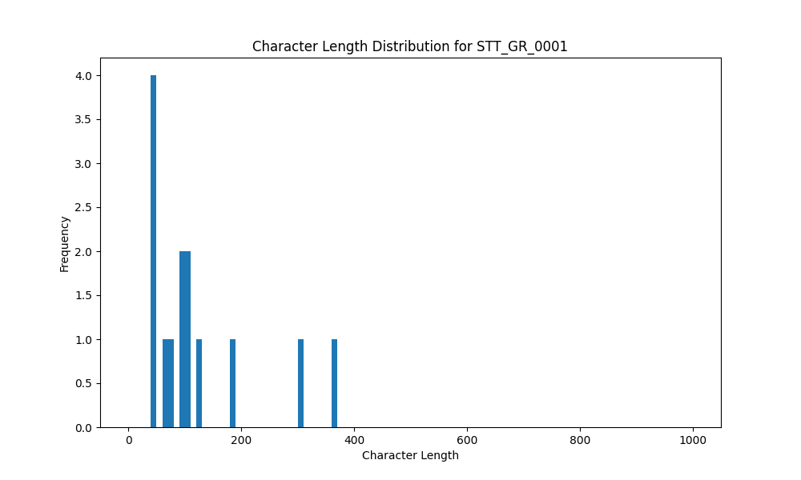

# Analysis Report for STT_GR_0001

## Summary Statistics

| Metric | Value |
|--------|-------|
| Total Segments | 14 |
| Total Duration | 119.80 seconds |
| Total Characters | 1697 |
| Average Characters/Segment | 121.21 |

## Character Length Distribution

## Detailed Statistics by Character Length Bins

### Bin: (30.0, 40.0]

| Metric | Value |
|--------|-------|
| Number of Segments | 1.0 |
| Average Character Length | 40.0 |
| Total Characters | 40.0 |
| Average Duration | 3.7 seconds |
| Total Duration | 3.7 seconds |

#### Files in this bin:

| File Name | Character Length | Duration (s) |
|-----------|-----------------|---------------|
| STT_GR_0001_0001_13400_to_17100 | 40 | 3.70 |

### Bin: (40.0, 50.0]

| Metric | Value |
|--------|-------|
| Number of Segments | 3.0 |
| Average Character Length | 46.33 |
| Total Characters | 139.0 |
| Average Duration | 3.83 seconds |
| Total Duration | 11.5 seconds |

#### Files in this bin:

| File Name | Character Length | Duration (s) |
|-----------|-----------------|---------------|
| STT_GR_0001_0019_192100_to_196200 | 44 | 4.10 |
| STT_GR_0001_0012_111300_to_114300 | 47 | 3.00 |
| STT_GR_0001_0011_106500_to_110900 | 48 | 4.40 |

### Bin: (60.0, 70.0]

| Metric | Value |
|--------|-------|
| Number of Segments | 1.0 |
| Average Character Length | 64.0 |
| Total Characters | 64.0 |
| Average Duration | 5.5 seconds |
| Total Duration | 5.5 seconds |

#### Files in this bin:

| File Name | Character Length | Duration (s) |
|-----------|-----------------|---------------|
| STT_GR_0001_0003_22300_to_27800 | 64 | 5.50 |

### Bin: (70.0, 80.0]

| Metric | Value |
|--------|-------|
| Number of Segments | 1.0 |
| Average Character Length | 76.0 |
| Total Characters | 76.0 |
| Average Duration | 4.5 seconds |
| Total Duration | 4.5 seconds |

#### Files in this bin:

| File Name | Character Length | Duration (s) |
|-----------|-----------------|---------------|
| STT_GR_0001_0025_249500_to_254000 | 76 | 4.50 |

### Bin: (90.0, 100.0]

| Metric | Value |
|--------|-------|
| Number of Segments | 2.0 |
| Average Character Length | 94.5 |
| Total Characters | 189.0 |
| Average Duration | 6.4 seconds |
| Total Duration | 12.8 seconds |

#### Files in this bin:

| File Name | Character Length | Duration (s) |
|-----------|-----------------|---------------|
| STT_GR_0001_0017_176000_to_182100 | 95 | 6.10 |
| STT_GR_0001_0013_115200_to_121900 | 94 | 6.70 |

### Bin: (100.0, 110.0]

| Metric | Value |
|--------|-------|
| Number of Segments | 2.0 |
| Average Character Length | 105.5 |
| Total Characters | 211.0 |
| Average Duration | 7.95 seconds |
| Total Duration | 15.9 seconds |

#### Files in this bin:

| File Name | Character Length | Duration (s) |
|-----------|-----------------|---------------|
| STT_GR_0001_0020_196900_to_204500 | 104 | 7.60 |
| STT_GR_0001_0007_67900_to_76200 | 107 | 8.30 |

### Bin: (120.0, 130.0]

| Metric | Value |
|--------|-------|
| Number of Segments | 1.0 |
| Average Character Length | 128.0 |
| Total Characters | 128.0 |
| Average Duration | 8.7 seconds |
| Total Duration | 8.7 seconds |

#### Files in this bin:

| File Name | Character Length | Duration (s) |
|-----------|-----------------|---------------|
| STT_GR_0001_0006_58500_to_67200 | 128 | 8.70 |

### Bin: (180.0, 190.0]

| Metric | Value |
|--------|-------|
| Number of Segments | 1.0 |
| Average Character Length | 181.0 |
| Total Characters | 181.0 |
| Average Duration | 12.6 seconds |
| Total Duration | 12.6 seconds |

#### Files in this bin:

| File Name | Character Length | Duration (s) |
|-----------|-----------------|---------------|
| STT_GR_0001_0010_93600_to_106200 | 181 | 12.60 |

### Bin: (300.0, 310.0]

| Metric | Value |
|--------|-------|
| Number of Segments | 1.0 |
| Average Character Length | 304.0 |
| Total Characters | 304.0 |
| Average Duration | 19.6 seconds |
| Total Duration | 19.6 seconds |

#### Files in this bin:

| File Name | Character Length | Duration (s) |
|-----------|-----------------|---------------|
| STT_GR_0001_0016_155300_to_174900 | 304 | 19.60 |

### Bin: (360.0, 370.0]

| Metric | Value |
|--------|-------|
| Number of Segments | 1.0 |
| Average Character Length | 365.0 |
| Total Characters | 365.0 |
| Average Duration | 25.0 seconds |
| Total Duration | 25.0 seconds |

#### Files in this bin:

| File Name | Character Length | Duration (s) |
|-----------|-----------------|---------------|
| STT_GR_0001_0005_32900_to_57900 | 365 | 25.00 |

