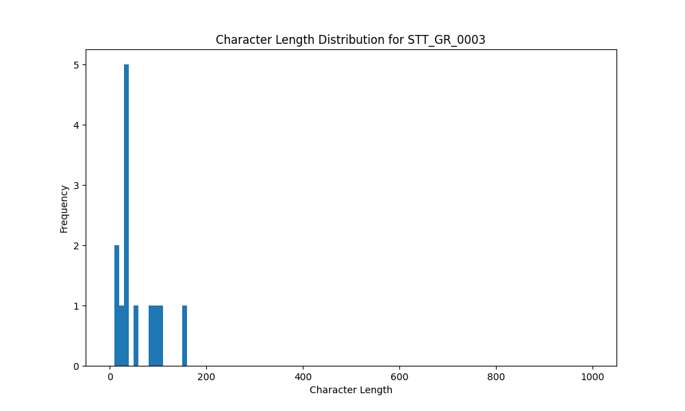

# Analysis Report for STT_GR_0003

## Summary Statistics

| Metric | Value |
|--------|-------|
| Total Segments | 13 |
| Total Duration | 40.67 seconds |
| Total Characters | 712 |
| Average Characters/Segment | 54.77 |

## Character Length Distribution

## Detailed Statistics by Character Length Bins

### Bin: (10.0, 20.0]

| Metric | Value |
|--------|-------|
| Number of Segments | 2.0 |
| Average Character Length | 13.0 |
| Total Characters | 26.0 |
| Average Duration | 0.8 seconds |
| Total Duration | 1.6 seconds |

#### Files in this bin:

| File Name | Character Length | Duration (s) |
|-----------|-----------------|---------------|
| STT_GR_0003_0214_1146244_to_1147204 | 13 | 0.96 |
| STT_GR_0003_0158_806340_to_806980 | 13 | 0.64 |

### Bin: (20.0, 30.0]

| Metric | Value |
|--------|-------|
| Number of Segments | 1.0 |
| Average Character Length | 24.0 |
| Total Characters | 24.0 |
| Average Duration | 1.12 seconds |
| Total Duration | 1.12 seconds |

#### Files in this bin:

| File Name | Character Length | Duration (s) |
|-----------|-----------------|---------------|
| STT_GR_0003_0097_489700_to_490820 | 24 | 1.12 |

### Bin: (30.0, 40.0]

| Metric | Value |
|--------|-------|
| Number of Segments | 5.0 |
| Average Character Length | 35.0 |
| Total Characters | 175.0 |
| Average Duration | 1.96 seconds |
| Total Duration | 9.82 seconds |

#### Files in this bin:

| File Name | Character Length | Duration (s) |
|-----------|-----------------|---------------|
| STT_GR_0003_0208_1135460_to_1136804 | 32 | 1.34 |
| STT_GR_0003_0040_211400_to_214400 | 34 | 3.00 |
| STT_GR_0003_0019_44912_to_46736 | 38 | 1.82 |
| STT_GR_0003_0054_259148_to_261196 | 37 | 2.05 |
| STT_GR_0003_0107_505219_to_506820 | 34 | 1.60 |

### Bin: (50.0, 60.0]

| Metric | Value |
|--------|-------|
| Number of Segments | 1.0 |
| Average Character Length | 53.0 |
| Total Characters | 53.0 |
| Average Duration | 2.34 seconds |
| Total Duration | 2.34 seconds |

#### Files in this bin:

| File Name | Character Length | Duration (s) |
|-----------|-----------------|---------------|
| STT_GR_0003_0079_343532_to_345868 | 53 | 2.34 |

### Bin: (80.0, 90.0]

| Metric | Value |
|--------|-------|
| Number of Segments | 1.0 |
| Average Character Length | 83.0 |
| Total Characters | 83.0 |
| Average Duration | 4.7 seconds |
| Total Duration | 4.7 seconds |

#### Files in this bin:

| File Name | Character Length | Duration (s) |
|-----------|-----------------|---------------|
| STT_GR_0003_0205_1123100_to_1127800 | 83 | 4.70 |

### Bin: (90.0, 100.0]

| Metric | Value |
|--------|-------|
| Number of Segments | 1.0 |
| Average Character Length | 92.0 |
| Total Characters | 92.0 |
| Average Duration | 6.1 seconds |
| Total Duration | 6.1 seconds |

#### Files in this bin:

| File Name | Character Length | Duration (s) |
|-----------|-----------------|---------------|
| STT_GR_0003_0093_472200_to_478300 | 92 | 6.10 |

### Bin: (100.0, 110.0]

| Metric | Value |
|--------|-------|
| Number of Segments | 1.0 |
| Average Character Length | 102.0 |
| Total Characters | 102.0 |
| Average Duration | 7.0 seconds |
| Total Duration | 7.0 seconds |

#### Files in this bin:

| File Name | Character Length | Duration (s) |
|-----------|-----------------|---------------|
| STT_GR_0003_0252_1506000_to_1513000 | 102 | 7.00 |

### Bin: (150.0, 160.0]

| Metric | Value |
|--------|-------|
| Number of Segments | 1.0 |
| Average Character Length | 157.0 |
| Total Characters | 157.0 |
| Average Duration | 8.0 seconds |
| Total Duration | 8.0 seconds |

#### Files in this bin:

| File Name | Character Length | Duration (s) |
|-----------|-----------------|---------------|
| STT_GR_0003_0119_524700_to_532700 | 157 | 8.00 |

