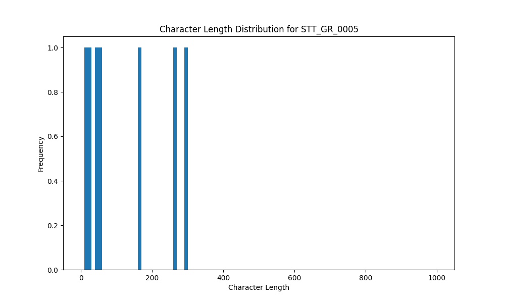

# Analysis Report for STT_GR_0005

## Summary Statistics

| Metric | Value |
|--------|-------|
| Total Segments | 7 |
| Total Duration | 56.50 seconds |
| Total Characters | 880 |
| Average Characters/Segment | 125.71 |

## Character Length Distribution

## Detailed Statistics by Character Length Bins

### Bin: (10.0, 20.0]

| Metric | Value |
|--------|-------|
| Number of Segments | 1.0 |
| Average Character Length | 14.0 |
| Total Characters | 14.0 |
| Average Duration | 2.3 seconds |
| Total Duration | 2.3 seconds |

#### Files in this bin:

| File Name | Character Length | Duration (s) |
|-----------|-----------------|---------------|
| STT_GR_0005_0003_36500_to_38800 | 14 | 2.30 |

### Bin: (20.0, 30.0]

| Metric | Value |
|--------|-------|
| Number of Segments | 1.0 |
| Average Character Length | 29.0 |
| Total Characters | 29.0 |
| Average Duration | 2.0 seconds |
| Total Duration | 2.0 seconds |

#### Files in this bin:

| File Name | Character Length | Duration (s) |
|-----------|-----------------|---------------|
| STT_GR_0005_0034_347300_to_349300 | 29 | 2.00 |

### Bin: (40.0, 50.0]

| Metric | Value |
|--------|-------|
| Number of Segments | 1.0 |
| Average Character Length | 49.0 |
| Total Characters | 49.0 |
| Average Duration | 3.4 seconds |
| Total Duration | 3.4 seconds |

#### Files in this bin:

| File Name | Character Length | Duration (s) |
|-----------|-----------------|---------------|
| STT_GR_0005_0025_257800_to_261200 | 49 | 3.40 |

### Bin: (50.0, 60.0]

| Metric | Value |
|--------|-------|
| Number of Segments | 1.0 |
| Average Character Length | 59.0 |
| Total Characters | 59.0 |
| Average Duration | 4.6 seconds |
| Total Duration | 4.6 seconds |

#### Files in this bin:

| File Name | Character Length | Duration (s) |
|-----------|-----------------|---------------|
| STT_GR_0005_0009_69300_to_73900 | 59 | 4.60 |

### Bin: (160.0, 170.0]

| Metric | Value |
|--------|-------|
| Number of Segments | 1.0 |
| Average Character Length | 162.0 |
| Total Characters | 162.0 |
| Average Duration | 10.6 seconds |
| Total Duration | 10.6 seconds |

#### Files in this bin:

| File Name | Character Length | Duration (s) |
|-----------|-----------------|---------------|
| STT_GR_0005_0036_355300_to_365900 | 162 | 10.60 |

### Bin: (260.0, 270.0]

| Metric | Value |
|--------|-------|
| Number of Segments | 1.0 |
| Average Character Length | 269.0 |
| Total Characters | 269.0 |
| Average Duration | 16.4 seconds |
| Total Duration | 16.4 seconds |

#### Files in this bin:

| File Name | Character Length | Duration (s) |
|-----------|-----------------|---------------|
| STT_GR_0005_0027_266800_to_283200 | 269 | 16.40 |

### Bin: (290.0, 300.0]

| Metric | Value |
|--------|-------|
| Number of Segments | 1.0 |
| Average Character Length | 298.0 |
| Total Characters | 298.0 |
| Average Duration | 17.2 seconds |
| Total Duration | 17.2 seconds |

#### Files in this bin:

| File Name | Character Length | Duration (s) |
|-----------|-----------------|---------------|
| STT_GR_0005_0033_328300_to_345500 | 298 | 17.20 |

