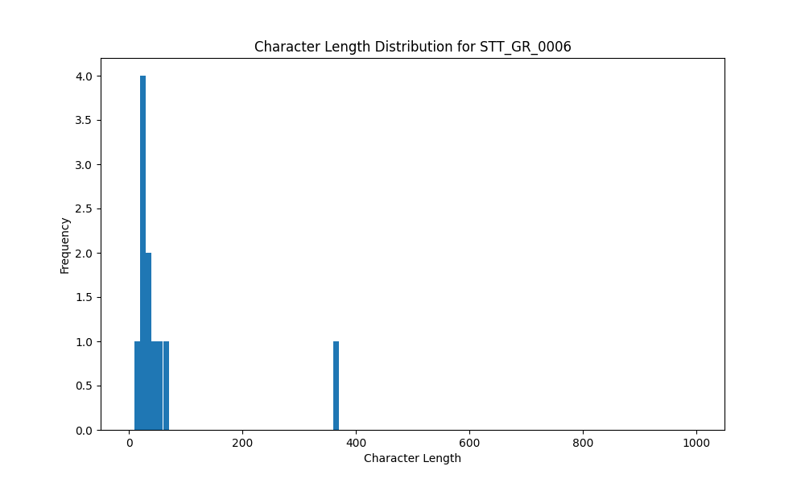

# Analysis Report for STT_GR_0006

## Summary Statistics

| Metric | Value |
|--------|-------|
| Total Segments | 11 |
| Total Duration | 39.98 seconds |
| Total Characters | 720 |
| Average Characters/Segment | 65.45 |

## Character Length Distribution

## Detailed Statistics by Character Length Bins

### Bin: (10.0, 20.0]

| Metric | Value |
|--------|-------|
| Number of Segments | 1.0 |
| Average Character Length | 17.0 |
| Total Characters | 17.0 |
| Average Duration | 0.7 seconds |
| Total Duration | 0.7 seconds |

#### Files in this bin:

| File Name | Character Length | Duration (s) |
|-----------|-----------------|---------------|
| STT_GR_0006_0027_180144_to_180848 | 17 | 0.70 |

### Bin: (20.0, 30.0]

| Metric | Value |
|--------|-------|
| Number of Segments | 4.0 |
| Average Character Length | 26.0 |
| Total Characters | 104.0 |
| Average Duration | 1.45 seconds |
| Total Duration | 5.81 seconds |

#### Files in this bin:

| File Name | Character Length | Duration (s) |
|-----------|-----------------|---------------|
| STT_GR_0006_0026_179216_to_180112 | 27 | 0.90 |
| STT_GR_0006_0083_414200_to_417000 | 25 | 2.80 |
| STT_GR_0006_0046_225664_to_226528 | 23 | 0.86 |
| STT_GR_0006_0062_292824_to_294072 | 29 | 1.25 |

### Bin: (30.0, 40.0]

| Metric | Value |
|--------|-------|
| Number of Segments | 2.0 |
| Average Character Length | 34.5 |
| Total Characters | 69.0 |
| Average Duration | 1.54 seconds |
| Total Duration | 3.07 seconds |

#### Files in this bin:

| File Name | Character Length | Duration (s) |
|-----------|-----------------|---------------|
| STT_GR_0006_0065_298840_to_300728 | 38 | 1.89 |
| STT_GR_0006_0012_152688_to_153872 | 31 | 1.18 |

### Bin: (40.0, 50.0]

| Metric | Value |
|--------|-------|
| Number of Segments | 1.0 |
| Average Character Length | 42.0 |
| Total Characters | 42.0 |
| Average Duration | 3.3 seconds |
| Total Duration | 3.3 seconds |

#### Files in this bin:

| File Name | Character Length | Duration (s) |
|-----------|-----------------|---------------|
| STT_GR_0006_0053_236300_to_239600 | 42 | 3.30 |

### Bin: (50.0, 60.0]

| Metric | Value |
|--------|-------|
| Number of Segments | 1.0 |
| Average Character Length | 57.0 |
| Total Characters | 57.0 |
| Average Duration | 4.3 seconds |
| Total Duration | 4.3 seconds |

#### Files in this bin:

| File Name | Character Length | Duration (s) |
|-----------|-----------------|---------------|
| STT_GR_0006_0082_407100_to_411400 | 57 | 4.30 |

### Bin: (60.0, 70.0]

| Metric | Value |
|--------|-------|
| Number of Segments | 1.0 |
| Average Character Length | 63.0 |
| Total Characters | 63.0 |
| Average Duration | 2.59 seconds |
| Total Duration | 2.59 seconds |

#### Files in this bin:

| File Name | Character Length | Duration (s) |
|-----------|-----------------|---------------|
| STT_GR_0006_0067_303736_to_306328 | 63 | 2.59 |

### Bin: (360.0, 370.0]

| Metric | Value |
|--------|-------|
| Number of Segments | 1.0 |
| Average Character Length | 368.0 |
| Total Characters | 368.0 |
| Average Duration | 20.2 seconds |
| Total Duration | 20.2 seconds |

#### Files in this bin:

| File Name | Character Length | Duration (s) |
|-----------|-----------------|---------------|
| STT_GR_0006_0003_47200_to_67400 | 368 | 20.20 |

