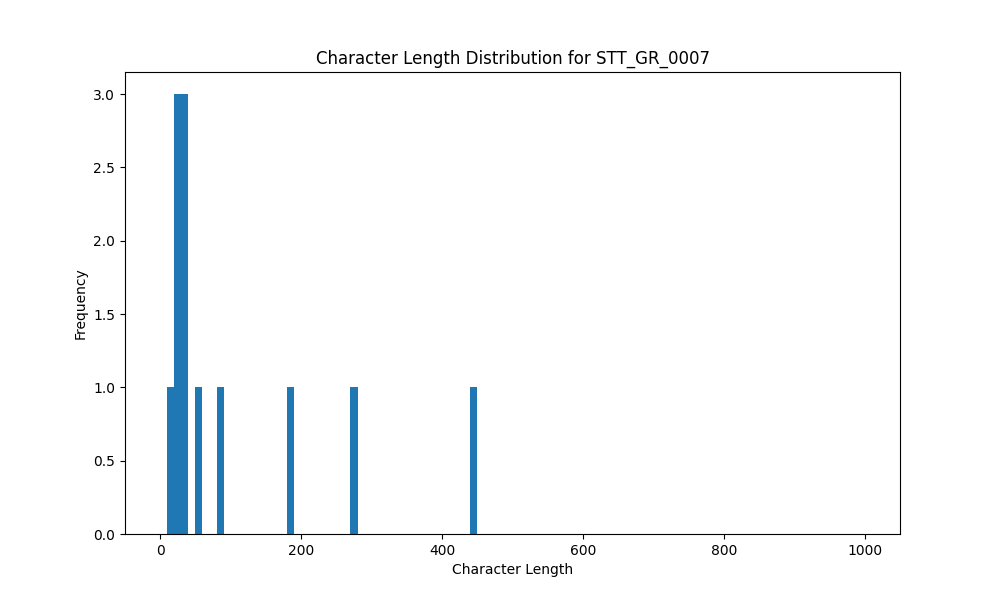

# Analysis Report for STT_GR_0007

## Summary Statistics

| Metric | Value |
|--------|-------|
| Total Segments | 12 |
| Total Duration | 65.14 seconds |
| Total Characters | 1228 |
| Average Characters/Segment | 102.33 |

## Character Length Distribution

## Detailed Statistics by Character Length Bins

### Bin: (10.0, 20.0]

| Metric | Value |
|--------|-------|
| Number of Segments | 2.0 |
| Average Character Length | 19.0 |
| Total Characters | 38.0 |
| Average Duration | 0.8 seconds |
| Total Duration | 1.6 seconds |

#### Files in this bin:

| File Name | Character Length | Duration (s) |
|-----------|-----------------|---------------|
| STT_GR_0007_0047_228708_to_229636 | 18 | 0.93 |
| STT_GR_0007_0055_268515_to_269188 | 20 | 0.67 |

### Bin: (20.0, 30.0]

| Metric | Value |
|--------|-------|
| Number of Segments | 2.0 |
| Average Character Length | 27.0 |
| Total Characters | 54.0 |
| Average Duration | 1.34 seconds |
| Total Duration | 2.69 seconds |

#### Files in this bin:

| File Name | Character Length | Duration (s) |
|-----------|-----------------|---------------|
| STT_GR_0007_0100_417856_to_419135 | 25 | 1.28 |
| STT_GR_0007_0059_272772_to_274180 | 29 | 1.41 |

### Bin: (30.0, 40.0]

| Metric | Value |
|--------|-------|
| Number of Segments | 3.0 |
| Average Character Length | 32.0 |
| Total Characters | 96.0 |
| Average Duration | 1.56 seconds |
| Total Duration | 4.67 seconds |

#### Files in this bin:

| File Name | Character Length | Duration (s) |
|-----------|-----------------|---------------|
| STT_GR_0007_0091_373640_to_374888 | 31 | 1.25 |
| STT_GR_0007_0134_533744_to_535408 | 33 | 1.66 |
| STT_GR_0007_0099_415072_to_416832 | 32 | 1.76 |

### Bin: (50.0, 60.0]

| Metric | Value |
|--------|-------|
| Number of Segments | 1.0 |
| Average Character Length | 59.0 |
| Total Characters | 59.0 |
| Average Duration | 2.18 seconds |
| Total Duration | 2.18 seconds |

#### Files in this bin:

| File Name | Character Length | Duration (s) |
|-----------|-----------------|---------------|
| STT_GR_0007_0118_445120_to_447296 | 59 | 2.18 |

### Bin: (70.0, 80.0]

| Metric | Value |
|--------|-------|
| Number of Segments | 1.0 |
| Average Character Length | 80.0 |
| Total Characters | 80.0 |
| Average Duration | 4.7 seconds |
| Total Duration | 4.7 seconds |

#### Files in this bin:

| File Name | Character Length | Duration (s) |
|-----------|-----------------|---------------|
| STT_GR_0007_0146_577100_to_581800 | 80 | 4.70 |

### Bin: (180.0, 190.0]

| Metric | Value |
|--------|-------|
| Number of Segments | 1.0 |
| Average Character Length | 181.0 |
| Total Characters | 181.0 |
| Average Duration | 11.4 seconds |
| Total Duration | 11.4 seconds |

#### Files in this bin:

| File Name | Character Length | Duration (s) |
|-----------|-----------------|---------------|
| STT_GR_0007_0028_136500_to_147900 | 181 | 11.40 |

### Bin: (270.0, 280.0]

| Metric | Value |
|--------|-------|
| Number of Segments | 1.0 |
| Average Character Length | 274.0 |
| Total Characters | 274.0 |
| Average Duration | 13.0 seconds |
| Total Duration | 13.0 seconds |

#### Files in this bin:

| File Name | Character Length | Duration (s) |
|-----------|-----------------|---------------|
| STT_GR_0007_0145_559400_to_572400 | 274 | 13.00 |

### Bin: (440.0, 450.0]

| Metric | Value |
|--------|-------|
| Number of Segments | 1.0 |
| Average Character Length | 446.0 |
| Total Characters | 446.0 |
| Average Duration | 24.9 seconds |
| Total Duration | 24.9 seconds |

#### Files in this bin:

| File Name | Character Length | Duration (s) |
|-----------|-----------------|---------------|
| STT_GR_0007_0093_377200_to_402100 | 446 | 24.90 |

