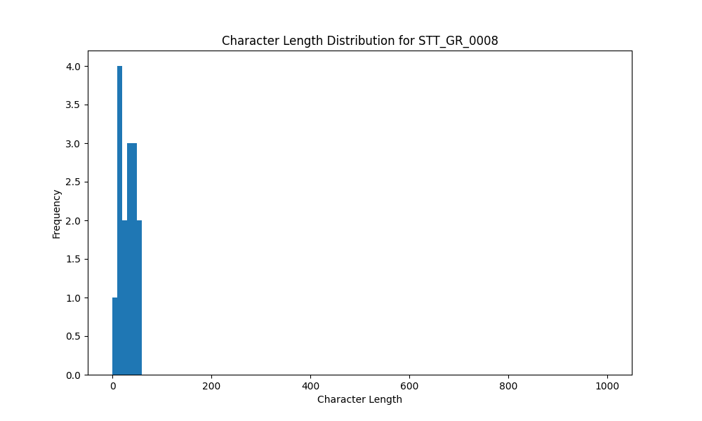

# Analysis Report for STT_GR_0008

## Summary Statistics

| Metric | Value |
|--------|-------|
| Total Segments | 15 |
| Total Duration | 25.01 seconds |
| Total Characters | 459 |
| Average Characters/Segment | 30.60 |

## Character Length Distribution

## Detailed Statistics by Character Length Bins

### Bin: (0.0, 10.0]

| Metric | Value |
|--------|-------|
| Number of Segments | 1.0 |
| Average Character Length | 9.0 |
| Total Characters | 9.0 |
| Average Duration | 0.51 seconds |
| Total Duration | 0.51 seconds |

#### Files in this bin:

| File Name | Character Length | Duration (s) |
|-----------|-----------------|---------------|
| STT_GR_0008_0022_176408_to_176920 | 9 | 0.51 |

### Bin: (10.0, 20.0]

| Metric | Value |
|--------|-------|
| Number of Segments | 4.0 |
| Average Character Length | 14.25 |
| Total Characters | 57.0 |
| Average Duration | 0.74 seconds |
| Total Duration | 2.98 seconds |

#### Files in this bin:

| File Name | Character Length | Duration (s) |
|-----------|-----------------|---------------|
| STT_GR_0008_0030_186904_to_187543 | 11 | 0.64 |
| STT_GR_0008_0072_408623_to_409456 | 19 | 0.83 |
| STT_GR_0008_0087_525127_to_525863 | 12 | 0.74 |
| STT_GR_0008_0108_669756_to_670524 | 15 | 0.77 |

### Bin: (20.0, 30.0]

| Metric | Value |
|--------|-------|
| Number of Segments | 2.0 |
| Average Character Length | 24.5 |
| Total Characters | 49.0 |
| Average Duration | 1.12 seconds |
| Total Duration | 2.24 seconds |

#### Files in this bin:

| File Name | Character Length | Duration (s) |
|-----------|-----------------|---------------|
| STT_GR_0008_0014_152920_to_153880 | 21 | 0.96 |
| STT_GR_0008_0118_688412_to_689692 | 28 | 1.28 |

### Bin: (30.0, 40.0]

| Metric | Value |
|--------|-------|
| Number of Segments | 4.0 |
| Average Character Length | 36.0 |
| Total Characters | 144.0 |
| Average Duration | 2.2 seconds |
| Total Duration | 8.78 seconds |

#### Files in this bin:

| File Name | Character Length | Duration (s) |
|-----------|-----------------|---------------|
| STT_GR_0008_0114_680060_to_681660 | 34 | 1.60 |
| STT_GR_0008_0051_354400_to_357200 | 39 | 2.80 |
| STT_GR_0008_0015_156920_to_158904 | 40 | 1.98 |
| STT_GR_0008_0038_247500_to_249900 | 31 | 2.40 |

### Bin: (40.0, 50.0]

| Metric | Value |
|--------|-------|
| Number of Segments | 2.0 |
| Average Character Length | 44.0 |
| Total Characters | 88.0 |
| Average Duration | 2.06 seconds |
| Total Duration | 4.13 seconds |

#### Files in this bin:

| File Name | Character Length | Duration (s) |
|-----------|-----------------|---------------|
| STT_GR_0008_0089_528264_to_530311 | 44 | 2.05 |
| STT_GR_0008_0110_672828_to_674908 | 44 | 2.08 |

### Bin: (50.0, 60.0]

| Metric | Value |
|--------|-------|
| Number of Segments | 2.0 |
| Average Character Length | 56.0 |
| Total Characters | 112.0 |
| Average Duration | 3.19 seconds |
| Total Duration | 6.37 seconds |

#### Files in this bin:

| File Name | Character Length | Duration (s) |
|-----------|-----------------|---------------|
| STT_GR_0008_0034_217500_to_221600 | 58 | 4.10 |
| STT_GR_0008_0084_518120_to_520391 | 54 | 2.27 |

