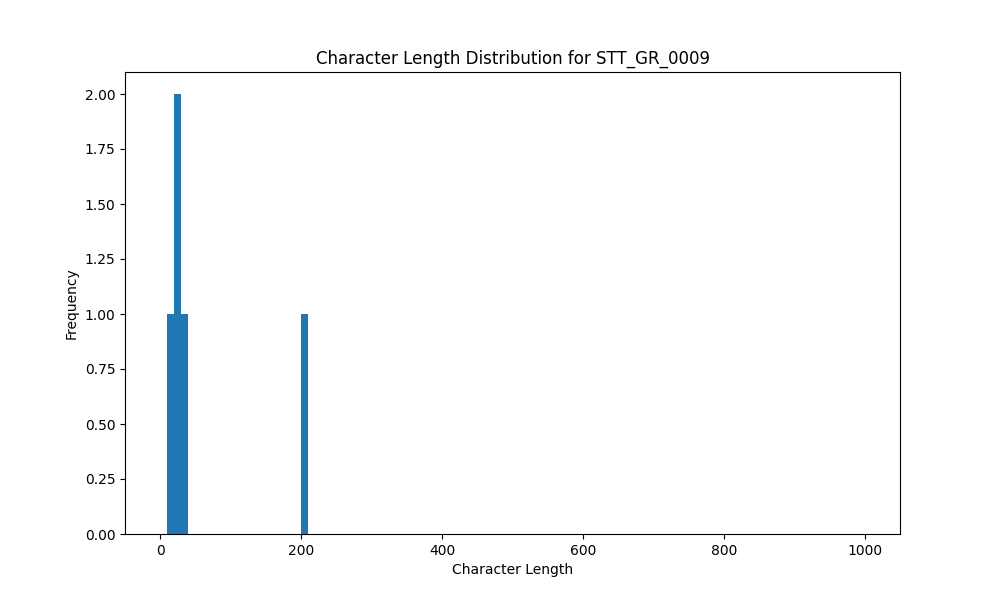

# Analysis Report for STT_GR_0009

## Summary Statistics

| Metric | Value |
|--------|-------|
| Total Segments | 5 |
| Total Duration | 16.39 seconds |
| Total Characters | 308 |
| Average Characters/Segment | 61.60 |

## Character Length Distribution

## Detailed Statistics by Character Length Bins

### Bin: (10.0, 20.0]

| Metric | Value |
|--------|-------|
| Number of Segments | 1.0 |
| Average Character Length | 16.0 |
| Total Characters | 16.0 |
| Average Duration | 0.7 seconds |
| Total Duration | 0.7 seconds |

#### Files in this bin:

| File Name | Character Length | Duration (s) |
|-----------|-----------------|---------------|
| STT_GR_0009_0081_355940_to_356644 | 16 | 0.70 |

### Bin: (20.0, 30.0]

| Metric | Value |
|--------|-------|
| Number of Segments | 3.0 |
| Average Character Length | 28.33 |
| Total Characters | 85.0 |
| Average Duration | 1.16 seconds |
| Total Duration | 3.49 seconds |

#### Files in this bin:

| File Name | Character Length | Duration (s) |
|-----------|-----------------|---------------|
| STT_GR_0009_0017_77416_to_78888 | 30 | 1.47 |
| STT_GR_0009_0073_342500_to_343556 | 29 | 1.06 |
| STT_GR_0009_0042_283796_to_284756 | 26 | 0.96 |

### Bin: (200.0, 210.0]

| Metric | Value |
|--------|-------|
| Number of Segments | 1.0 |
| Average Character Length | 207.0 |
| Total Characters | 207.0 |
| Average Duration | 12.2 seconds |
| Total Duration | 12.2 seconds |

#### Files in this bin:

| File Name | Character Length | Duration (s) |
|-----------|-----------------|---------------|
| STT_GR_0009_0029_173800_to_186000 | 207 | 12.20 |

