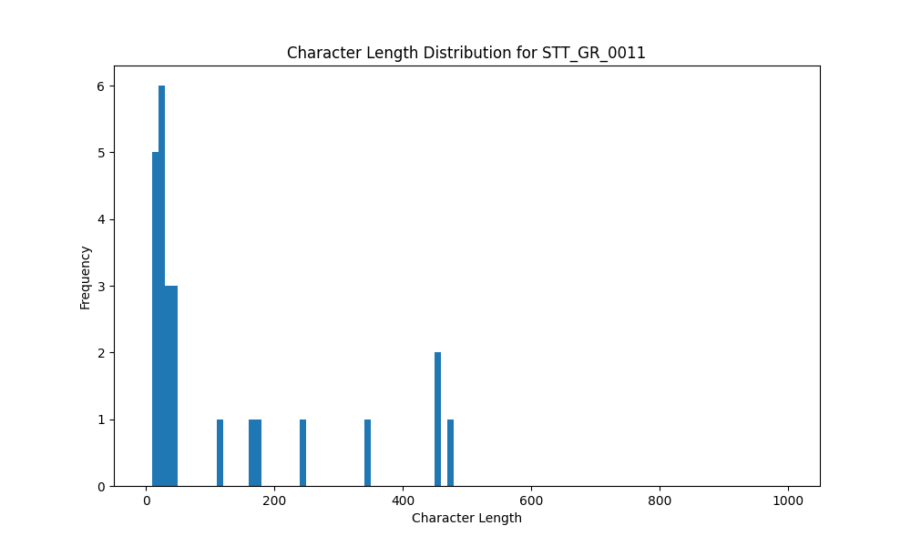

# Analysis Report for STT_GR_0011

## Summary Statistics

| Metric | Value |
|--------|-------|
| Total Segments | 25 |
| Total Duration | 178.61 seconds |
| Total Characters | 2910 |
| Average Characters/Segment | 116.40 |

## Character Length Distribution

## Detailed Statistics by Character Length Bins

### Bin: (10.0, 20.0]

| Metric | Value |
|--------|-------|
| Number of Segments | 6.0 |
| Average Character Length | 16.5 |
| Total Characters | 99.0 |
| Average Duration | 0.82 seconds |
| Total Duration | 4.93 seconds |

#### Files in this bin:

| File Name | Character Length | Duration (s) |
|-----------|-----------------|---------------|
| STT_GR_0011_0018_111919_to_112976 | 16 | 1.06 |
| STT_GR_0011_0035_185300_to_186004 | 15 | 0.70 |
| STT_GR_0011_0092_625356_to_625932 | 14 | 0.58 |
| STT_GR_0011_0020_115696_to_116399 | 20 | 0.70 |
| STT_GR_0011_0106_649579_to_650508 | 16 | 0.93 |
| STT_GR_0011_0087_615052_to_616012 | 18 | 0.96 |

### Bin: (20.0, 30.0]

| Metric | Value |
|--------|-------|
| Number of Segments | 5.0 |
| Average Character Length | 25.6 |
| Total Characters | 128.0 |
| Average Duration | 1.16 seconds |
| Total Duration | 5.8 seconds |

#### Files in this bin:

| File Name | Character Length | Duration (s) |
|-----------|-----------------|---------------|
| STT_GR_0011_0136_913040_to_914319 | 27 | 1.28 |
| STT_GR_0011_0037_188116_to_189076 | 29 | 0.96 |
| STT_GR_0011_0021_116527_to_117551 | 22 | 1.02 |
| STT_GR_0011_0140_920112_to_920848 | 25 | 0.74 |
| STT_GR_0011_0077_583500_to_585300 | 25 | 1.80 |

### Bin: (30.0, 40.0]

| Metric | Value |
|--------|-------|
| Number of Segments | 3.0 |
| Average Character Length | 35.67 |
| Total Characters | 107.0 |
| Average Duration | 1.55 seconds |
| Total Duration | 4.64 seconds |

#### Files in this bin:

| File Name | Character Length | Duration (s) |
|-----------|-----------------|---------------|
| STT_GR_0011_0098_634988_to_636812 | 36 | 1.82 |
| STT_GR_0011_0142_923504_to_924624 | 32 | 1.12 |
| STT_GR_0011_0135_910896_to_912592 | 39 | 1.70 |

### Bin: (40.0, 50.0]

| Metric | Value |
|--------|-------|
| Number of Segments | 3.0 |
| Average Character Length | 48.33 |
| Total Characters | 145.0 |
| Average Duration | 2.68 seconds |
| Total Duration | 8.04 seconds |

#### Files in this bin:

| File Name | Character Length | Duration (s) |
|-----------|-----------------|---------------|
| STT_GR_0011_0130_897199_to_899792 | 47 | 2.59 |
| STT_GR_0011_0131_900208_to_902256 | 49 | 2.05 |
| STT_GR_0011_0110_708500_to_711900 | 49 | 3.40 |

### Bin: (110.0, 120.0]

| Metric | Value |
|--------|-------|
| Number of Segments | 1.0 |
| Average Character Length | 117.0 |
| Total Characters | 117.0 |
| Average Duration | 6.3 seconds |
| Total Duration | 6.3 seconds |

#### Files in this bin:

| File Name | Character Length | Duration (s) |
|-----------|-----------------|---------------|
| STT_GR_0011_0066_436000_to_442300 | 117 | 6.30 |

### Bin: (160.0, 170.0]

| Metric | Value |
|--------|-------|
| Number of Segments | 1.0 |
| Average Character Length | 162.0 |
| Total Characters | 162.0 |
| Average Duration | 12.7 seconds |
| Total Duration | 12.7 seconds |

#### Files in this bin:

| File Name | Character Length | Duration (s) |
|-----------|-----------------|---------------|
| STT_GR_0011_0150_1036800_to_1049500 | 162 | 12.70 |

### Bin: (170.0, 180.0]

| Metric | Value |
|--------|-------|
| Number of Segments | 1.0 |
| Average Character Length | 178.0 |
| Total Characters | 178.0 |
| Average Duration | 14.2 seconds |
| Total Duration | 14.2 seconds |

#### Files in this bin:

| File Name | Character Length | Duration (s) |
|-----------|-----------------|---------------|
| STT_GR_0011_0067_448900_to_463100 | 178 | 14.20 |

### Bin: (240.0, 250.0]

| Metric | Value |
|--------|-------|
| Number of Segments | 1.0 |
| Average Character Length | 247.0 |
| Total Characters | 247.0 |
| Average Duration | 15.6 seconds |
| Total Duration | 15.6 seconds |

#### Files in this bin:

| File Name | Character Length | Duration (s) |
|-----------|-----------------|---------------|
| STT_GR_0011_0071_500100_to_515700 | 247 | 15.60 |

### Bin: (340.0, 350.0]

| Metric | Value |
|--------|-------|
| Number of Segments | 1.0 |
| Average Character Length | 348.0 |
| Total Characters | 348.0 |
| Average Duration | 21.9 seconds |
| Total Duration | 21.9 seconds |

#### Files in this bin:

| File Name | Character Length | Duration (s) |
|-----------|-----------------|---------------|
| STT_GR_0011_0158_1169600_to_1191500 | 348 | 21.90 |

### Bin: (450.0, 460.0]

| Metric | Value |
|--------|-------|
| Number of Segments | 2.0 |
| Average Character Length | 454.5 |
| Total Characters | 909.0 |
| Average Duration | 27.3 seconds |
| Total Duration | 54.6 seconds |

#### Files in this bin:

| File Name | Character Length | Duration (s) |
|-----------|-----------------|---------------|
| STT_GR_0011_0056_279700_to_309000 | 451 | 29.30 |
| STT_GR_0011_0152_1067400_to_1092700 | 458 | 25.30 |

### Bin: (460.0, 470.0]

| Metric | Value |
|--------|-------|
| Number of Segments | 1.0 |
| Average Character Length | 470.0 |
| Total Characters | 470.0 |
| Average Duration | 29.9 seconds |
| Total Duration | 29.9 seconds |

#### Files in this bin:

| File Name | Character Length | Duration (s) |
|-----------|-----------------|---------------|
| STT_GR_0011_0144_944500_to_974400 | 470 | 29.90 |

