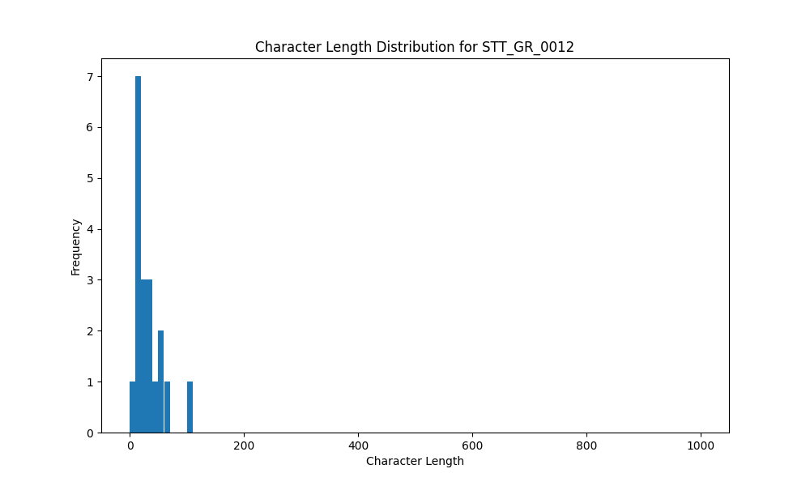

# Analysis Report for STT_GR_0012

## Summary Statistics

| Metric | Value |
|--------|-------|
| Total Segments | 19 |
| Total Duration | 30.30 seconds |
| Total Characters | 602 |
| Average Characters/Segment | 31.68 |

## Character Length Distribution

## Detailed Statistics by Character Length Bins

### Bin: (0.0, 10.0]

| Metric | Value |
|--------|-------|
| Number of Segments | 1.0 |
| Average Character Length | 6.0 |
| Total Characters | 6.0 |
| Average Duration | 0.51 seconds |
| Total Duration | 0.51 seconds |

#### Files in this bin:

| File Name | Character Length | Duration (s) |
|-----------|-----------------|---------------|
| STT_GR_0012_0136_729988_to_730500 | 6 | 0.51 |

### Bin: (10.0, 20.0]

| Metric | Value |
|--------|-------|
| Number of Segments | 7.0 |
| Average Character Length | 14.14 |
| Total Characters | 99.0 |
| Average Duration | 0.8 seconds |
| Total Duration | 5.6 seconds |

#### Files in this bin:

| File Name | Character Length | Duration (s) |
|-----------|-----------------|---------------|
| STT_GR_0012_0035_274140_to_274683 | 12 | 0.54 |
| STT_GR_0012_0217_1026487_to_1027319 | 17 | 0.83 |
| STT_GR_0012_0277_1264192_to_1265568 | 18 | 1.38 |
| STT_GR_0012_0256_1193908_to_1194580 | 11 | 0.67 |
| STT_GR_0012_0076_364372_to_365075 | 14 | 0.70 |
| STT_GR_0012_0132_721636_to_722339 | 16 | 0.70 |
| STT_GR_0012_0276_1263040_to_1263808 | 11 | 0.77 |

### Bin: (20.0, 30.0]

| Metric | Value |
|--------|-------|
| Number of Segments | 3.0 |
| Average Character Length | 23.0 |
| Total Characters | 69.0 |
| Average Duration | 1.03 seconds |
| Total Duration | 3.1 seconds |

#### Files in this bin:

| File Name | Character Length | Duration (s) |
|-----------|-----------------|---------------|
| STT_GR_0012_0154_771588_to_772388 | 22 | 0.80 |
| STT_GR_0012_0060_321300_to_322580 | 26 | 1.28 |
| STT_GR_0012_0176_845952_to_846976 | 21 | 1.02 |

### Bin: (30.0, 40.0]

| Metric | Value |
|--------|-------|
| Number of Segments | 3.0 |
| Average Character Length | 35.0 |
| Total Characters | 105.0 |
| Average Duration | 1.52 seconds |
| Total Duration | 4.58 seconds |

#### Files in this bin:

| File Name | Character Length | Duration (s) |
|-----------|-----------------|---------------|
| STT_GR_0012_0251_1183668_to_1185268 | 33 | 1.60 |
| STT_GR_0012_0315_1494432_to_1496224 | 39 | 1.79 |
| STT_GR_0012_0087_399592_to_400775 | 33 | 1.18 |

### Bin: (40.0, 50.0]

| Metric | Value |
|--------|-------|
| Number of Segments | 1.0 |
| Average Character Length | 46.0 |
| Total Characters | 46.0 |
| Average Duration | 1.82 seconds |
| Total Duration | 1.82 seconds |

#### Files in this bin:

| File Name | Character Length | Duration (s) |
|-----------|-----------------|---------------|
| STT_GR_0012_0129_712867_to_714692 | 46 | 1.82 |

### Bin: (50.0, 60.0]

| Metric | Value |
|--------|-------|
| Number of Segments | 2.0 |
| Average Character Length | 52.0 |
| Total Characters | 104.0 |
| Average Duration | 2.83 seconds |
| Total Duration | 5.66 seconds |

#### Files in this bin:

| File Name | Character Length | Duration (s) |
|-----------|-----------------|---------------|
| STT_GR_0012_0016_140700_to_143900 | 52 | 3.20 |
| STT_GR_0012_0206_991092_to_993555 | 52 | 2.46 |

### Bin: (60.0, 70.0]

| Metric | Value |
|--------|-------|
| Number of Segments | 1.0 |
| Average Character Length | 65.0 |
| Total Characters | 65.0 |
| Average Duration | 4.1 seconds |
| Total Duration | 4.1 seconds |

#### Files in this bin:

| File Name | Character Length | Duration (s) |
|-----------|-----------------|---------------|
| STT_GR_0012_0017_144300_to_148400 | 65 | 4.10 |

### Bin: (100.0, 110.0]

| Metric | Value |
|--------|-------|
| Number of Segments | 1.0 |
| Average Character Length | 108.0 |
| Total Characters | 108.0 |
| Average Duration | 4.93 seconds |
| Total Duration | 4.93 seconds |

#### Files in this bin:

| File Name | Character Length | Duration (s) |
|-----------|-----------------|---------------|
| STT_GR_0012_0313_1487808_to_1492735 | 108 | 4.93 |

