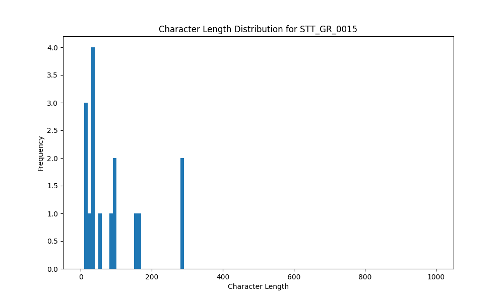

# Analysis Report for STT_GR_0015

## Summary Statistics

| Metric | Value |
|--------|-------|
| Total Segments | 16 |
| Total Duration | 80.86 seconds |
| Total Characters | 1418 |
| Average Characters/Segment | 88.62 |

## Character Length Distribution

## Detailed Statistics by Character Length Bins

### Bin: (10.0, 20.0]

| Metric | Value |
|--------|-------|
| Number of Segments | 3.0 |
| Average Character Length | 15.33 |
| Total Characters | 46.0 |
| Average Duration | 0.89 seconds |
| Total Duration | 2.66 seconds |

#### Files in this bin:

| File Name | Character Length | Duration (s) |
|-----------|-----------------|---------------|
| STT_GR_0015_0079_561564_to_562332 | 17 | 0.77 |
| STT_GR_0015_0094_621888_to_622976 | 17 | 1.09 |
| STT_GR_0015_0028_113856_to_114656 | 12 | 0.80 |

### Bin: (20.0, 30.0]

| Metric | Value |
|--------|-------|
| Number of Segments | 2.0 |
| Average Character Length | 26.0 |
| Total Characters | 52.0 |
| Average Duration | 1.3 seconds |
| Total Duration | 2.59 seconds |

#### Files in this bin:

| File Name | Character Length | Duration (s) |
|-----------|-----------------|---------------|
| STT_GR_0015_0098_629088_to_630144 | 22 | 1.06 |
| STT_GR_0015_0032_120800_to_122336 | 30 | 1.54 |

### Bin: (30.0, 40.0]

| Metric | Value |
|--------|-------|
| Number of Segments | 3.0 |
| Average Character Length | 35.67 |
| Total Characters | 107.0 |
| Average Duration | 1.77 seconds |
| Total Duration | 5.31 seconds |

#### Files in this bin:

| File Name | Character Length | Duration (s) |
|-----------|-----------------|---------------|
| STT_GR_0015_0016_85248_to_87552 | 35 | 2.30 |
| STT_GR_0015_0025_106944_to_108448 | 35 | 1.50 |
| STT_GR_0015_0010_73760_to_75264 | 37 | 1.50 |

### Bin: (50.0, 60.0]

| Metric | Value |
|--------|-------|
| Number of Segments | 1.0 |
| Average Character Length | 52.0 |
| Total Characters | 52.0 |
| Average Duration | 2.4 seconds |
| Total Duration | 2.4 seconds |

#### Files in this bin:

| File Name | Character Length | Duration (s) |
|-----------|-----------------|---------------|
| STT_GR_0015_0095_623776_to_626175 | 52 | 2.40 |

### Bin: (80.0, 90.0]

| Metric | Value |
|--------|-------|
| Number of Segments | 1.0 |
| Average Character Length | 85.0 |
| Total Characters | 85.0 |
| Average Duration | 5.2 seconds |
| Total Duration | 5.2 seconds |

#### Files in this bin:

| File Name | Character Length | Duration (s) |
|-----------|-----------------|---------------|
| STT_GR_0015_0090_608900_to_614100 | 85 | 5.20 |

### Bin: (90.0, 100.0]

| Metric | Value |
|--------|-------|
| Number of Segments | 2.0 |
| Average Character Length | 92.0 |
| Total Characters | 184.0 |
| Average Duration | 5.95 seconds |
| Total Duration | 11.9 seconds |

#### Files in this bin:

| File Name | Character Length | Duration (s) |
|-----------|-----------------|---------------|
| STT_GR_0015_0052_311800_to_317400 | 92 | 5.60 |
| STT_GR_0015_0110_656400_to_662700 | 92 | 6.30 |

### Bin: (150.0, 160.0]

| Metric | Value |
|--------|-------|
| Number of Segments | 1.0 |
| Average Character Length | 153.0 |
| Total Characters | 153.0 |
| Average Duration | 10.5 seconds |
| Total Duration | 10.5 seconds |

#### Files in this bin:

| File Name | Character Length | Duration (s) |
|-----------|-----------------|---------------|
| STT_GR_0015_0046_238700_to_249200 | 153 | 10.50 |

### Bin: (160.0, 170.0]

| Metric | Value |
|--------|-------|
| Number of Segments | 1.0 |
| Average Character Length | 168.0 |
| Total Characters | 168.0 |
| Average Duration | 8.2 seconds |
| Total Duration | 8.2 seconds |

#### Files in this bin:

| File Name | Character Length | Duration (s) |
|-----------|-----------------|---------------|
| STT_GR_0015_0069_492600_to_500800 | 168 | 8.20 |

### Bin: (280.0, 290.0]

| Metric | Value |
|--------|-------|
| Number of Segments | 2.0 |
| Average Character Length | 285.5 |
| Total Characters | 571.0 |
| Average Duration | 16.05 seconds |
| Total Duration | 32.1 seconds |

#### Files in this bin:

| File Name | Character Length | Duration (s) |
|-----------|-----------------|---------------|
| STT_GR_0015_0058_360300_to_376400 | 283 | 16.10 |
| STT_GR_0015_0045_217600_to_233600 | 288 | 16.00 |

