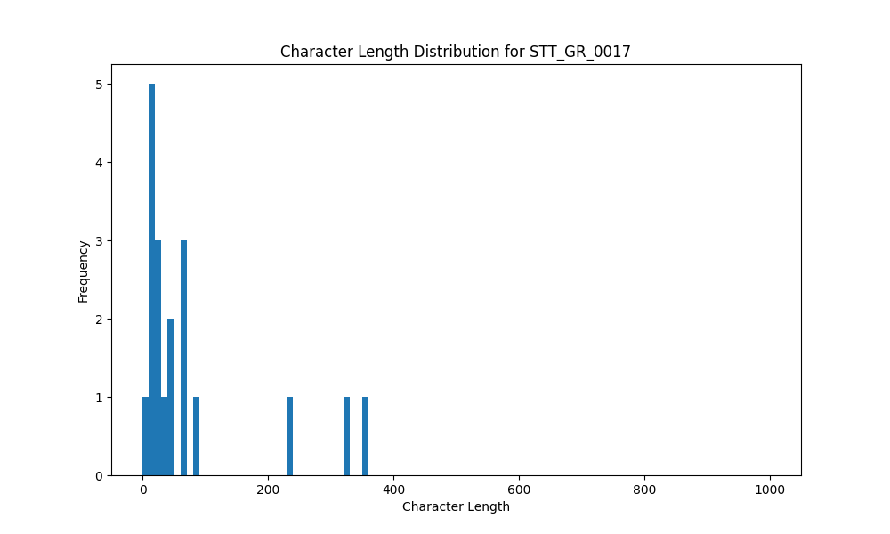

# Analysis Report for STT_GR_0017

## Summary Statistics

| Metric | Value |
|--------|-------|
| Total Segments | 19 |
| Total Duration | 83.25 seconds |
| Total Characters | 1448 |
| Average Characters/Segment | 76.21 |

## Character Length Distribution

## Detailed Statistics by Character Length Bins

### Bin: (0.0, 10.0]

| Metric | Value |
|--------|-------|
| Number of Segments | 1.0 |
| Average Character Length | 7.0 |
| Total Characters | 7.0 |
| Average Duration | 0.51 seconds |
| Total Duration | 0.51 seconds |

#### Files in this bin:

| File Name | Character Length | Duration (s) |
|-----------|-----------------|---------------|
| STT_GR_0017_0069_228424_to_228936 | 7 | 0.51 |

### Bin: (10.0, 20.0]

| Metric | Value |
|--------|-------|
| Number of Segments | 5.0 |
| Average Character Length | 16.2 |
| Total Characters | 81.0 |
| Average Duration | 0.72 seconds |
| Total Duration | 3.62 seconds |

#### Files in this bin:

| File Name | Character Length | Duration (s) |
|-----------|-----------------|---------------|
| STT_GR_0017_0131_602079_to_602816 | 17 | 0.74 |
| STT_GR_0017_0102_487044_to_487811 | 18 | 0.77 |
| STT_GR_0017_0059_200840_to_201512 | 12 | 0.67 |
| STT_GR_0017_0037_150912_to_151648 | 18 | 0.74 |
| STT_GR_0017_0124_585247_to_585952 | 16 | 0.70 |

### Bin: (20.0, 30.0]

| Metric | Value |
|--------|-------|
| Number of Segments | 3.0 |
| Average Character Length | 23.33 |
| Total Characters | 70.0 |
| Average Duration | 1.23 seconds |
| Total Duration | 3.68 seconds |

#### Files in this bin:

| File Name | Character Length | Duration (s) |
|-----------|-----------------|---------------|
| STT_GR_0017_0093_467811_to_469347 | 27 | 1.54 |
| STT_GR_0017_0091_461988_to_463171 | 22 | 1.18 |
| STT_GR_0017_0129_596352_to_597312 | 21 | 0.96 |

### Bin: (30.0, 40.0]

| Metric | Value |
|--------|-------|
| Number of Segments | 2.0 |
| Average Character Length | 36.5 |
| Total Characters | 73.0 |
| Average Duration | 1.73 seconds |
| Total Duration | 3.46 seconds |

#### Files in this bin:

| File Name | Character Length | Duration (s) |
|-----------|-----------------|---------------|
| STT_GR_0017_0118_573408_to_574816 | 33 | 1.41 |
| STT_GR_0017_0123_582624_to_584672 | 40 | 2.05 |

### Bin: (40.0, 50.0]

| Metric | Value |
|--------|-------|
| Number of Segments | 1.0 |
| Average Character Length | 42.0 |
| Total Characters | 42.0 |
| Average Duration | 1.66 seconds |
| Total Duration | 1.66 seconds |

#### Files in this bin:

| File Name | Character Length | Duration (s) |
|-----------|-----------------|---------------|
| STT_GR_0017_0132_603007_to_604672 | 42 | 1.67 |

### Bin: (50.0, 60.0]

| Metric | Value |
|--------|-------|
| Number of Segments | 2.0 |
| Average Character Length | 60.0 |
| Total Characters | 120.0 |
| Average Duration | 3.6 seconds |
| Total Duration | 7.2 seconds |

#### Files in this bin:

| File Name | Character Length | Duration (s) |
|-----------|-----------------|---------------|
| STT_GR_0017_0109_550100_to_554900 | 60 | 4.80 |
| STT_GR_0017_0092_464739_to_467140 | 60 | 2.40 |

### Bin: (60.0, 70.0]

| Metric | Value |
|--------|-------|
| Number of Segments | 1.0 |
| Average Character Length | 65.0 |
| Total Characters | 65.0 |
| Average Duration | 3.6 seconds |
| Total Duration | 3.6 seconds |

#### Files in this bin:

| File Name | Character Length | Duration (s) |
|-----------|-----------------|---------------|
| STT_GR_0017_0074_267100_to_270700 | 65 | 3.60 |

### Bin: (80.0, 90.0]

| Metric | Value |
|--------|-------|
| Number of Segments | 1.0 |
| Average Character Length | 81.0 |
| Total Characters | 81.0 |
| Average Duration | 3.62 seconds |
| Total Duration | 3.62 seconds |

#### Files in this bin:

| File Name | Character Length | Duration (s) |
|-----------|-----------------|---------------|
| STT_GR_0017_0111_558688_to_562304 | 81 | 3.62 |

### Bin: (220.0, 230.0]

| Metric | Value |
|--------|-------|
| Number of Segments | 1.0 |
| Average Character Length | 230.0 |
| Total Characters | 230.0 |
| Average Duration | 15.1 seconds |
| Total Duration | 15.1 seconds |

#### Files in this bin:

| File Name | Character Length | Duration (s) |
|-----------|-----------------|---------------|
| STT_GR_0017_0001_8300_to_23400 | 230 | 15.10 |

### Bin: (320.0, 330.0]

| Metric | Value |
|--------|-------|
| Number of Segments | 1.0 |
| Average Character Length | 328.0 |
| Total Characters | 328.0 |
| Average Duration | 21.8 seconds |
| Total Duration | 21.8 seconds |

#### Files in this bin:

| File Name | Character Length | Duration (s) |
|-----------|-----------------|---------------|
| STT_GR_0017_0085_374200_to_396000 | 328 | 21.80 |

### Bin: (350.0, 360.0]

| Metric | Value |
|--------|-------|
| Number of Segments | 1.0 |
| Average Character Length | 351.0 |
| Total Characters | 351.0 |
| Average Duration | 19.0 seconds |
| Total Duration | 19.0 seconds |

#### Files in this bin:

| File Name | Character Length | Duration (s) |
|-----------|-----------------|---------------|
| STT_GR_0017_0086_397700_to_416700 | 351 | 19.00 |

