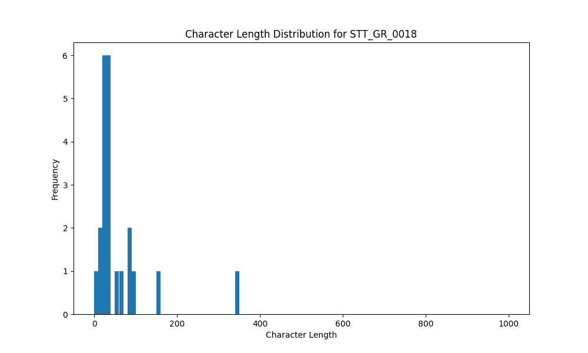

# Analysis Report for STT_GR_0018

## Summary Statistics

| Metric | Value |
|--------|-------|
| Total Segments | 22 |
| Total Duration | 70.42 seconds |
| Total Characters | 1265 |
| Average Characters/Segment | 57.50 |

## Character Length Distribution

## Detailed Statistics by Character Length Bins

### Bin: (0.0, 10.0]

| Metric | Value |
|--------|-------|
| Number of Segments | 1.0 |
| Average Character Length | 5.0 |
| Total Characters | 5.0 |
| Average Duration | 0.54 seconds |
| Total Duration | 0.54 seconds |

#### Files in this bin:

| File Name | Character Length | Duration (s) |
|-----------|-----------------|---------------|
| STT_GR_0018_0032_68952_to_69496 | 5 | 0.54 |

### Bin: (10.0, 20.0]

| Metric | Value |
|--------|-------|
| Number of Segments | 3.0 |
| Average Character Length | 16.0 |
| Total Characters | 48.0 |
| Average Duration | 0.85 seconds |
| Total Duration | 2.56 seconds |

#### Files in this bin:

| File Name | Character Length | Duration (s) |
|-----------|-----------------|---------------|
| STT_GR_0018_0014_39032_to_39928 | 17 | 0.90 |
| STT_GR_0018_0007_28151_to_29144 | 20 | 0.99 |
| STT_GR_0018_0012_37208_to_37879 | 11 | 0.67 |

### Bin: (20.0, 30.0]

| Metric | Value |
|--------|-------|
| Number of Segments | 5.0 |
| Average Character Length | 25.2 |
| Total Characters | 126.0 |
| Average Duration | 1.09 seconds |
| Total Duration | 5.47 seconds |

#### Files in this bin:

| File Name | Character Length | Duration (s) |
|-----------|-----------------|---------------|
| STT_GR_0018_0006_27095_to_28087 | 26 | 0.99 |
| STT_GR_0018_0011_35096_to_36120 | 25 | 1.02 |
| STT_GR_0018_0009_31287_to_32088 | 21 | 0.80 |
| STT_GR_0018_0003_21656_to_23000 | 29 | 1.34 |
| STT_GR_0018_0008_29176_to_30488 | 25 | 1.31 |

### Bin: (30.0, 40.0]

| Metric | Value |
|--------|-------|
| Number of Segments | 6.0 |
| Average Character Length | 33.5 |
| Total Characters | 201.0 |
| Average Duration | 1.55 seconds |
| Total Duration | 9.31 seconds |

#### Files in this bin:

| File Name | Character Length | Duration (s) |
|-----------|-----------------|---------------|
| STT_GR_0018_0031_65976_to_68184 | 31 | 2.21 |
| STT_GR_0018_0005_25592_to_27000 | 36 | 1.41 |
| STT_GR_0018_0004_23479_to_24855 | 31 | 1.38 |
| STT_GR_0018_0027_60184_to_61592 | 34 | 1.41 |
| STT_GR_0018_0017_43768_to_45432 | 37 | 1.66 |
| STT_GR_0018_0022_53848_to_55096 | 32 | 1.25 |

### Bin: (50.0, 60.0]

| Metric | Value |
|--------|-------|
| Number of Segments | 1.0 |
| Average Character Length | 53.0 |
| Total Characters | 53.0 |
| Average Duration | 2.18 seconds |
| Total Duration | 2.18 seconds |

#### Files in this bin:

| File Name | Character Length | Duration (s) |
|-----------|-----------------|---------------|
| STT_GR_0018_0018_45848_to_48024 | 53 | 2.18 |

### Bin: (60.0, 70.0]

| Metric | Value |
|--------|-------|
| Number of Segments | 1.0 |
| Average Character Length | 63.0 |
| Total Characters | 63.0 |
| Average Duration | 2.66 seconds |
| Total Duration | 2.66 seconds |

#### Files in this bin:

| File Name | Character Length | Duration (s) |
|-----------|-----------------|---------------|
| STT_GR_0018_0021_50872_to_53528 | 63 | 2.66 |

### Bin: (80.0, 90.0]

| Metric | Value |
|--------|-------|
| Number of Segments | 2.0 |
| Average Character Length | 87.5 |
| Total Characters | 175.0 |
| Average Duration | 6.95 seconds |
| Total Duration | 13.9 seconds |

#### Files in this bin:

| File Name | Character Length | Duration (s) |
|-----------|-----------------|---------------|
| STT_GR_0018_0001_6600_to_13900 | 88 | 7.30 |
| STT_GR_0018_0002_14500_to_21100 | 87 | 6.60 |

### Bin: (90.0, 100.0]

| Metric | Value |
|--------|-------|
| Number of Segments | 1.0 |
| Average Character Length | 94.0 |
| Total Characters | 94.0 |
| Average Duration | 5.4 seconds |
| Total Duration | 5.4 seconds |

#### Files in this bin:

| File Name | Character Length | Duration (s) |
|-----------|-----------------|---------------|
| STT_GR_0018_0036_99200_to_104600 | 94 | 5.40 |

### Bin: (150.0, 160.0]

| Metric | Value |
|--------|-------|
| Number of Segments | 1.0 |
| Average Character Length | 157.0 |
| Total Characters | 157.0 |
| Average Duration | 7.7 seconds |
| Total Duration | 7.7 seconds |

#### Files in this bin:

| File Name | Character Length | Duration (s) |
|-----------|-----------------|---------------|
| STT_GR_0018_0038_127000_to_134700 | 157 | 7.70 |

### Bin: (340.0, 350.0]

| Metric | Value |
|--------|-------|
| Number of Segments | 1.0 |
| Average Character Length | 343.0 |
| Total Characters | 343.0 |
| Average Duration | 20.7 seconds |
| Total Duration | 20.7 seconds |

#### Files in this bin:

| File Name | Character Length | Duration (s) |
|-----------|-----------------|---------------|
| STT_GR_0018_0037_105500_to_126200 | 343 | 20.70 |

