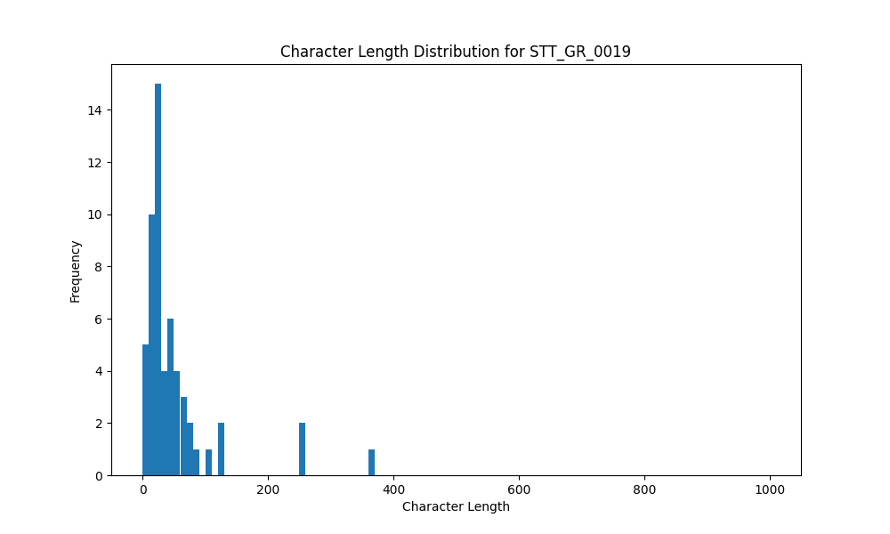

# Analysis Report for STT_GR_0019

## Summary Statistics

| Metric | Value |
|--------|-------|
| Total Segments | 56 |
| Total Duration | 156.91 seconds |
| Total Characters | 2830 |
| Average Characters/Segment | 50.54 |

## Character Length Distribution

## Detailed Statistics by Character Length Bins

### Bin: (0.0, 10.0]

| Metric | Value |
|--------|-------|
| Number of Segments | 5.0 |
| Average Character Length | 6.6 |
| Total Characters | 33.0 |
| Average Duration | 0.84 seconds |
| Total Duration | 4.19 seconds |

#### Files in this bin:

| File Name | Character Length | Duration (s) |
|-----------|-----------------|---------------|
| STT_GR_0019_0315_1576856_to_1577560 | 7 | 0.70 |
| STT_GR_0019_0085_437908_to_438515 | 5 | 0.61 |
| STT_GR_0019_0079_426580_to_427956 | 8 | 1.38 |
| STT_GR_0019_0110_492948_to_493460 | 5 | 0.51 |
| STT_GR_0019_0100_475123_to_476116 | 8 | 0.99 |

### Bin: (10.0, 20.0]

| Metric | Value |
|--------|-------|
| Number of Segments | 13.0 |
| Average Character Length | 16.38 |
| Total Characters | 213.0 |
| Average Duration | 0.79 seconds |
| Total Duration | 10.21 seconds |

#### Files in this bin:

| File Name | Character Length | Duration (s) |
|-----------|-----------------|---------------|
| STT_GR_0019_0301_1553495_to_1554296 | 15 | 0.80 |
| STT_GR_0019_0061_355800_to_356695 | 16 | 0.90 |
| STT_GR_0019_0317_1579576_to_1580568 | 14 | 0.99 |
| STT_GR_0019_0259_1338247_to_1339080 | 16 | 0.83 |
| STT_GR_0019_0254_1332679_to_1333255 | 14 | 0.58 |
| STT_GR_0019_0060_354520_to_355352 | 20 | 0.83 |
| STT_GR_0019_0111_493844_to_494548 | 16 | 0.70 |
| STT_GR_0019_0033_206448_to_207184 | 20 | 0.74 |
| STT_GR_0019_0159_689268_to_689844 | 12 | 0.58 |
| STT_GR_0019_0246_1317063_to_1317639 | 17 | 0.58 |
| STT_GR_0019_0204_1129092_to_1129764 | 17 | 0.67 |
| STT_GR_0019_0227_1176516_to_1177604 | 20 | 1.09 |
| STT_GR_0019_0102_478099_to_479027 | 16 | 0.93 |

### Bin: (20.0, 30.0]

| Metric | Value |
|--------|-------|
| Number of Segments | 12.0 |
| Average Character Length | 25.25 |
| Total Characters | 303.0 |
| Average Duration | 1.12 seconds |
| Total Duration | 13.45 seconds |

#### Files in this bin:

| File Name | Character Length | Duration (s) |
|-----------|-----------------|---------------|
| STT_GR_0019_0261_1340904_to_1341992 | 26 | 1.09 |
| STT_GR_0019_0206_1133060_to_1134116 | 25 | 1.06 |
| STT_GR_0019_0042_314024_to_315048 | 27 | 1.02 |
| STT_GR_0019_0311_1570936_to_1571672 | 22 | 0.74 |
| STT_GR_0019_0209_1136804_to_1137604 | 25 | 0.80 |
| STT_GR_0019_0049_332072_to_333352 | 27 | 1.28 |
| STT_GR_0019_0191_965600_to_967500 | 28 | 1.90 |
| STT_GR_0019_0322_1587672_to_1588856 | 25 | 1.18 |
| STT_GR_0019_0116_501075_to_502164 | 23 | 1.09 |
| STT_GR_0019_0288_1434468_to_1435524 | 26 | 1.06 |
| STT_GR_0019_0117_502195_to_503251 | 24 | 1.06 |
| STT_GR_0019_0125_516563_to_517747 | 25 | 1.18 |

### Bin: (30.0, 40.0]

| Metric | Value |
|--------|-------|
| Number of Segments | 4.0 |
| Average Character Length | 33.75 |
| Total Characters | 135.0 |
| Average Duration | 2.02 seconds |
| Total Duration | 8.06 seconds |

#### Files in this bin:

| File Name | Character Length | Duration (s) |
|-----------|-----------------|---------------|
| STT_GR_0019_0308_1563704_to_1565303 | 33 | 1.60 |
| STT_GR_0019_0276_1412484_to_1413924 | 38 | 1.44 |
| STT_GR_0019_0220_1159844_to_1163588 | 31 | 3.74 |
| STT_GR_0019_0255_1333351_to_1334631 | 33 | 1.28 |

### Bin: (40.0, 50.0]

| Metric | Value |
|--------|-------|
| Number of Segments | 6.0 |
| Average Character Length | 44.33 |
| Total Characters | 266.0 |
| Average Duration | 2.07 seconds |
| Total Duration | 12.42 seconds |

#### Files in this bin:

| File Name | Character Length | Duration (s) |
|-----------|-----------------|---------------|
| STT_GR_0019_0027_192368_to_194384 | 44 | 2.02 |
| STT_GR_0019_0052_339432_to_341063 | 41 | 1.63 |
| STT_GR_0019_0073_382840_to_384440 | 41 | 1.60 |
| STT_GR_0019_0155_682964_to_685460 | 48 | 2.50 |
| STT_GR_0019_0222_1165924_to_1168004 | 49 | 2.08 |
| STT_GR_0019_0290_1440500_to_1443100 | 43 | 2.60 |

### Bin: (50.0, 60.0]

| Metric | Value |
|--------|-------|
| Number of Segments | 4.0 |
| Average Character Length | 54.25 |
| Total Characters | 217.0 |
| Average Duration | 2.54 seconds |
| Total Duration | 10.15 seconds |

#### Files in this bin:

| File Name | Character Length | Duration (s) |
|-----------|-----------------|---------------|
| STT_GR_0019_0274_1409028_to_1411236 | 53 | 2.21 |
| STT_GR_0019_0171_721600_to_724200 | 52 | 2.60 |
| STT_GR_0019_0236_1263900_to_1267000 | 57 | 3.10 |
| STT_GR_0019_0070_374135_to_376376 | 55 | 2.24 |

### Bin: (60.0, 70.0]

| Metric | Value |
|--------|-------|
| Number of Segments | 4.0 |
| Average Character Length | 65.5 |
| Total Characters | 262.0 |
| Average Duration | 3.48 seconds |
| Total Duration | 13.92 seconds |

#### Files in this bin:

| File Name | Character Length | Duration (s) |
|-----------|-----------------|---------------|
| STT_GR_0019_0267_1389028_to_1392804 | 70 | 3.78 |
| STT_GR_0019_0017_164200_to_169100 | 66 | 4.90 |
| STT_GR_0019_0103_479060_to_481683 | 61 | 2.62 |
| STT_GR_0019_0072_378712_to_381336 | 65 | 2.62 |

### Bin: (70.0, 80.0]

| Metric | Value |
|--------|-------|
| Number of Segments | 2.0 |
| Average Character Length | 79.5 |
| Total Characters | 159.0 |
| Average Duration | 5.55 seconds |
| Total Duration | 11.1 seconds |

#### Files in this bin:

| File Name | Character Length | Duration (s) |
|-----------|-----------------|---------------|
| STT_GR_0019_0075_388900_to_394100 | 79 | 5.20 |
| STT_GR_0019_0175_769000_to_774900 | 80 | 5.90 |

### Bin: (100.0, 110.0]

| Metric | Value |
|--------|-------|
| Number of Segments | 1.0 |
| Average Character Length | 109.0 |
| Total Characters | 109.0 |
| Average Duration | 6.0 seconds |
| Total Duration | 6.0 seconds |

#### Files in this bin:

| File Name | Character Length | Duration (s) |
|-----------|-----------------|---------------|
| STT_GR_0019_0128_557700_to_563700 | 109 | 6.00 |

### Bin: (120.0, 130.0]

| Metric | Value |
|--------|-------|
| Number of Segments | 2.0 |
| Average Character Length | 126.5 |
| Total Characters | 253.0 |
| Average Duration | 7.35 seconds |
| Total Duration | 14.7 seconds |

#### Files in this bin:

| File Name | Character Length | Duration (s) |
|-----------|-----------------|---------------|
| STT_GR_0019_0130_567200_to_573700 | 126 | 6.50 |
| STT_GR_0019_0133_616800_to_625000 | 127 | 8.20 |

### Bin: (250.0, 260.0]

| Metric | Value |
|--------|-------|
| Number of Segments | 2.0 |
| Average Character Length | 255.5 |
| Total Characters | 511.0 |
| Average Duration | 16.45 seconds |
| Total Duration | 32.9 seconds |

#### Files in this bin:

| File Name | Character Length | Duration (s) |
|-----------|-----------------|---------------|
| STT_GR_0019_0188_933500_to_950500 | 254 | 17.00 |
| STT_GR_0019_0233_1230600_to_1246500 | 257 | 15.90 |

### Bin: (360.0, 370.0]

| Metric | Value |
|--------|-------|
| Number of Segments | 1.0 |
| Average Character Length | 369.0 |
| Total Characters | 369.0 |
| Average Duration | 19.8 seconds |
| Total Duration | 19.8 seconds |

#### Files in this bin:

| File Name | Character Length | Duration (s) |
|-----------|-----------------|---------------|
| STT_GR_0019_0295_1504100_to_1523900 | 369 | 19.80 |

