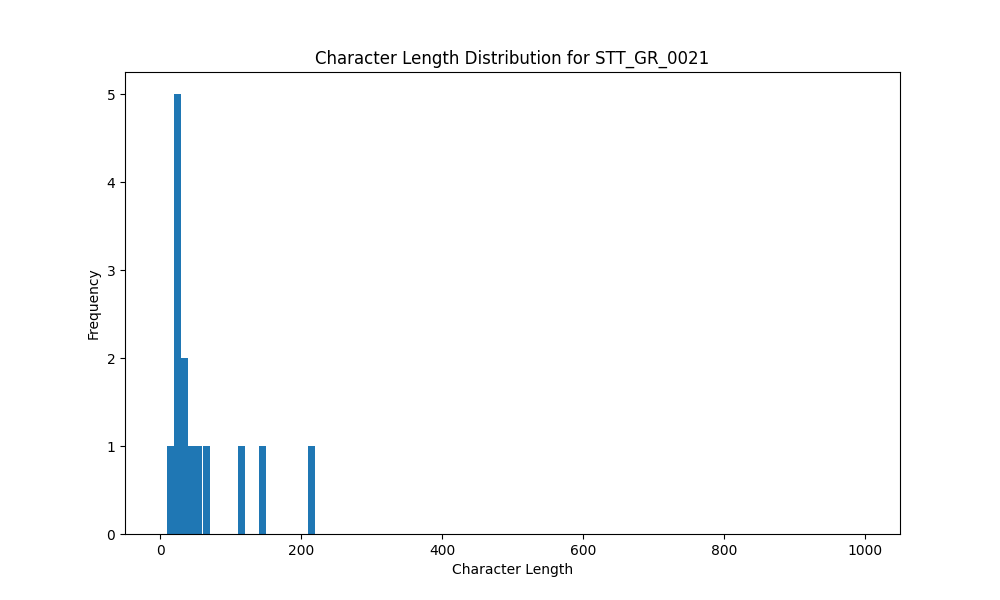

# Analysis Report for STT_GR_0021

## Summary Statistics

| Metric | Value |
|--------|-------|
| Total Segments | 14 |
| Total Duration | 50.81 seconds |
| Total Characters | 841 |
| Average Characters/Segment | 60.07 |

## Character Length Distribution

## Detailed Statistics by Character Length Bins

### Bin: (10.0, 20.0]

| Metric | Value |
|--------|-------|
| Number of Segments | 3.0 |
| Average Character Length | 19.33 |
| Total Characters | 58.0 |
| Average Duration | 1.14 seconds |
| Total Duration | 3.44 seconds |

#### Files in this bin:

| File Name | Character Length | Duration (s) |
|-----------|-----------------|---------------|
| STT_GR_0021_0047_325288_to_326183 | 20 | 0.90 |
| STT_GR_0021_0167_1124944_to_1125584 | 18 | 0.64 |
| STT_GR_0021_0024_212400_to_214300 | 20 | 1.90 |

### Bin: (20.0, 30.0]

| Metric | Value |
|--------|-------|
| Number of Segments | 4.0 |
| Average Character Length | 26.5 |
| Total Characters | 106.0 |
| Average Duration | 1.79 seconds |
| Total Duration | 7.17 seconds |

#### Files in this bin:

| File Name | Character Length | Duration (s) |
|-----------|-----------------|---------------|
| STT_GR_0021_0122_934816_to_936000 | 21 | 1.18 |
| STT_GR_0021_0095_756387_to_757476 | 30 | 1.09 |
| STT_GR_0021_0023_209700_to_211600 | 26 | 1.90 |
| STT_GR_0021_0019_180800_to_183800 | 29 | 3.00 |

### Bin: (30.0, 40.0]

| Metric | Value |
|--------|-------|
| Number of Segments | 1.0 |
| Average Character Length | 37.0 |
| Total Characters | 37.0 |
| Average Duration | 2.5 seconds |
| Total Duration | 2.5 seconds |

#### Files in this bin:

| File Name | Character Length | Duration (s) |
|-----------|-----------------|---------------|
| STT_GR_0021_0057_433700_to_436200 | 37 | 2.50 |

### Bin: (40.0, 50.0]

| Metric | Value |
|--------|-------|
| Number of Segments | 1.0 |
| Average Character Length | 49.0 |
| Total Characters | 49.0 |
| Average Duration | 3.4 seconds |
| Total Duration | 3.4 seconds |

#### Files in this bin:

| File Name | Character Length | Duration (s) |
|-----------|-----------------|---------------|
| STT_GR_0021_0022_205700_to_209100 | 49 | 3.40 |

### Bin: (50.0, 60.0]

| Metric | Value |
|--------|-------|
| Number of Segments | 1.0 |
| Average Character Length | 52.0 |
| Total Characters | 52.0 |
| Average Duration | 2.02 seconds |
| Total Duration | 2.02 seconds |

#### Files in this bin:

| File Name | Character Length | Duration (s) |
|-----------|-----------------|---------------|
| STT_GR_0021_0168_1125616_to_1127632 | 52 | 2.02 |

### Bin: (60.0, 70.0]

| Metric | Value |
|--------|-------|
| Number of Segments | 1.0 |
| Average Character Length | 62.0 |
| Total Characters | 62.0 |
| Average Duration | 1.98 seconds |
| Total Duration | 1.98 seconds |

#### Files in this bin:

| File Name | Character Length | Duration (s) |
|-----------|-----------------|---------------|
| STT_GR_0021_0093_752164_to_754148 | 62 | 1.98 |

### Bin: (110.0, 120.0]

| Metric | Value |
|--------|-------|
| Number of Segments | 1.0 |
| Average Character Length | 118.0 |
| Total Characters | 118.0 |
| Average Duration | 7.0 seconds |
| Total Duration | 7.0 seconds |

#### Files in this bin:

| File Name | Character Length | Duration (s) |
|-----------|-----------------|---------------|
| STT_GR_0021_0155_1041200_to_1048200 | 118 | 7.00 |

### Bin: (140.0, 150.0]

| Metric | Value |
|--------|-------|
| Number of Segments | 1.0 |
| Average Character Length | 147.0 |
| Total Characters | 147.0 |
| Average Duration | 10.3 seconds |
| Total Duration | 10.3 seconds |

#### Files in this bin:

| File Name | Character Length | Duration (s) |
|-----------|-----------------|---------------|
| STT_GR_0021_0149_996700_to_1007000 | 147 | 10.30 |

### Bin: (210.0, 220.0]

| Metric | Value |
|--------|-------|
| Number of Segments | 1.0 |
| Average Character Length | 212.0 |
| Total Characters | 212.0 |
| Average Duration | 13.0 seconds |
| Total Duration | 13.0 seconds |

#### Files in this bin:

| File Name | Character Length | Duration (s) |
|-----------|-----------------|---------------|
| STT_GR_0021_0087_727300_to_740300 | 212 | 13.00 |

