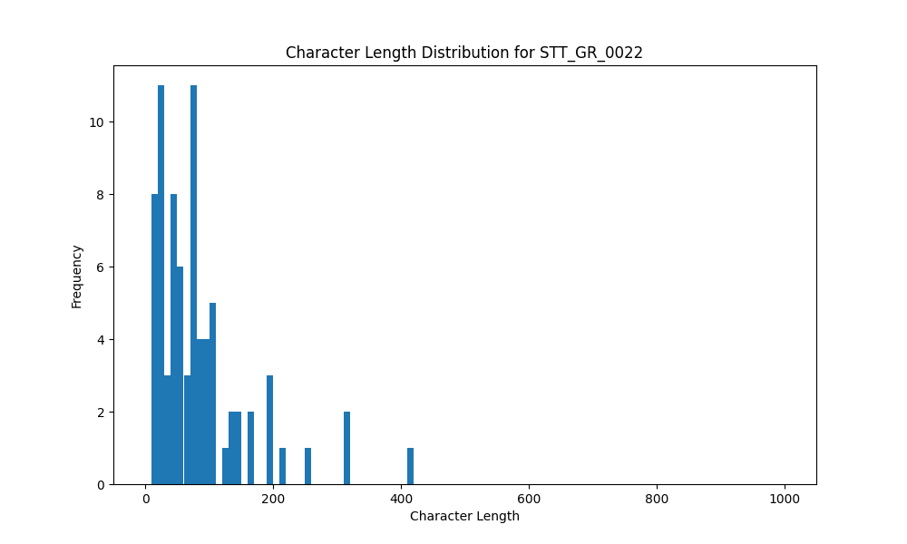

# Analysis Report for STT_GR_0022

## Summary Statistics

| Metric | Value |
|--------|-------|
| Total Segments | 78 |
| Total Duration | 390.58 seconds |
| Total Characters | 6566 |
| Average Characters/Segment | 84.18 |

## Character Length Distribution

## Detailed Statistics by Character Length Bins

### Bin: (0.0, 10.0]

| Metric | Value |
|--------|-------|
| Number of Segments | 1.0 |
| Average Character Length | 10.0 |
| Total Characters | 10.0 |
| Average Duration | 0.64 seconds |
| Total Duration | 0.64 seconds |

#### Files in this bin:

| File Name | Character Length | Duration (s) |
|-----------|-----------------|---------------|
| STT_GR_0022_0279_1905484_to_1906124 | 10 | 0.64 |

### Bin: (10.0, 20.0]

| Metric | Value |
|--------|-------|
| Number of Segments | 8.0 |
| Average Character Length | 16.25 |
| Total Characters | 130.0 |
| Average Duration | 1.14 seconds |
| Total Duration | 9.12 seconds |

#### Files in this bin:

| File Name | Character Length | Duration (s) |
|-----------|-----------------|---------------|
| STT_GR_0022_0211_1615328_to_1616064 | 16 | 0.74 |
| STT_GR_0022_0270_1890028_to_1891084 | 15 | 1.06 |
| STT_GR_0022_0322_2118332_to_2119163 | 11 | 0.83 |
| STT_GR_0022_0229_1713500_to_1715800 | 20 | 2.30 |
| STT_GR_0022_0233_1745940_to_1746900 | 19 | 0.96 |
| STT_GR_0022_0300_2048012_to_2048908 | 19 | 0.90 |
| STT_GR_0022_0274_1896268_to_1896908 | 13 | 0.64 |
| STT_GR_0022_0226_1674100_to_1675800 | 17 | 1.70 |

### Bin: (20.0, 30.0]

| Metric | Value |
|--------|-------|
| Number of Segments | 10.0 |
| Average Character Length | 24.0 |
| Total Characters | 240.0 |
| Average Duration | 1.33 seconds |
| Total Duration | 13.32 seconds |

#### Files in this bin:

| File Name | Character Length | Duration (s) |
|-----------|-----------------|---------------|
| STT_GR_0022_0125_1151036_to_1152124 | 21 | 1.09 |
| STT_GR_0022_0218_1630336_to_1631680 | 27 | 1.34 |
| STT_GR_0022_0051_474700_to_476300 | 23 | 1.60 |
| STT_GR_0022_0143_1192916_to_1194004 | 22 | 1.09 |
| STT_GR_0022_0216_1627872_to_1628768 | 29 | 0.90 |
| STT_GR_0022_0033_289900_to_293300 | 22 | 3.40 |
| STT_GR_0022_0220_1633664_to_1634528 | 26 | 0.86 |
| STT_GR_0022_0253_1778324_to_1779476 | 21 | 1.15 |
| STT_GR_0022_0272_1892908_to_1893740 | 28 | 0.83 |
| STT_GR_0022_0268_1886732_to_1887788 | 21 | 1.06 |

### Bin: (30.0, 40.0]

| Metric | Value |
|--------|-------|
| Number of Segments | 4.0 |
| Average Character Length | 37.75 |
| Total Characters | 151.0 |
| Average Duration | 1.78 seconds |
| Total Duration | 7.11 seconds |

#### Files in this bin:

| File Name | Character Length | Duration (s) |
|-----------|-----------------|---------------|
| STT_GR_0022_0306_2057036_to_2058380 | 40 | 1.34 |
| STT_GR_0022_0265_1881516_to_1882924 | 37 | 1.41 |
| STT_GR_0022_0100_896700_to_899300 | 35 | 2.60 |
| STT_GR_0022_0204_1598848_to_1600608 | 39 | 1.76 |

### Bin: (40.0, 50.0]

| Metric | Value |
|--------|-------|
| Number of Segments | 7.0 |
| Average Character Length | 45.86 |
| Total Characters | 321.0 |
| Average Duration | 2.79 seconds |
| Total Duration | 19.5 seconds |

#### Files in this bin:

| File Name | Character Length | Duration (s) |
|-----------|-----------------|---------------|
| STT_GR_0022_0280_1906412_to_1908140 | 42 | 1.73 |
| STT_GR_0022_0210_1612864_to_1614816 | 44 | 1.95 |
| STT_GR_0022_0326_2125147_to_2127035 | 48 | 1.89 |
| STT_GR_0022_0200_1575100_to_1580100 | 48 | 5.00 |
| STT_GR_0022_0325_2122332_to_2124763 | 49 | 2.43 |
| STT_GR_0022_0001_6800_to_10300 | 43 | 3.50 |
| STT_GR_0022_0009_72600_to_75600 | 47 | 3.00 |

### Bin: (50.0, 60.0]

| Metric | Value |
|--------|-------|
| Number of Segments | 6.0 |
| Average Character Length | 56.17 |
| Total Characters | 337.0 |
| Average Duration | 3.36 seconds |
| Total Duration | 20.17 seconds |

#### Files in this bin:

| File Name | Character Length | Duration (s) |
|-----------|-----------------|---------------|
| STT_GR_0022_0189_1500500_to_1504500 | 58 | 4.00 |
| STT_GR_0022_0172_1421600_to_1425700 | 52 | 4.10 |
| STT_GR_0022_0078_678200_to_680700 | 57 | 2.50 |
| STT_GR_0022_0215_1625312_to_1627584 | 58 | 2.27 |
| STT_GR_0022_0328_2132252_to_2134652 | 55 | 2.40 |
| STT_GR_0022_0192_1514900_to_1519800 | 57 | 4.90 |

### Bin: (60.0, 70.0]

| Metric | Value |
|--------|-------|
| Number of Segments | 5.0 |
| Average Character Length | 67.4 |
| Total Characters | 337.0 |
| Average Duration | 3.74 seconds |
| Total Duration | 18.7 seconds |

#### Files in this bin:

| File Name | Character Length | Duration (s) |
|-----------|-----------------|---------------|
| STT_GR_0022_0014_103300_to_106100 | 63 | 2.80 |
| STT_GR_0022_0155_1245500_to_1249000 | 68 | 3.50 |
| STT_GR_0022_0027_218700_to_223000 | 70 | 4.30 |
| STT_GR_0022_0098_874300_to_878600 | 70 | 4.30 |
| STT_GR_0022_0081_687500_to_691300 | 66 | 3.80 |

### Bin: (70.0, 80.0]

| Metric | Value |
|--------|-------|
| Number of Segments | 9.0 |
| Average Character Length | 74.56 |
| Total Characters | 671.0 |
| Average Duration | 4.95 seconds |
| Total Duration | 44.58 seconds |

#### Files in this bin:

| File Name | Character Length | Duration (s) |
|-----------|-----------------|---------------|
| STT_GR_0022_0034_293600_to_300100 | 78 | 6.50 |
| STT_GR_0022_0190_1504900_to_1509500 | 74 | 4.60 |
| STT_GR_0022_0024_195500_to_200600 | 74 | 5.10 |
| STT_GR_0022_0074_637800_to_642400 | 71 | 4.60 |
| STT_GR_0022_0004_34700_to_38500 | 74 | 3.80 |
| STT_GR_0022_0119_1138204_to_1141468 | 77 | 3.26 |
| STT_GR_0022_0089_778400_to_783700 | 73 | 5.30 |
| STT_GR_0022_0287_1948800_to_1956500 | 72 | 7.70 |
| STT_GR_0022_0148_1202100_to_1205812 | 78 | 3.71 |

### Bin: (80.0, 90.0]

| Metric | Value |
|--------|-------|
| Number of Segments | 4.0 |
| Average Character Length | 86.25 |
| Total Characters | 345.0 |
| Average Duration | 4.24 seconds |
| Total Duration | 16.95 seconds |

#### Files in this bin:

| File Name | Character Length | Duration (s) |
|-----------|-----------------|---------------|
| STT_GR_0022_0327_2127419_to_2131323 | 89 | 3.90 |
| STT_GR_0022_0180_1454740_to_1458484 | 83 | 3.74 |
| STT_GR_0022_0222_1637200_to_1642400 | 87 | 5.20 |
| STT_GR_0022_0090_784900_to_789000 | 86 | 4.10 |

### Bin: (90.0, 100.0]

| Metric | Value |
|--------|-------|
| Number of Segments | 4.0 |
| Average Character Length | 92.75 |
| Total Characters | 371.0 |
| Average Duration | 5.98 seconds |
| Total Duration | 23.9 seconds |

#### Files in this bin:

| File Name | Character Length | Duration (s) |
|-----------|-----------------|---------------|
| STT_GR_0022_0070_614300_to_620300 | 97 | 6.00 |
| STT_GR_0022_0005_39600_to_45600 | 91 | 6.00 |
| STT_GR_0022_0012_87800_to_94300 | 92 | 6.50 |
| STT_GR_0022_0095_837800_to_843200 | 91 | 5.40 |

### Bin: (100.0, 110.0]

| Metric | Value |
|--------|-------|
| Number of Segments | 5.0 |
| Average Character Length | 105.2 |
| Total Characters | 526.0 |
| Average Duration | 6.68 seconds |
| Total Duration | 33.39 seconds |

#### Files in this bin:

| File Name | Character Length | Duration (s) |
|-----------|-----------------|---------------|
| STT_GR_0022_0010_75900_to_81700 | 108 | 5.80 |
| STT_GR_0022_0002_16200_to_24800 | 106 | 8.60 |
| STT_GR_0022_0255_1781140_to_1786132 | 101 | 4.99 |
| STT_GR_0022_0008_61900_to_68600 | 105 | 6.70 |
| STT_GR_0022_0042_370800_to_378100 | 106 | 7.30 |

### Bin: (120.0, 130.0]

| Metric | Value |
|--------|-------|
| Number of Segments | 1.0 |
| Average Character Length | 128.0 |
| Total Characters | 128.0 |
| Average Duration | 6.8 seconds |
| Total Duration | 6.8 seconds |

#### Files in this bin:

| File Name | Character Length | Duration (s) |
|-----------|-----------------|---------------|
| STT_GR_0022_0163_1338900_to_1345700 | 128 | 6.80 |

### Bin: (130.0, 140.0]

| Metric | Value |
|--------|-------|
| Number of Segments | 2.0 |
| Average Character Length | 138.0 |
| Total Characters | 276.0 |
| Average Duration | 7.55 seconds |
| Total Duration | 15.1 seconds |

#### Files in this bin:

| File Name | Character Length | Duration (s) |
|-----------|-----------------|---------------|
| STT_GR_0022_0154_1233400_to_1241500 | 137 | 8.10 |
| STT_GR_0022_0315_2096900_to_2103900 | 139 | 7.00 |

### Bin: (140.0, 150.0]

| Metric | Value |
|--------|-------|
| Number of Segments | 2.0 |
| Average Character Length | 145.5 |
| Total Characters | 291.0 |
| Average Duration | 7.05 seconds |
| Total Duration | 14.1 seconds |

#### Files in this bin:

| File Name | Character Length | Duration (s) |
|-----------|-----------------|---------------|
| STT_GR_0022_0332_2141100_to_2148300 | 146 | 7.20 |
| STT_GR_0022_0106_943700_to_950600 | 145 | 6.90 |

### Bin: (160.0, 170.0]

| Metric | Value |
|--------|-------|
| Number of Segments | 2.0 |
| Average Character Length | 163.0 |
| Total Characters | 326.0 |
| Average Duration | 9.75 seconds |
| Total Duration | 19.5 seconds |

#### Files in this bin:

| File Name | Character Length | Duration (s) |
|-----------|-----------------|---------------|
| STT_GR_0022_0105_932300_to_942900 | 163 | 10.60 |
| STT_GR_0022_0337_2200900_to_2209800 | 163 | 8.90 |

### Bin: (190.0, 200.0]

| Metric | Value |
|--------|-------|
| Number of Segments | 3.0 |
| Average Character Length | 196.33 |
| Total Characters | 589.0 |
| Average Duration | 11.03 seconds |
| Total Duration | 33.1 seconds |

#### Files in this bin:

| File Name | Character Length | Duration (s) |
|-----------|-----------------|---------------|
| STT_GR_0022_0031_262400_to_272100 | 193 | 9.70 |
| STT_GR_0022_0113_1059300_to_1071600 | 198 | 12.30 |
| STT_GR_0022_0197_1544100_to_1555200 | 198 | 11.10 |

### Bin: (210.0, 220.0]

| Metric | Value |
|--------|-------|
| Number of Segments | 1.0 |
| Average Character Length | 211.0 |
| Total Characters | 211.0 |
| Average Duration | 11.9 seconds |
| Total Duration | 11.9 seconds |

#### Files in this bin:

| File Name | Character Length | Duration (s) |
|-----------|-----------------|---------------|
| STT_GR_0022_0158_1283900_to_1295800 | 211 | 11.90 |

### Bin: (250.0, 260.0]

| Metric | Value |
|--------|-------|
| Number of Segments | 1.0 |
| Average Character Length | 257.0 |
| Total Characters | 257.0 |
| Average Duration | 17.1 seconds |
| Total Duration | 17.1 seconds |

#### Files in this bin:

| File Name | Character Length | Duration (s) |
|-----------|-----------------|---------------|
| STT_GR_0022_0068_575800_to_592900 | 257 | 17.10 |

### Bin: (310.0, 320.0]

| Metric | Value |
|--------|-------|
| Number of Segments | 2.0 |
| Average Character Length | 316.5 |
| Total Characters | 633.0 |
| Average Duration | 20.55 seconds |
| Total Duration | 41.1 seconds |

#### Files in this bin:

| File Name | Character Length | Duration (s) |
|-----------|-----------------|---------------|
| STT_GR_0022_0336_2180700_to_2200500 | 316 | 19.80 |
| STT_GR_0022_0228_1690700_to_1712000 | 317 | 21.30 |

### Bin: (410.0, 420.0]

| Metric | Value |
|--------|-------|
| Number of Segments | 1.0 |
| Average Character Length | 416.0 |
| Total Characters | 416.0 |
| Average Duration | 24.5 seconds |
| Total Duration | 24.5 seconds |

#### Files in this bin:

| File Name | Character Length | Duration (s) |
|-----------|-----------------|---------------|
| STT_GR_0022_0050_449600_to_474100 | 416 | 24.50 |

