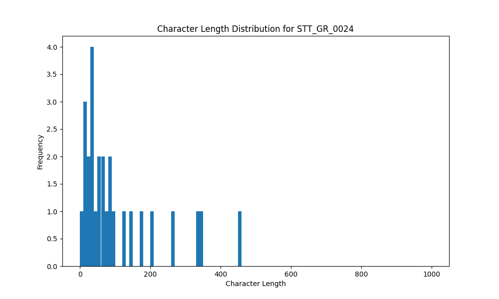

# Analysis Report for STT_GR_0024

## Summary Statistics

| Metric | Value |
|--------|-------|
| Total Segments | 27 |
| Total Duration | 170.32 seconds |
| Total Characters | 2911 |
| Average Characters/Segment | 107.81 |

## Character Length Distribution

## Detailed Statistics by Character Length Bins

### Bin: (0.0, 10.0]

| Metric | Value |
|--------|-------|
| Number of Segments | 1.0 |
| Average Character Length | 8.0 |
| Total Characters | 8.0 |
| Average Duration | 0.7 seconds |
| Total Duration | 0.7 seconds |

#### Files in this bin:

| File Name | Character Length | Duration (s) |
|-----------|-----------------|---------------|
| STT_GR_0024_0083_535128_to_535832 | 8 | 0.70 |

### Bin: (10.0, 20.0]

| Metric | Value |
|--------|-------|
| Number of Segments | 3.0 |
| Average Character Length | 13.67 |
| Total Characters | 41.0 |
| Average Duration | 0.68 seconds |
| Total Duration | 2.05 seconds |

#### Files in this bin:

| File Name | Character Length | Duration (s) |
|-----------|-----------------|---------------|
| STT_GR_0024_0047_327860_to_328628 | 18 | 0.77 |
| STT_GR_0024_0145_997432_to_997976 | 11 | 0.54 |
| STT_GR_0024_0125_899028_to_899764 | 12 | 0.74 |

### Bin: (20.0, 30.0]

| Metric | Value |
|--------|-------|
| Number of Segments | 2.0 |
| Average Character Length | 23.0 |
| Total Characters | 46.0 |
| Average Duration | 1.58 seconds |
| Total Duration | 3.15 seconds |

#### Files in this bin:

| File Name | Character Length | Duration (s) |
|-----------|-----------------|---------------|
| STT_GR_0024_0026_237700_to_239700 | 23 | 2.00 |
| STT_GR_0024_0160_1026743_to_1027896 | 23 | 1.15 |

### Bin: (30.0, 40.0]

| Metric | Value |
|--------|-------|
| Number of Segments | 4.0 |
| Average Character Length | 36.0 |
| Total Characters | 144.0 |
| Average Duration | 1.78 seconds |
| Total Duration | 7.11 seconds |

#### Files in this bin:

| File Name | Character Length | Duration (s) |
|-----------|-----------------|---------------|
| STT_GR_0024_0189_1190960_to_1192560 | 35 | 1.60 |
| STT_GR_0024_0085_541688_to_543064 | 35 | 1.38 |
| STT_GR_0024_0053_336500_to_338036 | 36 | 1.54 |
| STT_GR_0024_0028_253400_to_256000 | 38 | 2.60 |

### Bin: (40.0, 50.0]

| Metric | Value |
|--------|-------|
| Number of Segments | 1.0 |
| Average Character Length | 43.0 |
| Total Characters | 43.0 |
| Average Duration | 1.82 seconds |
| Total Duration | 1.82 seconds |

#### Files in this bin:

| File Name | Character Length | Duration (s) |
|-----------|-----------------|---------------|
| STT_GR_0024_0192_1197680_to_1199504 | 43 | 1.82 |

### Bin: (50.0, 60.0]

| Metric | Value |
|--------|-------|
| Number of Segments | 2.0 |
| Average Character Length | 54.5 |
| Total Characters | 109.0 |
| Average Duration | 3.6 seconds |
| Total Duration | 7.2 seconds |

#### Files in this bin:

| File Name | Character Length | Duration (s) |
|-----------|-----------------|---------------|
| STT_GR_0024_0202_1284500_to_1288200 | 55 | 3.70 |
| STT_GR_0024_0121_874400_to_877900 | 54 | 3.50 |

### Bin: (60.0, 70.0]

| Metric | Value |
|--------|-------|
| Number of Segments | 2.0 |
| Average Character Length | 68.5 |
| Total Characters | 137.0 |
| Average Duration | 3.19 seconds |
| Total Duration | 6.38 seconds |

#### Files in this bin:

| File Name | Character Length | Duration (s) |
|-----------|-----------------|---------------|
| STT_GR_0024_0075_518584_to_521560 | 69 | 2.98 |
| STT_GR_0024_0013_131500_to_134900 | 68 | 3.40 |

### Bin: (70.0, 80.0]

| Metric | Value |
|--------|-------|
| Number of Segments | 1.0 |
| Average Character Length | 72.0 |
| Total Characters | 72.0 |
| Average Duration | 4.4 seconds |
| Total Duration | 4.4 seconds |

#### Files in this bin:

| File Name | Character Length | Duration (s) |
|-----------|-----------------|---------------|
| STT_GR_0024_0115_806500_to_810900 | 72 | 4.40 |

### Bin: (80.0, 90.0]

| Metric | Value |
|--------|-------|
| Number of Segments | 2.0 |
| Average Character Length | 82.0 |
| Total Characters | 164.0 |
| Average Duration | 4.75 seconds |
| Total Duration | 9.5 seconds |

#### Files in this bin:

| File Name | Character Length | Duration (s) |
|-----------|-----------------|---------------|
| STT_GR_0024_0065_459600_to_464200 | 82 | 4.60 |
| STT_GR_0024_0113_789800_to_794700 | 82 | 4.90 |

### Bin: (90.0, 100.0]

| Metric | Value |
|--------|-------|
| Number of Segments | 1.0 |
| Average Character Length | 94.0 |
| Total Characters | 94.0 |
| Average Duration | 5.7 seconds |
| Total Duration | 5.7 seconds |

#### Files in this bin:

| File Name | Character Length | Duration (s) |
|-----------|-----------------|---------------|
| STT_GR_0024_0068_491000_to_496700 | 94 | 5.70 |

### Bin: (120.0, 130.0]

| Metric | Value |
|--------|-------|
| Number of Segments | 1.0 |
| Average Character Length | 125.0 |
| Total Characters | 125.0 |
| Average Duration | 7.4 seconds |
| Total Duration | 7.4 seconds |

#### Files in this bin:

| File Name | Character Length | Duration (s) |
|-----------|-----------------|---------------|
| STT_GR_0024_0108_749800_to_757200 | 125 | 7.40 |

### Bin: (140.0, 150.0]

| Metric | Value |
|--------|-------|
| Number of Segments | 1.0 |
| Average Character Length | 148.0 |
| Total Characters | 148.0 |
| Average Duration | 8.4 seconds |
| Total Duration | 8.4 seconds |

#### Files in this bin:

| File Name | Character Length | Duration (s) |
|-----------|-----------------|---------------|
| STT_GR_0024_0033_275700_to_284100 | 148 | 8.40 |

### Bin: (170.0, 180.0]

| Metric | Value |
|--------|-------|
| Number of Segments | 1.0 |
| Average Character Length | 177.0 |
| Total Characters | 177.0 |
| Average Duration | 10.1 seconds |
| Total Duration | 10.1 seconds |

#### Files in this bin:

| File Name | Character Length | Duration (s) |
|-----------|-----------------|---------------|
| STT_GR_0024_0098_644200_to_654300 | 177 | 10.10 |

### Bin: (200.0, 210.0]

| Metric | Value |
|--------|-------|
| Number of Segments | 1.0 |
| Average Character Length | 204.0 |
| Total Characters | 204.0 |
| Average Duration | 12.4 seconds |
| Total Duration | 12.4 seconds |

#### Files in this bin:

| File Name | Character Length | Duration (s) |
|-----------|-----------------|---------------|
| STT_GR_0024_0165_1069400_to_1081800 | 204 | 12.40 |

### Bin: (260.0, 270.0]

| Metric | Value |
|--------|-------|
| Number of Segments | 1.0 |
| Average Character Length | 269.0 |
| Total Characters | 269.0 |
| Average Duration | 16.1 seconds |
| Total Duration | 16.1 seconds |

#### Files in this bin:

| File Name | Character Length | Duration (s) |
|-----------|-----------------|---------------|
| STT_GR_0024_0204_1295300_to_1311400 | 269 | 16.10 |

### Bin: (330.0, 340.0]

| Metric | Value |
|--------|-------|
| Number of Segments | 2.0 |
| Average Character Length | 335.5 |
| Total Characters | 671.0 |
| Average Duration | 20.55 seconds |
| Total Duration | 41.1 seconds |

#### Files in this bin:

| File Name | Character Length | Duration (s) |
|-----------|-----------------|---------------|
| STT_GR_0024_0117_824700_to_847200 | 331 | 22.50 |
| STT_GR_0024_0099_657000_to_675600 | 340 | 18.60 |

### Bin: (450.0, 460.0]

| Metric | Value |
|--------|-------|
| Number of Segments | 1.0 |
| Average Character Length | 459.0 |
| Total Characters | 459.0 |
| Average Duration | 26.8 seconds |
| Total Duration | 26.8 seconds |

#### Files in this bin:

| File Name | Character Length | Duration (s) |
|-----------|-----------------|---------------|
| STT_GR_0024_0207_1331600_to_1358400 | 459 | 26.80 |

