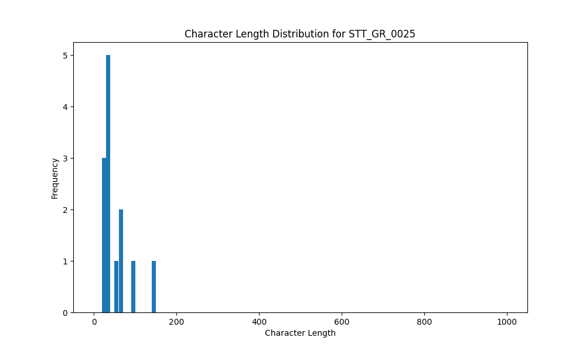

# Analysis Report for STT_GR_0025

## Summary Statistics

| Metric | Value |
|--------|-------|
| Total Segments | 13 |
| Total Duration | 35.59 seconds |
| Total Characters | 666 |
| Average Characters/Segment | 51.23 |

## Character Length Distribution

## Detailed Statistics by Character Length Bins

### Bin: (10.0, 20.0]

| Metric | Value |
|--------|-------|
| Number of Segments | 1.0 |
| Average Character Length | 20.0 |
| Total Characters | 20.0 |
| Average Duration | 0.9 seconds |
| Total Duration | 0.9 seconds |

#### Files in this bin:

| File Name | Character Length | Duration (s) |
|-----------|-----------------|---------------|
| STT_GR_0025_0038_203152_to_204048 | 20 | 0.90 |

### Bin: (20.0, 30.0]

| Metric | Value |
|--------|-------|
| Number of Segments | 3.0 |
| Average Character Length | 24.67 |
| Total Characters | 74.0 |
| Average Duration | 1.69 seconds |
| Total Duration | 5.08 seconds |

#### Files in this bin:

| File Name | Character Length | Duration (s) |
|-----------|-----------------|---------------|
| STT_GR_0025_0061_330792_to_331976 | 21 | 1.18 |
| STT_GR_0025_0022_152800_to_154800 | 30 | 2.00 |
| STT_GR_0025_0017_127100_to_129000 | 23 | 1.90 |

### Bin: (30.0, 40.0]

| Metric | Value |
|--------|-------|
| Number of Segments | 4.0 |
| Average Character Length | 35.5 |
| Total Characters | 142.0 |
| Average Duration | 1.6 seconds |
| Total Duration | 6.4 seconds |

#### Files in this bin:

| File Name | Character Length | Duration (s) |
|-----------|-----------------|---------------|
| STT_GR_0025_0097_478680_to_480344 | 36 | 1.66 |
| STT_GR_0025_0041_206384_to_208112 | 36 | 1.73 |
| STT_GR_0025_0043_210192_to_212048 | 39 | 1.86 |
| STT_GR_0025_0095_474584_to_475736 | 31 | 1.15 |

### Bin: (50.0, 60.0]

| Metric | Value |
|--------|-------|
| Number of Segments | 1.0 |
| Average Character Length | 59.0 |
| Total Characters | 59.0 |
| Average Duration | 2.98 seconds |
| Total Duration | 2.98 seconds |

#### Files in this bin:

| File Name | Character Length | Duration (s) |
|-----------|-----------------|---------------|
| STT_GR_0025_0033_192016_to_194992 | 59 | 2.98 |

### Bin: (60.0, 70.0]

| Metric | Value |
|--------|-------|
| Number of Segments | 2.0 |
| Average Character Length | 66.5 |
| Total Characters | 133.0 |
| Average Duration | 2.77 seconds |
| Total Duration | 5.54 seconds |

#### Files in this bin:

| File Name | Character Length | Duration (s) |
|-----------|-----------------|---------------|
| STT_GR_0025_0059_325736_to_328680 | 69 | 2.94 |
| STT_GR_0025_0099_482967_to_485560 | 64 | 2.59 |

### Bin: (90.0, 100.0]

| Metric | Value |
|--------|-------|
| Number of Segments | 1.0 |
| Average Character Length | 97.0 |
| Total Characters | 97.0 |
| Average Duration | 4.9 seconds |
| Total Duration | 4.9 seconds |

#### Files in this bin:

| File Name | Character Length | Duration (s) |
|-----------|-----------------|---------------|
| STT_GR_0025_0019_135300_to_140200 | 97 | 4.90 |

### Bin: (140.0, 150.0]

| Metric | Value |
|--------|-------|
| Number of Segments | 1.0 |
| Average Character Length | 141.0 |
| Total Characters | 141.0 |
| Average Duration | 9.8 seconds |
| Total Duration | 9.8 seconds |

#### Files in this bin:

| File Name | Character Length | Duration (s) |
|-----------|-----------------|---------------|
| STT_GR_0025_0016_113000_to_122800 | 141 | 9.80 |

