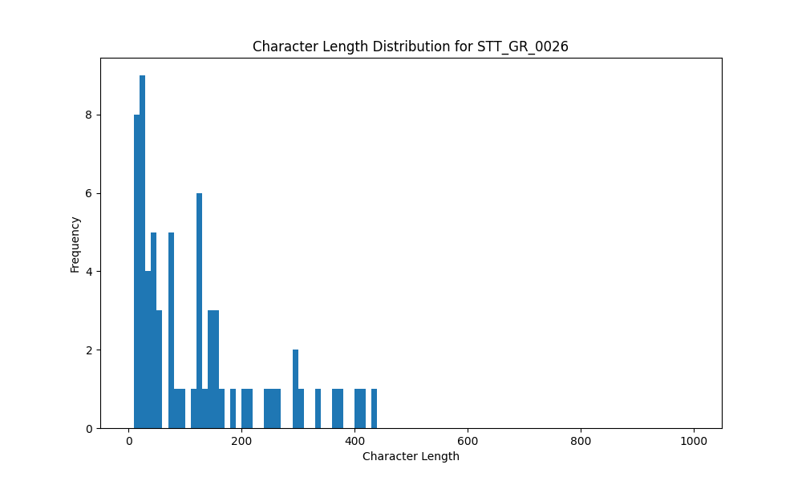

# Analysis Report for STT_GR_0026

## Summary Statistics

| Metric | Value |
|--------|-------|
| Total Segments | 66 |
| Total Duration | 458.12 seconds |
| Total Characters | 8017 |
| Average Characters/Segment | 121.47 |

## Character Length Distribution

## Detailed Statistics by Character Length Bins

### Bin: (10.0, 20.0]

| Metric | Value |
|--------|-------|
| Number of Segments | 9.0 |
| Average Character Length | 16.44 |
| Total Characters | 148.0 |
| Average Duration | 1.04 seconds |
| Total Duration | 9.36 seconds |

#### Files in this bin:

| File Name | Character Length | Duration (s) |
|-----------|-----------------|---------------|
| STT_GR_0026_0033_417628_to_418172 | 15 | 0.54 |
| STT_GR_0026_0091_770536_to_771176 | 17 | 0.64 |
| STT_GR_0026_0005_54300_to_56700 | 14 | 2.40 |
| STT_GR_0026_0095_780712_to_781352 | 15 | 0.64 |
| STT_GR_0026_0078_746504_to_747464 | 19 | 0.96 |
| STT_GR_0026_0045_443996_to_444604 | 13 | 0.61 |
| STT_GR_0026_0081_751272_to_751976 | 18 | 0.70 |
| STT_GR_0026_0026_334000_to_336000 | 17 | 2.00 |
| STT_GR_0026_0036_423260_to_424124 | 20 | 0.86 |

### Bin: (20.0, 30.0]

| Metric | Value |
|--------|-------|
| Number of Segments | 8.0 |
| Average Character Length | 25.88 |
| Total Characters | 207.0 |
| Average Duration | 1.35 seconds |
| Total Duration | 10.78 seconds |

#### Files in this bin:

| File Name | Character Length | Duration (s) |
|-----------|-----------------|---------------|
| STT_GR_0026_0082_752232_to_753256 | 25 | 1.02 |
| STT_GR_0026_0097_800900_to_802900 | 29 | 2.00 |
| STT_GR_0026_0038_426428_to_427388 | 21 | 0.96 |
| STT_GR_0026_0039_428668_to_429980 | 28 | 1.31 |
| STT_GR_0026_0044_442268_to_443548 | 27 | 1.28 |
| STT_GR_0026_0098_803700_to_805500 | 24 | 1.80 |
| STT_GR_0026_0034_418652_to_419676 | 28 | 1.02 |
| STT_GR_0026_0080_749832_to_751208 | 25 | 1.38 |

### Bin: (30.0, 40.0]

| Metric | Value |
|--------|-------|
| Number of Segments | 6.0 |
| Average Character Length | 34.17 |
| Total Characters | 205.0 |
| Average Duration | 1.57 seconds |
| Total Duration | 9.41 seconds |

#### Files in this bin:

| File Name | Character Length | Duration (s) |
|-----------|-----------------|---------------|
| STT_GR_0026_0086_761832_to_763272 | 31 | 1.44 |
| STT_GR_0026_0076_741416_to_742824 | 31 | 1.41 |
| STT_GR_0026_0077_744072_to_745672 | 31 | 1.60 |
| STT_GR_0026_0088_765256_to_767528 | 40 | 2.27 |
| STT_GR_0026_0046_445436_to_446652 | 32 | 1.22 |
| STT_GR_0026_0084_758952_to_760424 | 40 | 1.47 |

### Bin: (40.0, 50.0]

| Metric | Value |
|--------|-------|
| Number of Segments | 3.0 |
| Average Character Length | 44.0 |
| Total Characters | 132.0 |
| Average Duration | 2.73 seconds |
| Total Duration | 8.19 seconds |

#### Files in this bin:

| File Name | Character Length | Duration (s) |
|-----------|-----------------|---------------|
| STT_GR_0026_0079_747496_to_749800 | 45 | 2.30 |
| STT_GR_0026_0035_420124_to_422012 | 42 | 1.89 |
| STT_GR_0026_0062_600300_to_604300 | 45 | 4.00 |

### Bin: (50.0, 60.0]

| Metric | Value |
|--------|-------|
| Number of Segments | 3.0 |
| Average Character Length | 54.67 |
| Total Characters | 164.0 |
| Average Duration | 3.5 seconds |
| Total Duration | 10.5 seconds |

#### Files in this bin:

| File Name | Character Length | Duration (s) |
|-----------|-----------------|---------------|
| STT_GR_0026_0069_662900_to_666300 | 54 | 3.40 |
| STT_GR_0026_0102_850800_to_855300 | 52 | 4.50 |
| STT_GR_0026_0103_855900_to_858500 | 58 | 2.60 |

### Bin: (60.0, 70.0]

| Metric | Value |
|--------|-------|
| Number of Segments | 1.0 |
| Average Character Length | 70.0 |
| Total Characters | 70.0 |
| Average Duration | 4.3 seconds |
| Total Duration | 4.3 seconds |

#### Files in this bin:

| File Name | Character Length | Duration (s) |
|-----------|-----------------|---------------|
| STT_GR_0026_0031_401400_to_405700 | 70 | 4.30 |

### Bin: (70.0, 80.0]

| Metric | Value |
|--------|-------|
| Number of Segments | 4.0 |
| Average Character Length | 73.75 |
| Total Characters | 295.0 |
| Average Duration | 3.92 seconds |
| Total Duration | 15.69 seconds |

#### Files in this bin:

| File Name | Character Length | Duration (s) |
|-----------|-----------------|---------------|
| STT_GR_0026_0101_843000_to_847500 | 72 | 4.50 |
| STT_GR_0026_0092_771912_to_775304 | 77 | 3.39 |
| STT_GR_0026_0056_537100_to_541300 | 71 | 4.20 |
| STT_GR_0026_0072_700900_to_704500 | 75 | 3.60 |

### Bin: (80.0, 90.0]

| Metric | Value |
|--------|-------|
| Number of Segments | 1.0 |
| Average Character Length | 88.0 |
| Total Characters | 88.0 |
| Average Duration | 5.6 seconds |
| Total Duration | 5.6 seconds |

#### Files in this bin:

| File Name | Character Length | Duration (s) |
|-----------|-----------------|---------------|
| STT_GR_0026_0058_568800_to_574400 | 88 | 5.60 |

### Bin: (90.0, 100.0]

| Metric | Value |
|--------|-------|
| Number of Segments | 1.0 |
| Average Character Length | 99.0 |
| Total Characters | 99.0 |
| Average Duration | 6.2 seconds |
| Total Duration | 6.2 seconds |

#### Files in this bin:

| File Name | Character Length | Duration (s) |
|-----------|-----------------|---------------|
| STT_GR_0026_0010_108100_to_114300 | 99 | 6.20 |

### Bin: (100.0, 110.0]

| Metric | Value |
|--------|-------|
| Number of Segments | 1.0 |
| Average Character Length | 110.0 |
| Total Characters | 110.0 |
| Average Duration | 6.0 seconds |
| Total Duration | 6.0 seconds |

#### Files in this bin:

| File Name | Character Length | Duration (s) |
|-----------|-----------------|---------------|
| STT_GR_0026_0053_506400_to_512400 | 110 | 6.00 |

### Bin: (110.0, 120.0]

| Metric | Value |
|--------|-------|
| Number of Segments | 1.0 |
| Average Character Length | 120.0 |
| Total Characters | 120.0 |
| Average Duration | 7.2 seconds |
| Total Duration | 7.2 seconds |

#### Files in this bin:

| File Name | Character Length | Duration (s) |
|-----------|-----------------|---------------|
| STT_GR_0026_0052_499000_to_506200 | 120 | 7.20 |

### Bin: (120.0, 130.0]

| Metric | Value |
|--------|-------|
| Number of Segments | 5.0 |
| Average Character Length | 123.6 |
| Total Characters | 618.0 |
| Average Duration | 7.08 seconds |
| Total Duration | 35.39 seconds |

#### Files in this bin:

| File Name | Character Length | Duration (s) |
|-----------|-----------------|---------------|
| STT_GR_0026_0009_101000_to_107900 | 123 | 6.90 |
| STT_GR_0026_0067_649300_to_657400 | 121 | 8.10 |
| STT_GR_0026_0003_36000_to_43200 | 129 | 7.20 |
| STT_GR_0026_0042_434268_to_439260 | 123 | 4.99 |
| STT_GR_0026_0008_92500_to_100700 | 122 | 8.20 |

### Bin: (130.0, 140.0]

| Metric | Value |
|--------|-------|
| Number of Segments | 2.0 |
| Average Character Length | 138.5 |
| Total Characters | 277.0 |
| Average Duration | 7.85 seconds |
| Total Duration | 15.7 seconds |

#### Files in this bin:

| File Name | Character Length | Duration (s) |
|-----------|-----------------|---------------|
| STT_GR_0026_0001_7300_to_14700 | 140 | 7.40 |
| STT_GR_0026_0070_667200_to_675500 | 137 | 8.30 |

### Bin: (140.0, 150.0]

| Metric | Value |
|--------|-------|
| Number of Segments | 2.0 |
| Average Character Length | 144.0 |
| Total Characters | 288.0 |
| Average Duration | 8.75 seconds |
| Total Duration | 17.5 seconds |

#### Files in this bin:

| File Name | Character Length | Duration (s) |
|-----------|-----------------|---------------|
| STT_GR_0026_0099_806600_to_815200 | 145 | 8.60 |
| STT_GR_0026_0024_308300_to_317200 | 143 | 8.90 |

### Bin: (150.0, 160.0]

| Metric | Value |
|--------|-------|
| Number of Segments | 4.0 |
| Average Character Length | 155.75 |
| Total Characters | 623.0 |
| Average Duration | 9.45 seconds |
| Total Duration | 37.8 seconds |

#### Files in this bin:

| File Name | Character Length | Duration (s) |
|-----------|-----------------|---------------|
| STT_GR_0026_0015_180100_to_189900 | 154 | 9.80 |
| STT_GR_0026_0073_707200_to_716100 | 157 | 8.90 |
| STT_GR_0026_0027_337800_to_347600 | 152 | 9.80 |
| STT_GR_0026_0016_192400_to_201700 | 160 | 9.30 |

### Bin: (180.0, 190.0]

| Metric | Value |
|--------|-------|
| Number of Segments | 1.0 |
| Average Character Length | 183.0 |
| Total Characters | 183.0 |
| Average Duration | 8.7 seconds |
| Total Duration | 8.7 seconds |

#### Files in this bin:

| File Name | Character Length | Duration (s) |
|-----------|-----------------|---------------|
| STT_GR_0026_0060_587100_to_595800 | 183 | 8.70 |

### Bin: (200.0, 210.0]

| Metric | Value |
|--------|-------|
| Number of Segments | 2.0 |
| Average Character Length | 208.0 |
| Total Characters | 416.0 |
| Average Duration | 11.9 seconds |
| Total Duration | 23.8 seconds |

#### Files in this bin:

| File Name | Character Length | Duration (s) |
|-----------|-----------------|---------------|
| STT_GR_0026_0023_294400_to_304500 | 206 | 10.10 |
| STT_GR_0026_0022_279200_to_292900 | 210 | 13.70 |

### Bin: (230.0, 240.0]

| Metric | Value |
|--------|-------|
| Number of Segments | 1.0 |
| Average Character Length | 240.0 |
| Total Characters | 240.0 |
| Average Duration | 12.4 seconds |
| Total Duration | 12.4 seconds |

#### Files in this bin:

| File Name | Character Length | Duration (s) |
|-----------|-----------------|---------------|
| STT_GR_0026_0054_513600_to_526000 | 240 | 12.40 |

### Bin: (240.0, 250.0]

| Metric | Value |
|--------|-------|
| Number of Segments | 1.0 |
| Average Character Length | 250.0 |
| Total Characters | 250.0 |
| Average Duration | 15.4 seconds |
| Total Duration | 15.4 seconds |

#### Files in this bin:

| File Name | Character Length | Duration (s) |
|-----------|-----------------|---------------|
| STT_GR_0026_0017_203200_to_218600 | 250 | 15.40 |

### Bin: (250.0, 260.0]

| Metric | Value |
|--------|-------|
| Number of Segments | 1.0 |
| Average Character Length | 260.0 |
| Total Characters | 260.0 |
| Average Duration | 14.2 seconds |
| Total Duration | 14.2 seconds |

#### Files in this bin:

| File Name | Character Length | Duration (s) |
|-----------|-----------------|---------------|
| STT_GR_0026_0002_19100_to_33300 | 260 | 14.20 |

### Bin: (290.0, 300.0]

| Metric | Value |
|--------|-------|
| Number of Segments | 2.0 |
| Average Character Length | 292.0 |
| Total Characters | 584.0 |
| Average Duration | 15.75 seconds |
| Total Duration | 31.5 seconds |

#### Files in this bin:

| File Name | Character Length | Duration (s) |
|-----------|-----------------|---------------|
| STT_GR_0026_0096_784900_to_800600 | 291 | 15.70 |
| STT_GR_0026_0007_75000_to_90800 | 293 | 15.80 |

### Bin: (300.0, 310.0]

| Metric | Value |
|--------|-------|
| Number of Segments | 1.0 |
| Average Character Length | 306.0 |
| Total Characters | 306.0 |
| Average Duration | 20.4 seconds |
| Total Duration | 20.4 seconds |

#### Files in this bin:

| File Name | Character Length | Duration (s) |
|-----------|-----------------|---------------|
| STT_GR_0026_0030_378800_to_399200 | 306 | 20.40 |

### Bin: (330.0, 340.0]

| Metric | Value |
|--------|-------|
| Number of Segments | 1.0 |
| Average Character Length | 336.0 |
| Total Characters | 336.0 |
| Average Duration | 17.1 seconds |
| Total Duration | 17.1 seconds |

#### Files in this bin:

| File Name | Character Length | Duration (s) |
|-----------|-----------------|---------------|
| STT_GR_0026_0006_57200_to_74300 | 336 | 17.10 |

### Bin: (360.0, 370.0]

| Metric | Value |
|--------|-------|
| Number of Segments | 1.0 |
| Average Character Length | 366.0 |
| Total Characters | 366.0 |
| Average Duration | 20.5 seconds |
| Total Duration | 20.5 seconds |

#### Files in this bin:

| File Name | Character Length | Duration (s) |
|-----------|-----------------|---------------|
| STT_GR_0026_0049_456700_to_477200 | 366 | 20.50 |

### Bin: (370.0, 380.0]

| Metric | Value |
|--------|-------|
| Number of Segments | 1.0 |
| Average Character Length | 378.0 |
| Total Characters | 378.0 |
| Average Duration | 22.7 seconds |
| Total Duration | 22.7 seconds |

#### Files in this bin:

| File Name | Character Length | Duration (s) |
|-----------|-----------------|---------------|
| STT_GR_0026_0057_541600_to_564300 | 378 | 22.70 |

### Bin: (400.0, 410.0]

| Metric | Value |
|--------|-------|
| Number of Segments | 1.0 |
| Average Character Length | 402.0 |
| Total Characters | 402.0 |
| Average Duration | 23.5 seconds |
| Total Duration | 23.5 seconds |

#### Files in this bin:

| File Name | Character Length | Duration (s) |
|-----------|-----------------|---------------|
| STT_GR_0026_0011_115000_to_138500 | 402 | 23.50 |

### Bin: (410.0, 420.0]

| Metric | Value |
|--------|-------|
| Number of Segments | 1.0 |
| Average Character Length | 415.0 |
| Total Characters | 415.0 |
| Average Duration | 24.4 seconds |
| Total Duration | 24.4 seconds |

#### Files in this bin:

| File Name | Character Length | Duration (s) |
|-----------|-----------------|---------------|
| STT_GR_0026_0100_815500_to_839900 | 415 | 24.40 |

### Bin: (430.0, 440.0]

| Metric | Value |
|--------|-------|
| Number of Segments | 1.0 |
| Average Character Length | 437.0 |
| Total Characters | 437.0 |
| Average Duration | 23.9 seconds |
| Total Duration | 23.9 seconds |

#### Files in this bin:

| File Name | Character Length | Duration (s) |
|-----------|-----------------|---------------|
| STT_GR_0026_0018_219100_to_243000 | 437 | 23.90 |

