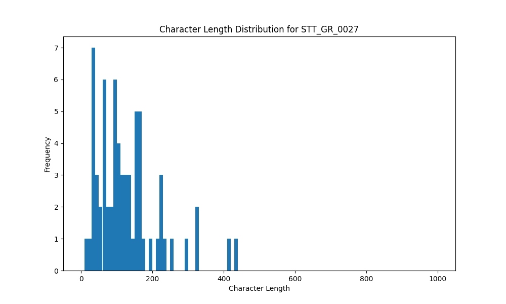

# Analysis Report for STT_GR_0027

## Summary Statistics

| Metric | Value |
|--------|-------|
| Total Segments | 67 |
| Total Duration | 538.70 seconds |
| Total Characters | 8603 |
| Average Characters/Segment | 128.40 |

## Character Length Distribution

## Detailed Statistics by Character Length Bins

### Bin: (10.0, 20.0]

| Metric | Value |
|--------|-------|
| Number of Segments | 1.0 |
| Average Character Length | 13.0 |
| Total Characters | 13.0 |
| Average Duration | 2.2 seconds |
| Total Duration | 2.2 seconds |

#### Files in this bin:

| File Name | Character Length | Duration (s) |
|-----------|-----------------|---------------|
| STT_GR_0027_0045_485800_to_488000 | 13 | 2.20 |

### Bin: (20.0, 30.0]

| Metric | Value |
|--------|-------|
| Number of Segments | 2.0 |
| Average Character Length | 27.5 |
| Total Characters | 55.0 |
| Average Duration | 3.45 seconds |
| Total Duration | 6.9 seconds |

#### Files in this bin:

| File Name | Character Length | Duration (s) |
|-----------|-----------------|---------------|
| STT_GR_0027_0023_253900_to_258300 | 25 | 4.40 |
| STT_GR_0027_0029_308600_to_311100 | 30 | 2.50 |

### Bin: (30.0, 40.0]

| Metric | Value |
|--------|-------|
| Number of Segments | 8.0 |
| Average Character Length | 35.0 |
| Total Characters | 280.0 |
| Average Duration | 2.72 seconds |
| Total Duration | 21.8 seconds |

#### Files in this bin:

| File Name | Character Length | Duration (s) |
|-----------|-----------------|---------------|
| STT_GR_0027_0003_62700_to_65200 | 32 | 2.50 |
| STT_GR_0027_0012_149900_to_152000 | 38 | 2.10 |
| STT_GR_0027_0021_232000_to_235300 | 34 | 3.30 |
| STT_GR_0027_0027_291200_to_293700 | 40 | 2.50 |
| STT_GR_0027_0035_371000_to_372800 | 31 | 1.80 |
| STT_GR_0027_0050_533100_to_535900 | 34 | 2.80 |
| STT_GR_0027_0055_572500_to_575900 | 31 | 3.40 |
| STT_GR_0027_0066_674900_to_678300 | 40 | 3.40 |

### Bin: (40.0, 50.0]

| Metric | Value |
|--------|-------|
| Number of Segments | 1.0 |
| Average Character Length | 46.0 |
| Total Characters | 46.0 |
| Average Duration | 4.2 seconds |
| Total Duration | 4.2 seconds |

#### Files in this bin:

| File Name | Character Length | Duration (s) |
|-----------|-----------------|---------------|
| STT_GR_0027_0057_582500_to_586700 | 46 | 4.20 |

### Bin: (50.0, 60.0]

| Metric | Value |
|--------|-------|
| Number of Segments | 2.0 |
| Average Character Length | 56.5 |
| Total Characters | 113.0 |
| Average Duration | 3.75 seconds |
| Total Duration | 7.5 seconds |

#### Files in this bin:

| File Name | Character Length | Duration (s) |
|-----------|-----------------|---------------|
| STT_GR_0027_0004_65600_to_68400 | 54 | 2.80 |
| STT_GR_0027_0032_340400_to_345100 | 59 | 4.70 |

### Bin: (60.0, 70.0]

| Metric | Value |
|--------|-------|
| Number of Segments | 6.0 |
| Average Character Length | 63.5 |
| Total Characters | 381.0 |
| Average Duration | 4.3 seconds |
| Total Duration | 25.8 seconds |

#### Files in this bin:

| File Name | Character Length | Duration (s) |
|-----------|-----------------|---------------|
| STT_GR_0027_0002_57400_to_61200 | 63 | 3.80 |
| STT_GR_0027_0039_422300_to_426600 | 64 | 4.30 |
| STT_GR_0027_0054_566800_to_570800 | 64 | 4.00 |
| STT_GR_0027_0056_576300_to_581900 | 62 | 5.60 |
| STT_GR_0027_0058_587100_to_591500 | 67 | 4.40 |
| STT_GR_0027_0068_697800_to_701500 | 61 | 3.70 |

### Bin: (70.0, 80.0]

| Metric | Value |
|--------|-------|
| Number of Segments | 3.0 |
| Average Character Length | 76.0 |
| Total Characters | 228.0 |
| Average Duration | 4.27 seconds |
| Total Duration | 12.8 seconds |

#### Files in this bin:

| File Name | Character Length | Duration (s) |
|-----------|-----------------|---------------|
| STT_GR_0027_0009_111200_to_114900 | 80 | 3.70 |
| STT_GR_0027_0016_187700_to_192000 | 75 | 4.30 |
| STT_GR_0027_0051_536500_to_541300 | 73 | 4.80 |

### Bin: (80.0, 90.0]

| Metric | Value |
|--------|-------|
| Number of Segments | 1.0 |
| Average Character Length | 87.0 |
| Total Characters | 87.0 |
| Average Duration | 4.9 seconds |
| Total Duration | 4.9 seconds |

#### Files in this bin:

| File Name | Character Length | Duration (s) |
|-----------|-----------------|---------------|
| STT_GR_0027_0028_295200_to_300100 | 87 | 4.90 |

### Bin: (90.0, 100.0]

| Metric | Value |
|--------|-------|
| Number of Segments | 6.0 |
| Average Character Length | 94.5 |
| Total Characters | 567.0 |
| Average Duration | 6.12 seconds |
| Total Duration | 36.7 seconds |

#### Files in this bin:

| File Name | Character Length | Duration (s) |
|-----------|-----------------|---------------|
| STT_GR_0027_0010_116100_to_122200 | 91 | 6.10 |
| STT_GR_0027_0020_226700_to_231800 | 98 | 5.10 |
| STT_GR_0027_0031_330700_to_336700 | 95 | 6.00 |
| STT_GR_0027_0034_359700_to_366800 | 97 | 7.10 |
| STT_GR_0027_0038_398500_to_405900 | 91 | 7.40 |
| STT_GR_0027_0060_598900_to_603900 | 95 | 5.00 |

### Bin: (100.0, 110.0]

| Metric | Value |
|--------|-------|
| Number of Segments | 4.0 |
| Average Character Length | 105.0 |
| Total Characters | 420.0 |
| Average Duration | 5.95 seconds |
| Total Duration | 23.8 seconds |

#### Files in this bin:

| File Name | Character Length | Duration (s) |
|-----------|-----------------|---------------|
| STT_GR_0027_0015_180400_to_186500 | 106 | 6.10 |
| STT_GR_0027_0019_220300_to_225700 | 102 | 5.40 |
| STT_GR_0027_0044_478600_to_484200 | 109 | 5.60 |
| STT_GR_0027_0059_591800_to_598500 | 103 | 6.70 |

### Bin: (110.0, 120.0]

| Metric | Value |
|--------|-------|
| Number of Segments | 3.0 |
| Average Character Length | 114.67 |
| Total Characters | 344.0 |
| Average Duration | 5.7 seconds |
| Total Duration | 17.1 seconds |

#### Files in this bin:

| File Name | Character Length | Duration (s) |
|-----------|-----------------|---------------|
| STT_GR_0027_0008_103000_to_108700 | 116 | 5.70 |
| STT_GR_0027_0037_390700_to_396800 | 113 | 6.10 |
| STT_GR_0027_0049_519900_to_525200 | 115 | 5.30 |

### Bin: (120.0, 130.0]

| Metric | Value |
|--------|-------|
| Number of Segments | 4.0 |
| Average Character Length | 125.5 |
| Total Characters | 502.0 |
| Average Duration | 7.45 seconds |
| Total Duration | 29.8 seconds |

#### Files in this bin:

| File Name | Character Length | Duration (s) |
|-----------|-----------------|---------------|
| STT_GR_0027_0014_170300_to_176400 | 123 | 6.10 |
| STT_GR_0027_0024_259200_to_266800 | 122 | 7.60 |
| STT_GR_0027_0046_488300_to_496600 | 127 | 8.30 |
| STT_GR_0027_0063_644400_to_652200 | 130 | 7.80 |

### Bin: (130.0, 140.0]

| Metric | Value |
|--------|-------|
| Number of Segments | 2.0 |
| Average Character Length | 134.5 |
| Total Characters | 269.0 |
| Average Duration | 7.8 seconds |
| Total Duration | 15.6 seconds |

#### Files in this bin:

| File Name | Character Length | Duration (s) |
|-----------|-----------------|---------------|
| STT_GR_0027_0005_69200_to_77800 | 131 | 8.60 |
| STT_GR_0027_0048_512000_to_519000 | 138 | 7.00 |

### Bin: (140.0, 150.0]

| Metric | Value |
|--------|-------|
| Number of Segments | 1.0 |
| Average Character Length | 141.0 |
| Total Characters | 141.0 |
| Average Duration | 8.0 seconds |
| Total Duration | 8.0 seconds |

#### Files in this bin:

| File Name | Character Length | Duration (s) |
|-----------|-----------------|---------------|
| STT_GR_0027_0041_439300_to_447300 | 141 | 8.00 |

### Bin: (150.0, 160.0]

| Metric | Value |
|--------|-------|
| Number of Segments | 5.0 |
| Average Character Length | 155.4 |
| Total Characters | 777.0 |
| Average Duration | 9.46 seconds |
| Total Duration | 47.3 seconds |

#### Files in this bin:

| File Name | Character Length | Duration (s) |
|-----------|-----------------|---------------|
| STT_GR_0027_0006_79700_to_89200 | 159 | 9.50 |
| STT_GR_0027_0013_158500_to_170000 | 156 | 11.50 |
| STT_GR_0027_0017_193100_to_201400 | 156 | 8.30 |
| STT_GR_0027_0025_267900_to_276200 | 151 | 8.30 |
| STT_GR_0027_0043_468200_to_477900 | 155 | 9.70 |

### Bin: (160.0, 170.0]

| Metric | Value |
|--------|-------|
| Number of Segments | 5.0 |
| Average Character Length | 164.8 |
| Total Characters | 824.0 |
| Average Duration | 10.56 seconds |
| Total Duration | 52.8 seconds |

#### Files in this bin:

| File Name | Character Length | Duration (s) |
|-----------|-----------------|---------------|
| STT_GR_0027_0026_278900_to_290500 | 166 | 11.60 |
| STT_GR_0027_0040_427600_to_438600 | 163 | 11.00 |
| STT_GR_0027_0052_542900_to_554400 | 166 | 11.50 |
| STT_GR_0027_0053_556200_to_565000 | 165 | 8.80 |
| STT_GR_0027_0061_604900_to_614800 | 164 | 9.90 |

### Bin: (170.0, 180.0]

| Metric | Value |
|--------|-------|
| Number of Segments | 1.0 |
| Average Character Length | 171.0 |
| Total Characters | 171.0 |
| Average Duration | 12.3 seconds |
| Total Duration | 12.3 seconds |

#### Files in this bin:

| File Name | Character Length | Duration (s) |
|-----------|-----------------|---------------|
| STT_GR_0027_0007_90200_to_102500 | 171 | 12.30 |

### Bin: (190.0, 200.0]

| Metric | Value |
|--------|-------|
| Number of Segments | 1.0 |
| Average Character Length | 199.0 |
| Total Characters | 199.0 |
| Average Duration | 12.9 seconds |
| Total Duration | 12.9 seconds |

#### Files in this bin:

| File Name | Character Length | Duration (s) |
|-----------|-----------------|---------------|
| STT_GR_0027_0067_681000_to_693900 | 199 | 12.90 |

### Bin: (210.0, 220.0]

| Metric | Value |
|--------|-------|
| Number of Segments | 1.0 |
| Average Character Length | 216.0 |
| Total Characters | 216.0 |
| Average Duration | 13.0 seconds |
| Total Duration | 13.0 seconds |

#### Files in this bin:

| File Name | Character Length | Duration (s) |
|-----------|-----------------|---------------|
| STT_GR_0027_0033_345300_to_358300 | 216 | 13.00 |

### Bin: (220.0, 230.0]

| Metric | Value |
|--------|-------|
| Number of Segments | 3.0 |
| Average Character Length | 225.67 |
| Total Characters | 677.0 |
| Average Duration | 14.4 seconds |
| Total Duration | 43.2 seconds |

#### Files in this bin:

| File Name | Character Length | Duration (s) |
|-----------|-----------------|---------------|
| STT_GR_0027_0018_204200_to_218400 | 221 | 14.20 |
| STT_GR_0027_0036_374300_to_390300 | 228 | 16.00 |
| STT_GR_0027_0047_498400_to_511400 | 228 | 13.00 |

### Bin: (230.0, 240.0]

| Metric | Value |
|--------|-------|
| Number of Segments | 1.0 |
| Average Character Length | 238.0 |
| Total Characters | 238.0 |
| Average Duration | 13.1 seconds |
| Total Duration | 13.1 seconds |

#### Files in this bin:

| File Name | Character Length | Duration (s) |
|-----------|-----------------|---------------|
| STT_GR_0027_0064_653000_to_666100 | 238 | 13.10 |

### Bin: (250.0, 260.0]

| Metric | Value |
|--------|-------|
| Number of Segments | 1.0 |
| Average Character Length | 256.0 |
| Total Characters | 256.0 |
| Average Duration | 16.2 seconds |
| Total Duration | 16.2 seconds |

#### Files in this bin:

| File Name | Character Length | Duration (s) |
|-----------|-----------------|---------------|
| STT_GR_0027_0022_237000_to_253200 | 256 | 16.20 |

### Bin: (280.0, 290.0]

| Metric | Value |
|--------|-------|
| Number of Segments | 1.0 |
| Average Character Length | 290.0 |
| Total Characters | 290.0 |
| Average Duration | 17.7 seconds |
| Total Duration | 17.7 seconds |

#### Files in this bin:

| File Name | Character Length | Duration (s) |
|-----------|-----------------|---------------|
| STT_GR_0027_0030_312600_to_330300 | 290 | 17.70 |

### Bin: (320.0, 330.0]

| Metric | Value |
|--------|-------|
| Number of Segments | 2.0 |
| Average Character Length | 327.5 |
| Total Characters | 655.0 |
| Average Duration | 20.3 seconds |
| Total Duration | 40.6 seconds |

#### Files in this bin:

| File Name | Character Length | Duration (s) |
|-----------|-----------------|---------------|
| STT_GR_0027_0011_124300_to_145900 | 329 | 21.60 |
| STT_GR_0027_0042_448900_to_467900 | 326 | 19.00 |

### Bin: (410.0, 420.0]

| Metric | Value |
|--------|-------|
| Number of Segments | 1.0 |
| Average Character Length | 416.0 |
| Total Characters | 416.0 |
| Average Duration | 27.7 seconds |
| Total Duration | 27.7 seconds |

#### Files in this bin:

| File Name | Character Length | Duration (s) |
|-----------|-----------------|---------------|
| STT_GR_0027_0001_28900_to_56600 | 416 | 27.70 |

### Bin: (430.0, 440.0]

| Metric | Value |
|--------|-------|
| Number of Segments | 1.0 |
| Average Character Length | 438.0 |
| Total Characters | 438.0 |
| Average Duration | 24.8 seconds |
| Total Duration | 24.8 seconds |

#### Files in this bin:

| File Name | Character Length | Duration (s) |
|-----------|-----------------|---------------|
| STT_GR_0027_0062_616300_to_641100 | 438 | 24.80 |

