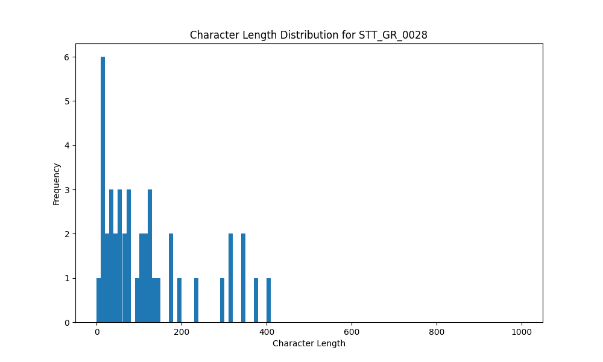

# Analysis Report for STT_GR_0028

## Summary Statistics

| Metric | Value |
|--------|-------|
| Total Segments | 43 |
| Total Duration | 315.06 seconds |
| Total Characters | 5251 |
| Average Characters/Segment | 122.12 |

## Character Length Distribution

## Detailed Statistics by Character Length Bins

### Bin: (0.0, 10.0]

| Metric | Value |
|--------|-------|
| Number of Segments | 2.0 |
| Average Character Length | 7.0 |
| Total Characters | 14.0 |
| Average Duration | 0.67 seconds |
| Total Duration | 1.34 seconds |

#### Files in this bin:

| File Name | Character Length | Duration (s) |
|-----------|-----------------|---------------|
| STT_GR_0028_0111_862760_to_863304 | 10 | 0.54 |
| STT_GR_0028_0069_520832_to_521632 | 4 | 0.80 |

### Bin: (10.0, 20.0]

| Metric | Value |
|--------|-------|
| Number of Segments | 5.0 |
| Average Character Length | 18.2 |
| Total Characters | 91.0 |
| Average Duration | 0.96 seconds |
| Total Duration | 4.8 seconds |

#### Files in this bin:

| File Name | Character Length | Duration (s) |
|-----------|-----------------|---------------|
| STT_GR_0028_0127_914192_to_914992 | 18 | 0.80 |
| STT_GR_0028_0121_903247_to_904175 | 19 | 0.93 |
| STT_GR_0028_0055_497088_to_497984 | 18 | 0.90 |
| STT_GR_0028_0067_515392_to_516448 | 18 | 1.06 |
| STT_GR_0028_0076_535200_to_536320 | 18 | 1.12 |

### Bin: (20.0, 30.0]

| Metric | Value |
|--------|-------|
| Number of Segments | 2.0 |
| Average Character Length | 23.0 |
| Total Characters | 46.0 |
| Average Duration | 1.04 seconds |
| Total Duration | 2.08 seconds |

#### Files in this bin:

| File Name | Character Length | Duration (s) |
|-----------|-----------------|---------------|
| STT_GR_0028_0070_521888_to_522816 | 24 | 0.93 |
| STT_GR_0028_0077_536640_to_537792 | 22 | 1.15 |

### Bin: (30.0, 40.0]

| Metric | Value |
|--------|-------|
| Number of Segments | 3.0 |
| Average Character Length | 34.33 |
| Total Characters | 103.0 |
| Average Duration | 1.7 seconds |
| Total Duration | 5.09 seconds |

#### Files in this bin:

| File Name | Character Length | Duration (s) |
|-----------|-----------------|---------------|
| STT_GR_0028_0050_464000_to_466500 | 32 | 2.50 |
| STT_GR_0028_0066_513696_to_514943 | 39 | 1.25 |
| STT_GR_0028_0137_937232_to_938575 | 32 | 1.34 |

### Bin: (40.0, 50.0]

| Metric | Value |
|--------|-------|
| Number of Segments | 3.0 |
| Average Character Length | 47.67 |
| Total Characters | 143.0 |
| Average Duration | 2.14 seconds |
| Total Duration | 6.43 seconds |

#### Files in this bin:

| File Name | Character Length | Duration (s) |
|-----------|-----------------|---------------|
| STT_GR_0028_0125_910256_to_912175 | 47 | 1.92 |
| STT_GR_0028_0108_854216_to_856328 | 50 | 2.11 |
| STT_GR_0028_0013_100700_to_103100 | 46 | 2.40 |

### Bin: (50.0, 60.0]

| Metric | Value |
|--------|-------|
| Number of Segments | 2.0 |
| Average Character Length | 54.0 |
| Total Characters | 108.0 |
| Average Duration | 3.57 seconds |
| Total Duration | 7.14 seconds |

#### Files in this bin:

| File Name | Character Length | Duration (s) |
|-----------|-----------------|---------------|
| STT_GR_0028_0009_73400_to_78200 | 55 | 4.80 |
| STT_GR_0028_0057_499328_to_501664 | 53 | 2.34 |

### Bin: (60.0, 70.0]

| Metric | Value |
|--------|-------|
| Number of Segments | 2.0 |
| Average Character Length | 68.5 |
| Total Characters | 137.0 |
| Average Duration | 3.29 seconds |
| Total Duration | 6.58 seconds |

#### Files in this bin:

| File Name | Character Length | Duration (s) |
|-----------|-----------------|---------------|
| STT_GR_0028_0092_692100_to_695800 | 69 | 3.70 |
| STT_GR_0028_0114_866760_to_869640 | 68 | 2.88 |

### Bin: (70.0, 80.0]

| Metric | Value |
|--------|-------|
| Number of Segments | 3.0 |
| Average Character Length | 78.33 |
| Total Characters | 235.0 |
| Average Duration | 5.4 seconds |
| Total Duration | 16.2 seconds |

#### Files in this bin:

| File Name | Character Length | Duration (s) |
|-----------|-----------------|---------------|
| STT_GR_0028_0042_382500_to_387500 | 79 | 5.00 |
| STT_GR_0028_0004_34500_to_40200 | 79 | 5.70 |
| STT_GR_0028_0048_453900_to_459400 | 77 | 5.50 |

### Bin: (90.0, 100.0]

| Metric | Value |
|--------|-------|
| Number of Segments | 1.0 |
| Average Character Length | 93.0 |
| Total Characters | 93.0 |
| Average Duration | 7.4 seconds |
| Total Duration | 7.4 seconds |

#### Files in this bin:

| File Name | Character Length | Duration (s) |
|-----------|-----------------|---------------|
| STT_GR_0028_0046_435000_to_442400 | 93 | 7.40 |

### Bin: (100.0, 110.0]

| Metric | Value |
|--------|-------|
| Number of Segments | 2.0 |
| Average Character Length | 108.0 |
| Total Characters | 216.0 |
| Average Duration | 5.95 seconds |
| Total Duration | 11.89 seconds |

#### Files in this bin:

| File Name | Character Length | Duration (s) |
|-----------|-----------------|---------------|
| STT_GR_0028_0014_103900_to_110800 | 108 | 6.90 |
| STT_GR_0028_0115_871688_to_876680 | 108 | 4.99 |

### Bin: (110.0, 120.0]

| Metric | Value |
|--------|-------|
| Number of Segments | 2.0 |
| Average Character Length | 115.0 |
| Total Characters | 230.0 |
| Average Duration | 6.15 seconds |
| Total Duration | 12.3 seconds |

#### Files in this bin:

| File Name | Character Length | Duration (s) |
|-----------|-----------------|---------------|
| STT_GR_0028_0102_801700_to_807800 | 119 | 6.10 |
| STT_GR_0028_0082_560900_to_567100 | 111 | 6.20 |

### Bin: (120.0, 130.0]

| Metric | Value |
|--------|-------|
| Number of Segments | 3.0 |
| Average Character Length | 123.67 |
| Total Characters | 371.0 |
| Average Duration | 8.07 seconds |
| Total Duration | 24.2 seconds |

#### Files in this bin:

| File Name | Character Length | Duration (s) |
|-----------|-----------------|---------------|
| STT_GR_0028_0022_169300_to_178000 | 122 | 8.70 |
| STT_GR_0028_0012_91800_to_100300 | 123 | 8.50 |
| STT_GR_0028_0095_729800_to_736800 | 126 | 7.00 |

### Bin: (130.0, 140.0]

| Metric | Value |
|--------|-------|
| Number of Segments | 2.0 |
| Average Character Length | 138.0 |
| Total Characters | 276.0 |
| Average Duration | 7.5 seconds |
| Total Duration | 15.01 seconds |

#### Files in this bin:

| File Name | Character Length | Duration (s) |
|-----------|-----------------|---------------|
| STT_GR_0028_0138_938640_to_944048 | 136 | 5.41 |
| STT_GR_0028_0085_590000_to_599600 | 140 | 9.60 |

### Bin: (170.0, 180.0]

| Metric | Value |
|--------|-------|
| Number of Segments | 2.0 |
| Average Character Length | 174.5 |
| Total Characters | 349.0 |
| Average Duration | 11.55 seconds |
| Total Duration | 23.1 seconds |

#### Files in this bin:

| File Name | Character Length | Duration (s) |
|-----------|-----------------|---------------|
| STT_GR_0028_0037_336500_to_346200 | 174 | 9.70 |
| STT_GR_0028_0005_40500_to_53900 | 175 | 13.40 |

### Bin: (190.0, 200.0]

| Metric | Value |
|--------|-------|
| Number of Segments | 1.0 |
| Average Character Length | 198.0 |
| Total Characters | 198.0 |
| Average Duration | 12.4 seconds |
| Total Duration | 12.4 seconds |

#### Files in this bin:

| File Name | Character Length | Duration (s) |
|-----------|-----------------|---------------|
| STT_GR_0028_0033_294600_to_307000 | 198 | 12.40 |

### Bin: (230.0, 240.0]

| Metric | Value |
|--------|-------|
| Number of Segments | 1.0 |
| Average Character Length | 236.0 |
| Total Characters | 236.0 |
| Average Duration | 14.3 seconds |
| Total Duration | 14.3 seconds |

#### Files in this bin:

| File Name | Character Length | Duration (s) |
|-----------|-----------------|---------------|
| STT_GR_0028_0002_15400_to_29700 | 236 | 14.30 |

### Bin: (290.0, 300.0]

| Metric | Value |
|--------|-------|
| Number of Segments | 1.0 |
| Average Character Length | 294.0 |
| Total Characters | 294.0 |
| Average Duration | 16.7 seconds |
| Total Duration | 16.7 seconds |

#### Files in this bin:

| File Name | Character Length | Duration (s) |
|-----------|-----------------|---------------|
| STT_GR_0028_0101_782900_to_799600 | 294 | 16.70 |

### Bin: (310.0, 320.0]

| Metric | Value |
|--------|-------|
| Number of Segments | 2.0 |
| Average Character Length | 318.0 |
| Total Characters | 636.0 |
| Average Duration | 19.9 seconds |
| Total Duration | 39.8 seconds |

#### Files in this bin:

| File Name | Character Length | Duration (s) |
|-----------|-----------------|---------------|
| STT_GR_0028_0024_186300_to_207200 | 318 | 20.90 |
| STT_GR_0028_0030_254500_to_273400 | 318 | 18.90 |

### Bin: (340.0, 350.0]

| Metric | Value |
|--------|-------|
| Number of Segments | 2.0 |
| Average Character Length | 345.0 |
| Total Characters | 690.0 |
| Average Duration | 21.65 seconds |
| Total Duration | 43.3 seconds |

#### Files in this bin:

| File Name | Character Length | Duration (s) |
|-----------|-----------------|---------------|
| STT_GR_0028_0103_811500_to_832700 | 346 | 21.20 |
| STT_GR_0028_0043_391100_to_413200 | 344 | 22.10 |

### Bin: (370.0, 380.0]

| Metric | Value |
|--------|-------|
| Number of Segments | 1.0 |
| Average Character Length | 376.0 |
| Total Characters | 376.0 |
| Average Duration | 20.5 seconds |
| Total Duration | 20.5 seconds |

#### Files in this bin:

| File Name | Character Length | Duration (s) |
|-----------|-----------------|---------------|
| STT_GR_0028_0141_960400_to_980900 | 376 | 20.50 |

### Bin: (400.0, 410.0]

| Metric | Value |
|--------|-------|
| Number of Segments | 1.0 |
| Average Character Length | 409.0 |
| Total Characters | 409.0 |
| Average Duration | 24.5 seconds |
| Total Duration | 24.5 seconds |

#### Files in this bin:

| File Name | Character Length | Duration (s) |
|-----------|-----------------|---------------|
| STT_GR_0028_0093_697700_to_722200 | 409 | 24.50 |

