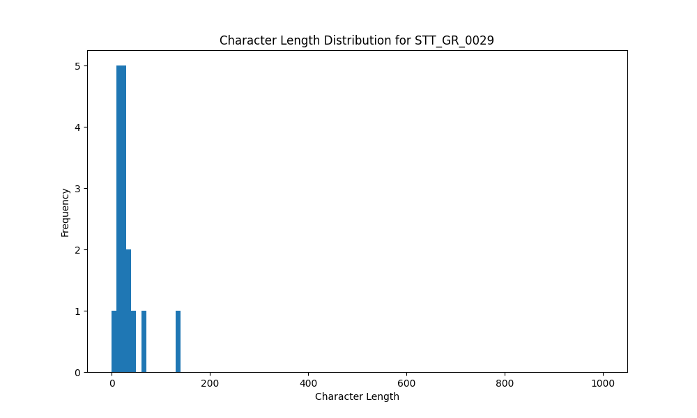

# Analysis Report for STT_GR_0029

## Summary Statistics

| Metric | Value |
|--------|-------|
| Total Segments | 16 |
| Total Duration | 28.66 seconds |
| Total Characters | 514 |
| Average Characters/Segment | 32.12 |

## Character Length Distribution

## Detailed Statistics by Character Length Bins

### Bin: (0.0, 10.0]

| Metric | Value |
|--------|-------|
| Number of Segments | 1.0 |
| Average Character Length | 7.0 |
| Total Characters | 7.0 |
| Average Duration | 0.7 seconds |
| Total Duration | 0.7 seconds |

#### Files in this bin:

| File Name | Character Length | Duration (s) |
|-----------|-----------------|---------------|
| STT_GR_0029_0004_27884_to_28588 | 7 | 0.70 |

### Bin: (10.0, 20.0]

| Metric | Value |
|--------|-------|
| Number of Segments | 6.0 |
| Average Character Length | 15.33 |
| Total Characters | 92.0 |
| Average Duration | 0.87 seconds |
| Total Duration | 5.25 seconds |

#### Files in this bin:

| File Name | Character Length | Duration (s) |
|-----------|-----------------|---------------|
| STT_GR_0029_0014_45355_to_46188 | 19 | 0.83 |
| STT_GR_0029_0154_911052_to_911820 | 15 | 0.77 |
| STT_GR_0029_0163_925580_to_926572 | 15 | 0.99 |
| STT_GR_0029_0090_573848_to_574360 | 11 | 0.51 |
| STT_GR_0029_0116_634808_to_636088 | 20 | 1.28 |
| STT_GR_0029_0032_158668_to_159532 | 12 | 0.86 |

### Bin: (20.0, 30.0]

| Metric | Value |
|--------|-------|
| Number of Segments | 5.0 |
| Average Character Length | 26.4 |
| Total Characters | 132.0 |
| Average Duration | 1.18 seconds |
| Total Duration | 5.89 seconds |

#### Files in this bin:

| File Name | Character Length | Duration (s) |
|-----------|-----------------|---------------|
| STT_GR_0029_0145_815432_to_816712 | 28 | 1.28 |
| STT_GR_0029_0178_955532_to_956716 | 30 | 1.18 |
| STT_GR_0029_0193_1028988_to_1029947 | 26 | 0.96 |
| STT_GR_0029_0018_53068_to_54284 | 24 | 1.22 |
| STT_GR_0029_0179_956780_to_958028 | 24 | 1.25 |

### Bin: (30.0, 40.0]

| Metric | Value |
|--------|-------|
| Number of Segments | 1.0 |
| Average Character Length | 37.0 |
| Total Characters | 37.0 |
| Average Duration | 1.95 seconds |
| Total Duration | 1.95 seconds |

#### Files in this bin:

| File Name | Character Length | Duration (s) |
|-----------|-----------------|---------------|
| STT_GR_0029_0200_1040475_to_1042427 | 37 | 1.95 |

### Bin: (40.0, 50.0]

| Metric | Value |
|--------|-------|
| Number of Segments | 1.0 |
| Average Character Length | 49.0 |
| Total Characters | 49.0 |
| Average Duration | 2.37 seconds |
| Total Duration | 2.37 seconds |

#### Files in this bin:

| File Name | Character Length | Duration (s) |
|-----------|-----------------|---------------|
| STT_GR_0029_0067_398124_to_400492 | 49 | 2.37 |

### Bin: (60.0, 70.0]

| Metric | Value |
|--------|-------|
| Number of Segments | 1.0 |
| Average Character Length | 62.0 |
| Total Characters | 62.0 |
| Average Duration | 3.2 seconds |
| Total Duration | 3.2 seconds |

#### Files in this bin:

| File Name | Character Length | Duration (s) |
|-----------|-----------------|---------------|
| STT_GR_0029_0102_598456_to_601656 | 62 | 3.20 |

### Bin: (130.0, 140.0]

| Metric | Value |
|--------|-------|
| Number of Segments | 1.0 |
| Average Character Length | 135.0 |
| Total Characters | 135.0 |
| Average Duration | 9.3 seconds |
| Total Duration | 9.3 seconds |

#### Files in this bin:

| File Name | Character Length | Duration (s) |
|-----------|-----------------|---------------|
| STT_GR_0029_0125_660900_to_670200 | 135 | 9.30 |

