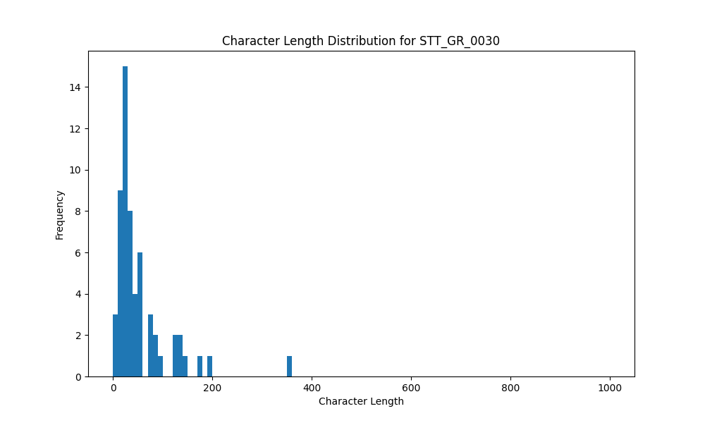

# Analysis Report for STT_GR_0030

## Summary Statistics

| Metric | Value |
|--------|-------|
| Total Segments | 59 |
| Total Duration | 170.21 seconds |
| Total Characters | 3179 |
| Average Characters/Segment | 53.88 |

## Character Length Distribution

## Detailed Statistics by Character Length Bins

### Bin: (0.0, 10.0]

| Metric | Value |
|--------|-------|
| Number of Segments | 3.0 |
| Average Character Length | 8.0 |
| Total Characters | 24.0 |
| Average Duration | 0.59 seconds |
| Total Duration | 1.76 seconds |

#### Files in this bin:

| File Name | Character Length | Duration (s) |
|-----------|-----------------|---------------|
| STT_GR_0030_0056_206428_to_206940 | 7 | 0.51 |
| STT_GR_0030_0088_321727_to_322240 | 8 | 0.51 |
| STT_GR_0030_0084_312640_to_313376 | 9 | 0.74 |

### Bin: (10.0, 20.0]

| Metric | Value |
|--------|-------|
| Number of Segments | 11.0 |
| Average Character Length | 17.09 |
| Total Characters | 188.0 |
| Average Duration | 0.93 seconds |
| Total Duration | 10.24 seconds |

#### Files in this bin:

| File Name | Character Length | Duration (s) |
|-----------|-----------------|---------------|
| STT_GR_0030_0064_226363_to_227387 | 20 | 1.02 |
| STT_GR_0030_0019_64604_to_65372 | 18 | 0.77 |
| STT_GR_0030_0018_63708_to_64412 | 15 | 0.70 |
| STT_GR_0030_0013_54524_to_55324 | 15 | 0.80 |
| STT_GR_0030_0060_216923_to_217916 | 19 | 0.99 |
| STT_GR_0030_0061_218875_to_220540 | 16 | 1.67 |
| STT_GR_0030_0051_199676_to_200411 | 16 | 0.73 |
| STT_GR_0030_0045_186428_to_187323 | 20 | 0.90 |
| STT_GR_0030_0073_290592_to_292000 | 18 | 1.41 |
| STT_GR_0030_0004_37788_to_38492 | 15 | 0.70 |
| STT_GR_0030_0020_65468_to_66012 | 16 | 0.54 |

### Bin: (20.0, 30.0]

| Metric | Value |
|--------|-------|
| Number of Segments | 13.0 |
| Average Character Length | 23.38 |
| Total Characters | 304.0 |
| Average Duration | 1.31 seconds |
| Total Duration | 16.97 seconds |

#### Files in this bin:

| File Name | Character Length | Duration (s) |
|-----------|-----------------|---------------|
| STT_GR_0030_0003_35388_to_37052 | 26 | 1.66 |
| STT_GR_0030_0008_46012_to_46812 | 21 | 0.80 |
| STT_GR_0030_0085_313952_to_315104 | 26 | 1.15 |
| STT_GR_0030_0089_322880_to_324799 | 27 | 1.92 |
| STT_GR_0030_0055_204923_to_206140 | 21 | 1.22 |
| STT_GR_0030_0026_115300_to_117100 | 22 | 1.80 |
| STT_GR_0030_0076_295744_to_297087 | 25 | 1.34 |
| STT_GR_0030_0012_53052_to_54492 | 22 | 1.44 |
| STT_GR_0030_0077_297344_to_298176 | 21 | 0.83 |
| STT_GR_0030_0011_51644_to_52700 | 21 | 1.06 |
| STT_GR_0030_0054_202971_to_204220 | 23 | 1.25 |
| STT_GR_0030_0059_215483_to_216700 | 22 | 1.22 |
| STT_GR_0030_0057_207227_to_208507 | 27 | 1.28 |

### Bin: (30.0, 40.0]

| Metric | Value |
|--------|-------|
| Number of Segments | 8.0 |
| Average Character Length | 33.5 |
| Total Characters | 268.0 |
| Average Duration | 1.57 seconds |
| Total Duration | 12.57 seconds |

#### Files in this bin:

| File Name | Character Length | Duration (s) |
|-----------|-----------------|---------------|
| STT_GR_0030_0044_184923_to_186299 | 31 | 1.38 |
| STT_GR_0030_0031_150423_to_152344 | 38 | 1.92 |
| STT_GR_0030_0092_329407_to_330976 | 39 | 1.57 |
| STT_GR_0030_0014_55676_to_57147 | 33 | 1.47 |
| STT_GR_0030_0070_282688_to_284703 | 31 | 2.02 |
| STT_GR_0030_0042_178392_to_179703 | 32 | 1.31 |
| STT_GR_0030_0090_324928_to_326784 | 33 | 1.86 |
| STT_GR_0030_0038_171512_to_172567 | 31 | 1.05 |

### Bin: (40.0, 50.0]

| Metric | Value |
|--------|-------|
| Number of Segments | 5.0 |
| Average Character Length | 46.8 |
| Total Characters | 234.0 |
| Average Duration | 2.12 seconds |
| Total Duration | 10.62 seconds |

#### Files in this bin:

| File Name | Character Length | Duration (s) |
|-----------|-----------------|---------------|
| STT_GR_0030_0021_66172_to_68283 | 44 | 2.11 |
| STT_GR_0030_0033_157495_to_159447 | 47 | 1.95 |
| STT_GR_0030_0034_159607_to_161815 | 50 | 2.21 |
| STT_GR_0030_0062_221628_to_224251 | 49 | 2.62 |
| STT_GR_0030_0005_39068_to_40796 | 44 | 1.73 |

### Bin: (50.0, 60.0]

| Metric | Value |
|--------|-------|
| Number of Segments | 5.0 |
| Average Character Length | 54.2 |
| Total Characters | 271.0 |
| Average Duration | 2.6 seconds |
| Total Duration | 13.02 seconds |

#### Files in this bin:

| File Name | Character Length | Duration (s) |
|-----------|-----------------|---------------|
| STT_GR_0030_0041_175896_to_178263 | 52 | 2.37 |
| STT_GR_0030_0072_287104_to_289727 | 53 | 2.62 |
| STT_GR_0030_0079_302431_to_306080 | 59 | 3.65 |
| STT_GR_0030_0048_191804_to_193947 | 51 | 2.14 |
| STT_GR_0030_0081_307808_to_310048 | 56 | 2.24 |

### Bin: (70.0, 80.0]

| Metric | Value |
|--------|-------|
| Number of Segments | 3.0 |
| Average Character Length | 76.0 |
| Total Characters | 228.0 |
| Average Duration | 3.92 seconds |
| Total Duration | 11.75 seconds |

#### Files in this bin:

| File Name | Character Length | Duration (s) |
|-----------|-----------------|---------------|
| STT_GR_0030_0093_331263_to_334368 | 74 | 3.10 |
| STT_GR_0030_0086_315520_to_318464 | 78 | 2.94 |
| STT_GR_0030_0069_275700_to_281400 | 76 | 5.70 |

### Bin: (80.0, 90.0]

| Metric | Value |
|--------|-------|
| Number of Segments | 2.0 |
| Average Character Length | 84.5 |
| Total Characters | 169.0 |
| Average Duration | 4.8 seconds |
| Total Duration | 9.6 seconds |

#### Files in this bin:

| File Name | Character Length | Duration (s) |
|-----------|-----------------|---------------|
| STT_GR_0030_0023_77000_to_81000 | 82 | 4.00 |
| STT_GR_0030_0095_356600_to_362200 | 87 | 5.60 |

### Bin: (90.0, 100.0]

| Metric | Value |
|--------|-------|
| Number of Segments | 1.0 |
| Average Character Length | 96.0 |
| Total Characters | 96.0 |
| Average Duration | 4.22 seconds |
| Total Duration | 4.22 seconds |

#### Files in this bin:

| File Name | Character Length | Duration (s) |
|-----------|-----------------|---------------|
| STT_GR_0030_0032_153079_to_157304 | 96 | 4.22 |

### Bin: (120.0, 130.0]

| Metric | Value |
|--------|-------|
| Number of Segments | 2.0 |
| Average Character Length | 124.0 |
| Total Characters | 248.0 |
| Average Duration | 7.4 seconds |
| Total Duration | 14.8 seconds |

#### Files in this bin:

| File Name | Character Length | Duration (s) |
|-----------|-----------------|---------------|
| STT_GR_0030_0027_117400_to_126600 | 124 | 9.20 |
| STT_GR_0030_0037_165495_to_171096 | 124 | 5.60 |

### Bin: (130.0, 140.0]

| Metric | Value |
|--------|-------|
| Number of Segments | 2.0 |
| Average Character Length | 138.5 |
| Total Characters | 277.0 |
| Average Duration | 7.82 seconds |
| Total Duration | 15.64 seconds |

#### Files in this bin:

| File Name | Character Length | Duration (s) |
|-----------|-----------------|---------------|
| STT_GR_0030_0096_364000_to_373500 | 139 | 9.50 |
| STT_GR_0030_0058_208827_to_214971 | 138 | 6.14 |

### Bin: (140.0, 150.0]

| Metric | Value |
|--------|-------|
| Number of Segments | 1.0 |
| Average Character Length | 145.0 |
| Total Characters | 145.0 |
| Average Duration | 8.0 seconds |
| Total Duration | 8.0 seconds |

#### Files in this bin:

| File Name | Character Length | Duration (s) |
|-----------|-----------------|---------------|
| STT_GR_0030_0097_375200_to_383200 | 145 | 8.00 |

### Bin: (170.0, 180.0]

| Metric | Value |
|--------|-------|
| Number of Segments | 1.0 |
| Average Character Length | 179.0 |
| Total Characters | 179.0 |
| Average Duration | 10.3 seconds |
| Total Duration | 10.3 seconds |

#### Files in this bin:

| File Name | Character Length | Duration (s) |
|-----------|-----------------|---------------|
| STT_GR_0030_0002_24100_to_34400 | 179 | 10.30 |

### Bin: (190.0, 200.0]

| Metric | Value |
|--------|-------|
| Number of Segments | 1.0 |
| Average Character Length | 196.0 |
| Total Characters | 196.0 |
| Average Duration | 11.2 seconds |
| Total Duration | 11.2 seconds |

#### Files in this bin:

| File Name | Character Length | Duration (s) |
|-----------|-----------------|---------------|
| STT_GR_0030_0066_250600_to_261800 | 196 | 11.20 |

### Bin: (350.0, 360.0]

| Metric | Value |
|--------|-------|
| Number of Segments | 1.0 |
| Average Character Length | 352.0 |
| Total Characters | 352.0 |
| Average Duration | 19.5 seconds |
| Total Duration | 19.5 seconds |

#### Files in this bin:

| File Name | Character Length | Duration (s) |
|-----------|-----------------|---------------|
| STT_GR_0030_0065_229300_to_248800 | 352 | 19.50 |

