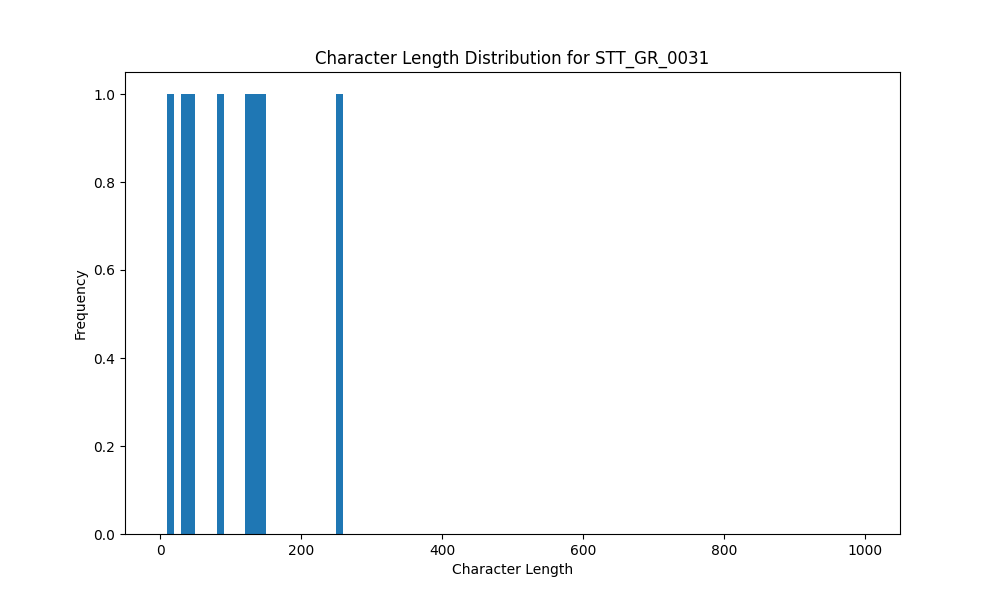

# Analysis Report for STT_GR_0031

## Summary Statistics

| Metric | Value |
|--------|-------|
| Total Segments | 8 |
| Total Duration | 47.41 seconds |
| Total Characters | 832 |
| Average Characters/Segment | 104.00 |

## Character Length Distribution

## Detailed Statistics by Character Length Bins

### Bin: (10.0, 20.0]

| Metric | Value |
|--------|-------|
| Number of Segments | 1.0 |
| Average Character Length | 15.0 |
| Total Characters | 15.0 |
| Average Duration | 0.61 seconds |
| Total Duration | 0.61 seconds |

#### Files in this bin:

| File Name | Character Length | Duration (s) |
|-----------|-----------------|---------------|
| STT_GR_0031_0021_151768_to_152375 | 15 | 0.61 |

### Bin: (30.0, 40.0]

| Metric | Value |
|--------|-------|
| Number of Segments | 1.0 |
| Average Character Length | 37.0 |
| Total Characters | 37.0 |
| Average Duration | 2.3 seconds |
| Total Duration | 2.3 seconds |

#### Files in this bin:

| File Name | Character Length | Duration (s) |
|-----------|-----------------|---------------|
| STT_GR_0031_0038_334700_to_337000 | 37 | 2.30 |

### Bin: (40.0, 50.0]

| Metric | Value |
|--------|-------|
| Number of Segments | 1.0 |
| Average Character Length | 45.0 |
| Total Characters | 45.0 |
| Average Duration | 3.5 seconds |
| Total Duration | 3.5 seconds |

#### Files in this bin:

| File Name | Character Length | Duration (s) |
|-----------|-----------------|---------------|
| STT_GR_0031_0012_124400_to_127900 | 45 | 3.50 |

### Bin: (80.0, 90.0]

| Metric | Value |
|--------|-------|
| Number of Segments | 1.0 |
| Average Character Length | 82.0 |
| Total Characters | 82.0 |
| Average Duration | 4.4 seconds |
| Total Duration | 4.4 seconds |

#### Files in this bin:

| File Name | Character Length | Duration (s) |
|-----------|-----------------|---------------|
| STT_GR_0031_0034_273600_to_278000 | 82 | 4.40 |

### Bin: (120.0, 130.0]

| Metric | Value |
|--------|-------|
| Number of Segments | 1.0 |
| Average Character Length | 121.0 |
| Total Characters | 121.0 |
| Average Duration | 5.8 seconds |
| Total Duration | 5.8 seconds |

#### Files in this bin:

| File Name | Character Length | Duration (s) |
|-----------|-----------------|---------------|
| STT_GR_0031_0031_246600_to_252400 | 121 | 5.80 |

### Bin: (130.0, 140.0]

| Metric | Value |
|--------|-------|
| Number of Segments | 1.0 |
| Average Character Length | 131.0 |
| Total Characters | 131.0 |
| Average Duration | 8.1 seconds |
| Total Duration | 8.1 seconds |

#### Files in this bin:

| File Name | Character Length | Duration (s) |
|-----------|-----------------|---------------|
| STT_GR_0031_0046_414900_to_423000 | 131 | 8.10 |

### Bin: (140.0, 150.0]

| Metric | Value |
|--------|-------|
| Number of Segments | 1.0 |
| Average Character Length | 149.0 |
| Total Characters | 149.0 |
| Average Duration | 8.5 seconds |
| Total Duration | 8.5 seconds |

#### Files in this bin:

| File Name | Character Length | Duration (s) |
|-----------|-----------------|---------------|
| STT_GR_0031_0053_511200_to_519700 | 149 | 8.50 |

### Bin: (250.0, 260.0]

| Metric | Value |
|--------|-------|
| Number of Segments | 1.0 |
| Average Character Length | 252.0 |
| Total Characters | 252.0 |
| Average Duration | 14.2 seconds |
| Total Duration | 14.2 seconds |

#### Files in this bin:

| File Name | Character Length | Duration (s) |
|-----------|-----------------|---------------|
| STT_GR_0031_0007_79800_to_94000 | 252 | 14.20 |

