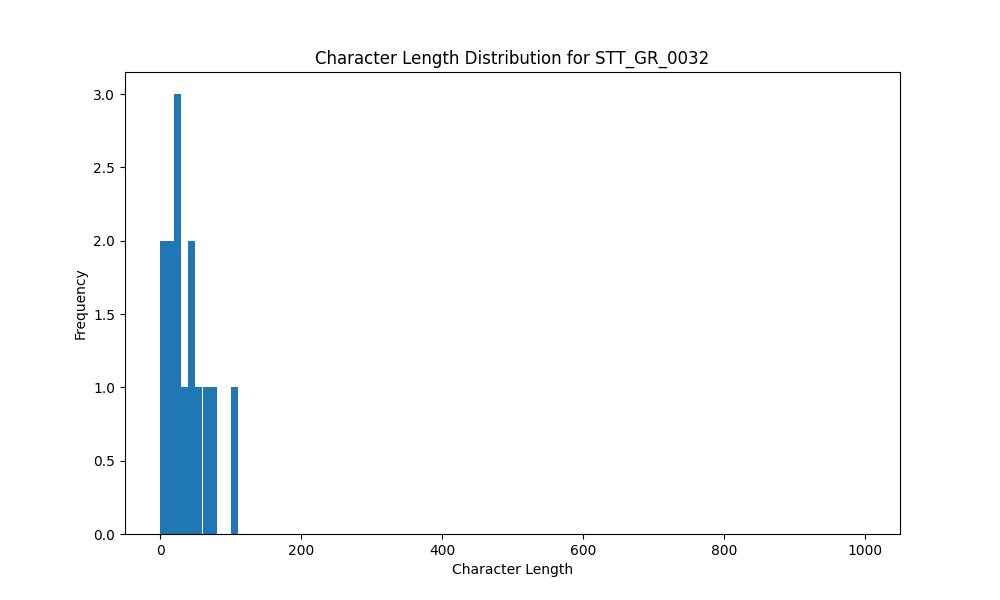

# Analysis Report for STT_GR_0032

## Summary Statistics

| Metric | Value |
|--------|-------|
| Total Segments | 14 |
| Total Duration | 47.81 seconds |
| Total Characters | 520 |
| Average Characters/Segment | 37.14 |

## Character Length Distribution

## Detailed Statistics by Character Length Bins

### Bin: (0.0, 10.0]

| Metric | Value |
|--------|-------|
| Number of Segments | 2.0 |
| Average Character Length | 5.0 |
| Total Characters | 10.0 |
| Average Duration | 0.74 seconds |
| Total Duration | 1.47 seconds |

#### Files in this bin:

| File Name | Character Length | Duration (s) |
|-----------|-----------------|---------------|
| STT_GR_0032_0007_32635_to_33436 | 7 | 0.80 |
| STT_GR_0032_0015_65019_to_65692 | 3 | 0.67 |

### Bin: (10.0, 20.0]

| Metric | Value |
|--------|-------|
| Number of Segments | 3.0 |
| Average Character Length | 16.67 |
| Total Characters | 50.0 |
| Average Duration | 3.54 seconds |
| Total Duration | 10.62 seconds |

#### Files in this bin:

| File Name | Character Length | Duration (s) |
|-----------|-----------------|---------------|
| STT_GR_0032_0017_70800_to_71984 | 19 | 1.18 |
| STT_GR_0032_0028_143500_to_151500 | 20 | 8.00 |
| STT_GR_0032_0002_12700_to_14139 | 11 | 1.44 |

### Bin: (20.0, 30.0]

| Metric | Value |
|--------|-------|
| Number of Segments | 2.0 |
| Average Character Length | 25.5 |
| Total Characters | 51.0 |
| Average Duration | 4.75 seconds |
| Total Duration | 9.51 seconds |

#### Files in this bin:

| File Name | Character Length | Duration (s) |
|-----------|-----------------|---------------|
| STT_GR_0032_0005_25596_to_31868 | 29 | 6.27 |
| STT_GR_0032_0016_66364_to_69600 | 22 | 3.24 |

### Bin: (30.0, 40.0]

| Metric | Value |
|--------|-------|
| Number of Segments | 1.0 |
| Average Character Length | 32.0 |
| Total Characters | 32.0 |
| Average Duration | 4.64 seconds |
| Total Duration | 4.64 seconds |

#### Files in this bin:

| File Name | Character Length | Duration (s) |
|-----------|-----------------|---------------|
| STT_GR_0032_0022_98608_to_103247 | 32 | 4.64 |

### Bin: (40.0, 50.0]

| Metric | Value |
|--------|-------|
| Number of Segments | 2.0 |
| Average Character Length | 42.5 |
| Total Characters | 85.0 |
| Average Duration | 2.5 seconds |
| Total Duration | 4.99 seconds |

#### Files in this bin:

| File Name | Character Length | Duration (s) |
|-----------|-----------------|---------------|
| STT_GR_0032_0024_110928_to_112783 | 43 | 1.85 |
| STT_GR_0032_0003_15100_to_18235 | 42 | 3.13 |

### Bin: (50.0, 60.0]

| Metric | Value |
|--------|-------|
| Number of Segments | 1.0 |
| Average Character Length | 54.0 |
| Total Characters | 54.0 |
| Average Duration | 4.03 seconds |
| Total Duration | 4.03 seconds |

#### Files in this bin:

| File Name | Character Length | Duration (s) |
|-----------|-----------------|---------------|
| STT_GR_0032_0014_60923_to_64956 | 54 | 4.03 |

### Bin: (60.0, 70.0]

| Metric | Value |
|--------|-------|
| Number of Segments | 2.0 |
| Average Character Length | 67.0 |
| Total Characters | 134.0 |
| Average Duration | 3.31 seconds |
| Total Duration | 6.62 seconds |

#### Files in this bin:

| File Name | Character Length | Duration (s) |
|-----------|-----------------|---------------|
| STT_GR_0032_0013_58300_to_60572 | 70 | 2.27 |
| STT_GR_0032_0020_87344_to_91696 | 64 | 4.35 |

### Bin: (100.0, 110.0]

| Metric | Value |
|--------|-------|
| Number of Segments | 1.0 |
| Average Character Length | 104.0 |
| Total Characters | 104.0 |
| Average Duration | 5.92 seconds |
| Total Duration | 5.92 seconds |

#### Files in this bin:

| File Name | Character Length | Duration (s) |
|-----------|-----------------|---------------|
| STT_GR_0032_0004_19067_to_24988 | 104 | 5.92 |

