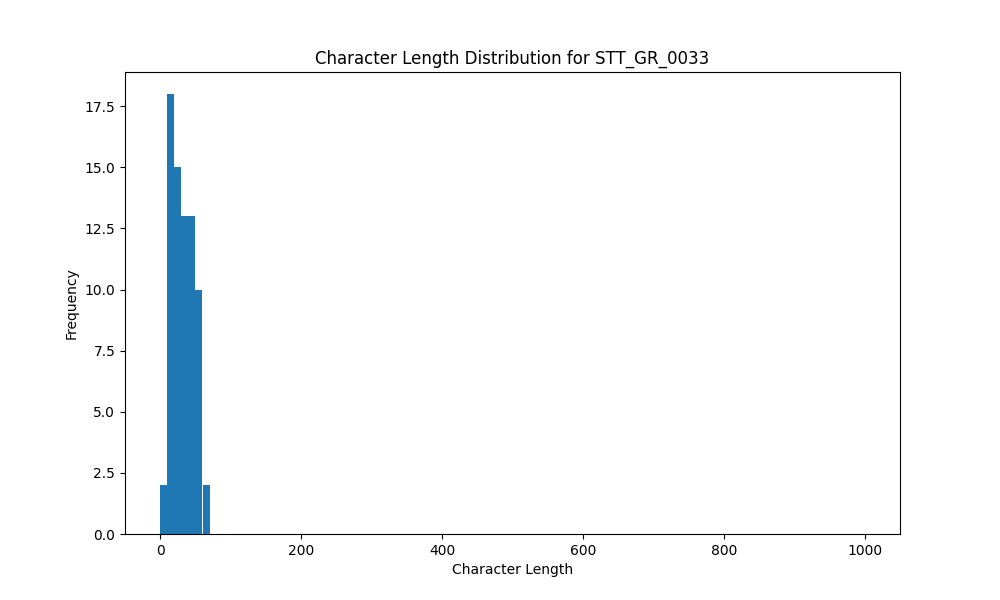

# Analysis Report for STT_GR_0033

## Summary Statistics

| Metric | Value |
|--------|-------|
| Total Segments | 73 |
| Total Duration | 121.22 seconds |
| Total Characters | 2332 |
| Average Characters/Segment | 31.95 |

## Character Length Distribution

## Detailed Statistics by Character Length Bins

### Bin: (0.0, 10.0]

| Metric | Value |
|--------|-------|
| Number of Segments | 3.0 |
| Average Character Length | 7.33 |
| Total Characters | 22.0 |
| Average Duration | 1.2 seconds |
| Total Duration | 3.61 seconds |

#### Files in this bin:

| File Name | Character Length | Duration (s) |
|-----------|-----------------|---------------|
| STT_GR_0033_0012_33244_to_34012 | 9 | 0.77 |
| STT_GR_0033_0001_9100_to_11400 | 10 | 2.30 |
| STT_GR_0033_0084_180384_to_180928 | 3 | 0.54 |

### Bin: (10.0, 20.0]

| Metric | Value |
|--------|-------|
| Number of Segments | 17.0 |
| Average Character Length | 14.18 |
| Total Characters | 241.0 |
| Average Duration | 0.86 seconds |
| Total Duration | 14.66 seconds |

#### Files in this bin:

| File Name | Character Length | Duration (s) |
|-----------|-----------------|---------------|
| STT_GR_0033_0099_212224_to_213024 | 14 | 0.80 |
| STT_GR_0033_0098_211168_to_211936 | 17 | 0.77 |
| STT_GR_0033_0116_243488_to_244128 | 12 | 0.64 |
| STT_GR_0033_0103_220032_to_221280 | 11 | 1.25 |
| STT_GR_0033_0083_179680_to_180352 | 14 | 0.67 |
| STT_GR_0033_0079_172768_to_173952 | 18 | 1.18 |
| STT_GR_0033_0017_42844_to_43964 | 16 | 1.12 |
| STT_GR_0033_0008_27259_to_27964 | 11 | 0.70 |
| STT_GR_0033_0080_174432_to_175136 | 14 | 0.70 |
| STT_GR_0033_0020_49500_to_50204 | 14 | 0.70 |
| STT_GR_0033_0048_102748_to_103804 | 19 | 1.06 |
| STT_GR_0033_0021_50780_to_51612 | 18 | 0.83 |
| STT_GR_0033_0115_242720_to_243328 | 13 | 0.61 |
| STT_GR_0033_0023_52955_to_53948 | 14 | 0.99 |
| STT_GR_0033_0030_65147_to_65980 | 11 | 0.83 |
| STT_GR_0033_0022_51676_to_52476 | 11 | 0.80 |
| STT_GR_0033_0070_151616_to_152608 | 14 | 0.99 |

### Bin: (20.0, 30.0]

| Metric | Value |
|--------|-------|
| Number of Segments | 15.0 |
| Average Character Length | 25.0 |
| Total Characters | 375.0 |
| Average Duration | 1.34 seconds |
| Total Duration | 20.13 seconds |

#### Files in this bin:

| File Name | Character Length | Duration (s) |
|-----------|-----------------|---------------|
| STT_GR_0033_0105_224320_to_225856 | 24 | 1.54 |
| STT_GR_0033_0078_171328_to_172640 | 23 | 1.31 |
| STT_GR_0033_0110_234336_to_235904 | 24 | 1.57 |
| STT_GR_0033_0009_28252_to_29276 | 25 | 1.02 |
| STT_GR_0033_0027_60955_to_61948 | 22 | 0.99 |
| STT_GR_0033_0093_200576_to_201824 | 29 | 1.25 |
| STT_GR_0033_0004_16764_to_18588 | 29 | 1.82 |
| STT_GR_0033_0089_191584_to_193216 | 25 | 1.63 |
| STT_GR_0033_0058_124188_to_125116 | 25 | 0.93 |
| STT_GR_0033_0050_106268_to_107836 | 28 | 1.57 |
| STT_GR_0033_0032_68348_to_69852 | 29 | 1.50 |
| STT_GR_0033_0040_85692_to_86780 | 25 | 1.09 |
| STT_GR_0033_0054_115516_to_116572 | 23 | 1.06 |
| STT_GR_0033_0063_134396_to_135676 | 21 | 1.28 |
| STT_GR_0033_0100_213408_to_214976 | 23 | 1.57 |

### Bin: (30.0, 40.0]

| Metric | Value |
|--------|-------|
| Number of Segments | 14.0 |
| Average Character Length | 35.5 |
| Total Characters | 497.0 |
| Average Duration | 1.89 seconds |
| Total Duration | 26.43 seconds |

#### Files in this bin:

| File Name | Character Length | Duration (s) |
|-----------|-----------------|---------------|
| STT_GR_0033_0049_104092_to_106012 | 36 | 1.92 |
| STT_GR_0033_0118_245696_to_247104 | 37 | 1.41 |
| STT_GR_0033_0108_229600_to_231744 | 35 | 2.14 |
| STT_GR_0033_0043_90204_to_92124 | 40 | 1.92 |
| STT_GR_0033_0107_227328_to_229248 | 31 | 1.92 |
| STT_GR_0033_0045_95420_to_97404 | 39 | 1.98 |
| STT_GR_0033_0053_113468_to_115164 | 32 | 1.70 |
| STT_GR_0033_0028_62268_to_63900 | 36 | 1.63 |
| STT_GR_0033_0067_142332_to_144476 | 39 | 2.14 |
| STT_GR_0033_0026_59036_to_60699 | 33 | 1.66 |
| STT_GR_0033_0051_108220_to_109948 | 33 | 1.73 |
| STT_GR_0033_0111_236256_to_237888 | 31 | 1.63 |
| STT_GR_0033_0112_238144_to_240544 | 37 | 2.40 |
| STT_GR_0033_0062_132124_to_134364 | 38 | 2.24 |

### Bin: (40.0, 50.0]

| Metric | Value |
|--------|-------|
| Number of Segments | 14.0 |
| Average Character Length | 46.0 |
| Total Characters | 644.0 |
| Average Duration | 2.2 seconds |
| Total Duration | 30.82 seconds |

#### Files in this bin:

| File Name | Character Length | Duration (s) |
|-----------|-----------------|---------------|
| STT_GR_0033_0025_56251_to_58684 | 50 | 2.43 |
| STT_GR_0033_0090_193568_to_195872 | 45 | 2.30 |
| STT_GR_0033_0086_184160_to_186112 | 47 | 1.95 |
| STT_GR_0033_0075_164704_to_166368 | 42 | 1.66 |
| STT_GR_0033_0092_198048_to_200256 | 48 | 2.21 |
| STT_GR_0033_0056_119868_to_122076 | 46 | 2.21 |
| STT_GR_0033_0046_97724_to_100284 | 49 | 2.56 |
| STT_GR_0033_0005_18940_to_21340 | 44 | 2.40 |
| STT_GR_0033_0069_149120_to_151392 | 50 | 2.27 |
| STT_GR_0033_0035_75420_to_77276 | 41 | 1.86 |
| STT_GR_0033_0016_40092_to_42492 | 46 | 2.40 |
| STT_GR_0033_0034_72924_to_75100 | 45 | 2.18 |
| STT_GR_0033_0088_189120_to_191296 | 46 | 2.18 |
| STT_GR_0033_0061_129564_to_131772 | 45 | 2.21 |

### Bin: (50.0, 60.0]

| Metric | Value |
|--------|-------|
| Number of Segments | 9.0 |
| Average Character Length | 54.67 |
| Total Characters | 492.0 |
| Average Duration | 2.52 seconds |
| Total Duration | 22.66 seconds |

#### Files in this bin:

| File Name | Character Length | Duration (s) |
|-----------|-----------------|---------------|
| STT_GR_0033_0006_21660_to_23932 | 60 | 2.27 |
| STT_GR_0033_0066_139452_to_141948 | 57 | 2.50 |
| STT_GR_0033_0060_126588_to_129148 | 51 | 2.56 |
| STT_GR_0033_0003_13500_to_16380 | 55 | 2.88 |
| STT_GR_0033_0036_77596_to_79868 | 55 | 2.27 |
| STT_GR_0033_0044_92476_to_95068 | 52 | 2.59 |
| STT_GR_0033_0072_155712_to_158304 | 51 | 2.59 |
| STT_GR_0033_0081_175328_to_177504 | 55 | 2.18 |
| STT_GR_0033_0073_158848_to_161664 | 56 | 2.82 |

### Bin: (60.0, 70.0]

| Metric | Value |
|--------|-------|
| Number of Segments | 1.0 |
| Average Character Length | 61.0 |
| Total Characters | 61.0 |
| Average Duration | 2.91 seconds |
| Total Duration | 2.91 seconds |

#### Files in this bin:

| File Name | Character Length | Duration (s) |
|-----------|-----------------|---------------|
| STT_GR_0033_0019_46108_to_49019 | 61 | 2.91 |

