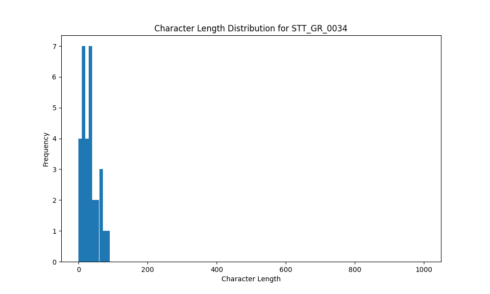

# Analysis Report for STT_GR_0034

## Summary Statistics

| Metric | Value |
|--------|-------|
| Total Segments | 31 |
| Total Duration | 58.27 seconds |
| Total Characters | 1011 |
| Average Characters/Segment | 32.61 |

## Character Length Distribution

## Detailed Statistics by Character Length Bins

### Bin: (0.0, 10.0]

| Metric | Value |
|--------|-------|
| Number of Segments | 4.0 |
| Average Character Length | 6.0 |
| Total Characters | 24.0 |
| Average Duration | 0.74 seconds |
| Total Duration | 2.94 seconds |

#### Files in this bin:

| File Name | Character Length | Duration (s) |
|-----------|-----------------|---------------|
| STT_GR_0034_1989_5497296_to_5497872 | 5 | 0.58 |
| STT_GR_0034_2193_5982324_to_5982964 | 5 | 0.64 |
| STT_GR_0034_2191_5980052_to_5980788 | 5 | 0.74 |
| STT_GR_0034_0519_1351735_to_1352727 | 9 | 0.99 |

### Bin: (10.0, 20.0]

| Metric | Value |
|--------|-------|
| Number of Segments | 7.0 |
| Average Character Length | 14.14 |
| Total Characters | 99.0 |
| Average Duration | 1.07 seconds |
| Total Duration | 7.49 seconds |

#### Files in this bin:

| File Name | Character Length | Duration (s) |
|-----------|-----------------|---------------|
| STT_GR_0034_1654_4703392_to_4704192 | 11 | 0.80 |
| STT_GR_0034_1669_4733504_to_4734208 | 13 | 0.70 |
| STT_GR_0034_0183_486248_to_487080 | 14 | 0.83 |
| STT_GR_0034_1011_2966584_to_2968984 | 17 | 2.40 |
| STT_GR_0034_0103_303812_to_304611 | 13 | 0.80 |
| STT_GR_0034_1329_3800208_to_3800944 | 13 | 0.74 |
| STT_GR_0034_0400_1030455_to_1031672 | 18 | 1.22 |

### Bin: (20.0, 30.0]

| Metric | Value |
|--------|-------|
| Number of Segments | 4.0 |
| Average Character Length | 26.75 |
| Total Characters | 107.0 |
| Average Duration | 1.55 seconds |
| Total Duration | 6.21 seconds |

#### Files in this bin:

| File Name | Character Length | Duration (s) |
|-----------|-----------------|---------------|
| STT_GR_0034_2204_6005844_to_6007508 | 29 | 1.66 |
| STT_GR_0034_1471_4212780_to_4213964 | 26 | 1.18 |
| STT_GR_0034_0593_1550536_to_1552200 | 25 | 1.66 |
| STT_GR_0034_1311_3752200_to_3753896 | 27 | 1.70 |

### Bin: (30.0, 40.0]

| Metric | Value |
|--------|-------|
| Number of Segments | 7.0 |
| Average Character Length | 33.57 |
| Total Characters | 235.0 |
| Average Duration | 1.89 seconds |
| Total Duration | 13.22 seconds |

#### Files in this bin:

| File Name | Character Length | Duration (s) |
|-----------|-----------------|---------------|
| STT_GR_0034_0869_2584816_to_2586416 | 34 | 1.60 |
| STT_GR_0034_1660_4715552_to_4717504 | 34 | 1.95 |
| STT_GR_0034_0938_2756144_to_2758256 | 31 | 2.11 |
| STT_GR_0034_0451_1203024_to_1205648 | 32 | 2.62 |
| STT_GR_0034_0153_412992_to_414496 | 35 | 1.50 |
| STT_GR_0034_0456_1215728_to_1217680 | 37 | 1.95 |
| STT_GR_0034_2344_6339396_to_6340868 | 32 | 1.47 |

### Bin: (40.0, 50.0]

| Metric | Value |
|--------|-------|
| Number of Segments | 2.0 |
| Average Character Length | 47.0 |
| Total Characters | 94.0 |
| Average Duration | 2.66 seconds |
| Total Duration | 5.31 seconds |

#### Files in this bin:

| File Name | Character Length | Duration (s) |
|-----------|-----------------|---------------|
| STT_GR_0034_1198_3435364_to_3438052 | 48 | 2.69 |
| STT_GR_0034_2421_6545436_to_6548059 | 46 | 2.62 |

### Bin: (50.0, 60.0]

| Metric | Value |
|--------|-------|
| Number of Segments | 3.0 |
| Average Character Length | 56.0 |
| Total Characters | 168.0 |
| Average Duration | 2.93 seconds |
| Total Duration | 8.8 seconds |

#### Files in this bin:

| File Name | Character Length | Duration (s) |
|-----------|-----------------|---------------|
| STT_GR_0034_1381_3998444_to_4001324 | 51 | 2.88 |
| STT_GR_0034_0518_1347416_to_1351255 | 60 | 3.84 |
| STT_GR_0034_1325_3789968_to_3792048 | 57 | 2.08 |

### Bin: (60.0, 70.0]

| Metric | Value |
|--------|-------|
| Number of Segments | 2.0 |
| Average Character Length | 64.0 |
| Total Characters | 128.0 |
| Average Duration | 3.68 seconds |
| Total Duration | 7.36 seconds |

#### Files in this bin:

| File Name | Character Length | Duration (s) |
|-----------|-----------------|---------------|
| STT_GR_0034_1158_3320144_to_3323824 | 65 | 3.68 |
| STT_GR_0034_0182_482376_to_486056 | 63 | 3.68 |

### Bin: (70.0, 80.0]

| Metric | Value |
|--------|-------|
| Number of Segments | 1.0 |
| Average Character Length | 75.0 |
| Total Characters | 75.0 |
| Average Duration | 3.01 seconds |
| Total Duration | 3.01 seconds |

#### Files in this bin:

| File Name | Character Length | Duration (s) |
|-----------|-----------------|---------------|
| STT_GR_0034_2436_6575900_to_6578907 | 75 | 3.01 |

### Bin: (80.0, 90.0]

| Metric | Value |
|--------|-------|
| Number of Segments | 1.0 |
| Average Character Length | 81.0 |
| Total Characters | 81.0 |
| Average Duration | 3.94 seconds |
| Total Duration | 3.94 seconds |

#### Files in this bin:

| File Name | Character Length | Duration (s) |
|-----------|-----------------|---------------|
| STT_GR_0034_1489_4266059_to_4269996 | 81 | 3.94 |

