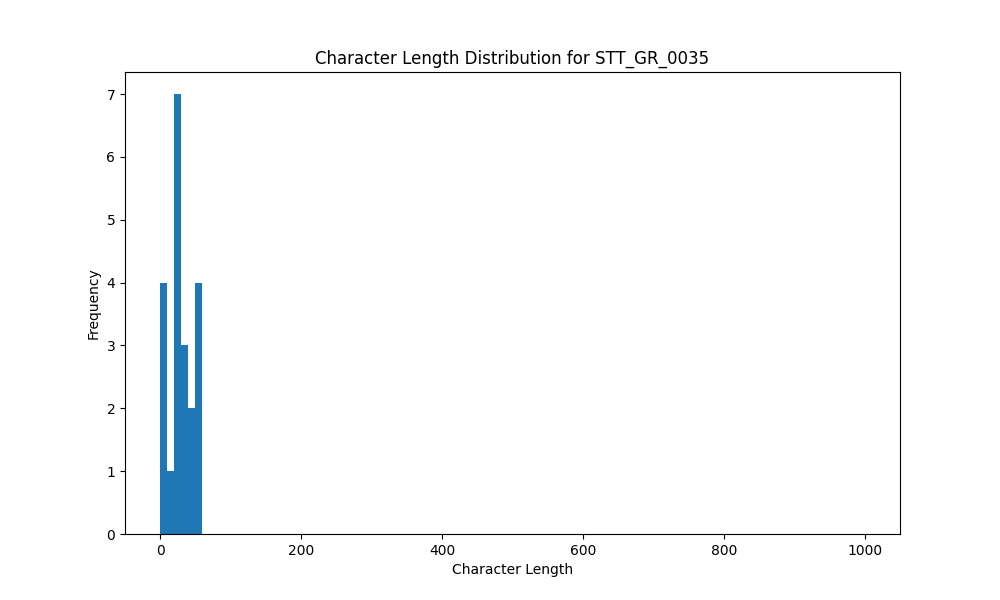

# Analysis Report for STT_GR_0035

## Summary Statistics

| Metric | Value |
|--------|-------|
| Total Segments | 21 |
| Total Duration | 34.95 seconds |
| Total Characters | 607 |
| Average Characters/Segment | 28.90 |

## Character Length Distribution

## Detailed Statistics by Character Length Bins

### Bin: (0.0, 10.0]

| Metric | Value |
|--------|-------|
| Number of Segments | 4.0 |
| Average Character Length | 4.75 |
| Total Characters | 19.0 |
| Average Duration | 0.63 seconds |
| Total Duration | 2.53 seconds |

#### Files in this bin:

| File Name | Character Length | Duration (s) |
|-----------|-----------------|---------------|
| STT_GR_0035_1542_4209024_to_4209568 | 4 | 0.54 |
| STT_GR_0035_1600_4386048_to_4386592 | 5 | 0.54 |
| STT_GR_0035_1185_3182243_to_3182852 | 5 | 0.61 |
| STT_GR_0035_0021_44416_to_45248 | 5 | 0.83 |

### Bin: (10.0, 20.0]

| Metric | Value |
|--------|-------|
| Number of Segments | 1.0 |
| Average Character Length | 11.0 |
| Total Characters | 11.0 |
| Average Duration | 0.74 seconds |
| Total Duration | 0.74 seconds |

#### Files in this bin:

| File Name | Character Length | Duration (s) |
|-----------|-----------------|---------------|
| STT_GR_0035_0815_2112060_to_2112796 | 11 | 0.74 |

### Bin: (20.0, 30.0]

| Metric | Value |
|--------|-------|
| Number of Segments | 8.0 |
| Average Character Length | 25.75 |
| Total Characters | 206.0 |
| Average Duration | 1.42 seconds |
| Total Duration | 11.33 seconds |

#### Files in this bin:

| File Name | Character Length | Duration (s) |
|-----------|-----------------|---------------|
| STT_GR_0035_0965_2599016_to_2601000 | 26 | 1.98 |
| STT_GR_0035_0406_982756_to_985124 | 30 | 2.37 |
| STT_GR_0035_1645_4473952_to_4474944 | 24 | 0.99 |
| STT_GR_0035_0035_79036_to_80508 | 28 | 1.47 |
| STT_GR_0035_0720_1909584_to_1910896 | 27 | 1.31 |
| STT_GR_0035_0971_2609096_to_2610312 | 22 | 1.22 |
| STT_GR_0035_1537_4173556_to_4174772 | 26 | 1.22 |
| STT_GR_0035_0524_1433252_to_1434020 | 23 | 0.77 |

### Bin: (30.0, 40.0]

| Metric | Value |
|--------|-------|
| Number of Segments | 2.0 |
| Average Character Length | 32.5 |
| Total Characters | 65.0 |
| Average Duration | 1.66 seconds |
| Total Duration | 3.33 seconds |

#### Files in this bin:

| File Name | Character Length | Duration (s) |
|-----------|-----------------|---------------|
| STT_GR_0035_0496_1364260_to_1365892 | 31 | 1.63 |
| STT_GR_0035_1584_4360896_to_4362592 | 34 | 1.70 |

### Bin: (40.0, 50.0]

| Metric | Value |
|--------|-------|
| Number of Segments | 3.0 |
| Average Character Length | 46.0 |
| Total Characters | 138.0 |
| Average Duration | 2.95 seconds |
| Total Duration | 8.86 seconds |

#### Files in this bin:

| File Name | Character Length | Duration (s) |
|-----------|-----------------|---------------|
| STT_GR_0035_2221_6133028_to_6136420 | 50 | 3.39 |
| STT_GR_0035_1196_3209379_to_3212803 | 45 | 3.42 |
| STT_GR_0035_0846_2180668_to_2182716 | 43 | 2.05 |

### Bin: (50.0, 60.0]

| Metric | Value |
|--------|-------|
| Number of Segments | 3.0 |
| Average Character Length | 56.0 |
| Total Characters | 168.0 |
| Average Duration | 2.72 seconds |
| Total Duration | 8.16 seconds |

#### Files in this bin:

| File Name | Character Length | Duration (s) |
|-----------|-----------------|---------------|
| STT_GR_0035_1670_4526080_to_4529120 | 59 | 3.04 |
| STT_GR_0035_2093_5831504_to_5833776 | 58 | 2.27 |
| STT_GR_0035_0467_1194540_to_1197388 | 51 | 2.85 |

