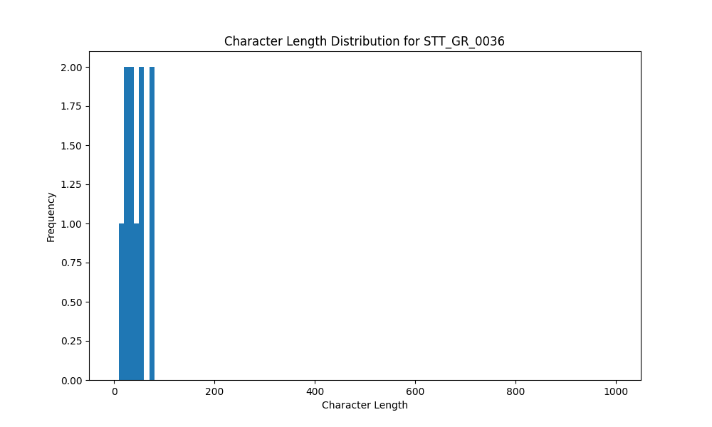

# Analysis Report for STT_GR_0036

## Summary Statistics

| Metric | Value |
|--------|-------|
| Total Segments | 10 |
| Total Duration | 27.98 seconds |
| Total Characters | 452 |
| Average Characters/Segment | 45.20 |

## Character Length Distribution

## Detailed Statistics by Character Length Bins

### Bin: (10.0, 20.0]

| Metric | Value |
|--------|-------|
| Number of Segments | 2.0 |
| Average Character Length | 19.5 |
| Total Characters | 39.0 |
| Average Duration | 1.12 seconds |
| Total Duration | 2.24 seconds |

#### Files in this bin:

| File Name | Character Length | Duration (s) |
|-----------|-----------------|---------------|
| STT_GR_0036_0736_2279995_to_2281243 | 20 | 1.25 |
| STT_GR_0036_0699_2198556_to_2199548 | 19 | 0.99 |

### Bin: (20.0, 30.0]

| Metric | Value |
|--------|-------|
| Number of Segments | 1.0 |
| Average Character Length | 27.0 |
| Total Characters | 27.0 |
| Average Duration | 1.54 seconds |
| Total Duration | 1.54 seconds |

#### Files in this bin:

| File Name | Character Length | Duration (s) |
|-----------|-----------------|---------------|
| STT_GR_0036_0701_2202428_to_2203964 | 27 | 1.54 |

### Bin: (30.0, 40.0]

| Metric | Value |
|--------|-------|
| Number of Segments | 2.0 |
| Average Character Length | 34.0 |
| Total Characters | 68.0 |
| Average Duration | 2.57 seconds |
| Total Duration | 5.14 seconds |

#### Files in this bin:

| File Name | Character Length | Duration (s) |
|-----------|-----------------|---------------|
| STT_GR_0036_0013_130100_to_133900 | 37 | 3.80 |
| STT_GR_0036_0338_1228439_to_1229783 | 31 | 1.34 |

### Bin: (40.0, 50.0]

| Metric | Value |
|--------|-------|
| Number of Segments | 1.0 |
| Average Character Length | 48.0 |
| Total Characters | 48.0 |
| Average Duration | 2.08 seconds |
| Total Duration | 2.08 seconds |

#### Files in this bin:

| File Name | Character Length | Duration (s) |
|-----------|-----------------|---------------|
| STT_GR_0036_0054_315616_to_317695 | 48 | 2.08 |

### Bin: (50.0, 60.0]

| Metric | Value |
|--------|-------|
| Number of Segments | 2.0 |
| Average Character Length | 56.0 |
| Total Characters | 112.0 |
| Average Duration | 2.58 seconds |
| Total Duration | 5.15 seconds |

#### Files in this bin:

| File Name | Character Length | Duration (s) |
|-----------|-----------------|---------------|
| STT_GR_0036_0230_927619_to_930308 | 56 | 2.69 |
| STT_GR_0036_0440_1550076_to_1552540 | 56 | 2.46 |

### Bin: (70.0, 80.0]

| Metric | Value |
|--------|-------|
| Number of Segments | 2.0 |
| Average Character Length | 79.0 |
| Total Characters | 158.0 |
| Average Duration | 5.92 seconds |
| Total Duration | 11.83 seconds |

#### Files in this bin:

| File Name | Character Length | Duration (s) |
|-----------|-----------------|---------------|
| STT_GR_0036_0806_2472400_to_2479400 | 79 | 7.00 |
| STT_GR_0036_0101_526140_to_530972 | 79 | 4.83 |

