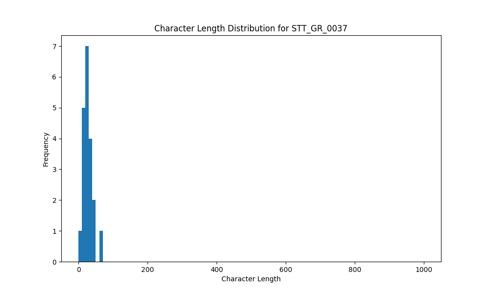

# Analysis Report for STT_GR_0037

## Summary Statistics

| Metric | Value |
|--------|-------|
| Total Segments | 20 |
| Total Duration | 31.17 seconds |
| Total Characters | 548 |
| Average Characters/Segment | 27.40 |

## Character Length Distribution

## Detailed Statistics by Character Length Bins

### Bin: (0.0, 10.0]

| Metric | Value |
|--------|-------|
| Number of Segments | 1.0 |
| Average Character Length | 5.0 |
| Total Characters | 5.0 |
| Average Duration | 0.54 seconds |
| Total Duration | 0.54 seconds |

#### Files in this bin:

| File Name | Character Length | Duration (s) |
|-----------|-----------------|---------------|
| STT_GR_0037_1006_2632532_to_2633076 | 5 | 0.54 |

### Bin: (10.0, 20.0]

| Metric | Value |
|--------|-------|
| Number of Segments | 6.0 |
| Average Character Length | 17.33 |
| Total Characters | 104.0 |
| Average Duration | 1.09 seconds |
| Total Duration | 6.53 seconds |

#### Files in this bin:

| File Name | Character Length | Duration (s) |
|-----------|-----------------|---------------|
| STT_GR_0037_0624_1694600_to_1695719 | 20 | 1.12 |
| STT_GR_0037_0427_1178700_to_1179852 | 19 | 1.15 |
| STT_GR_0037_1193_3113492_to_3114836 | 17 | 1.34 |
| STT_GR_0037_1563_4599228_to_4600220 | 17 | 0.99 |
| STT_GR_0037_1121_2936304_to_2937072 | 15 | 0.77 |
| STT_GR_0037_1197_3120340_to_3121492 | 16 | 1.15 |

### Bin: (20.0, 30.0]

| Metric | Value |
|--------|-------|
| Number of Segments | 7.0 |
| Average Character Length | 25.29 |
| Total Characters | 177.0 |
| Average Duration | 1.46 seconds |
| Total Duration | 10.24 seconds |

#### Files in this bin:

| File Name | Character Length | Duration (s) |
|-----------|-----------------|---------------|
| STT_GR_0037_0563_1523048_to_1524103 | 21 | 1.05 |
| STT_GR_0037_0026_83931_to_85628 | 23 | 1.70 |
| STT_GR_0037_1298_3673668_to_3675140 | 28 | 1.47 |
| STT_GR_0037_0619_1681480_to_1683240 | 21 | 1.76 |
| STT_GR_0037_1276_3578144_to_3579552 | 25 | 1.41 |
| STT_GR_0037_1453_4197896_to_4199208 | 29 | 1.31 |
| STT_GR_0037_0898_2371452_to_2372988 | 30 | 1.54 |

### Bin: (30.0, 40.0]

| Metric | Value |
|--------|-------|
| Number of Segments | 3.0 |
| Average Character Length | 34.67 |
| Total Characters | 104.0 |
| Average Duration | 1.79 seconds |
| Total Duration | 5.38 seconds |

#### Files in this bin:

| File Name | Character Length | Duration (s) |
|-----------|-----------------|---------------|
| STT_GR_0037_1163_3045432_to_3047031 | 33 | 1.60 |
| STT_GR_0037_1435_4161823_to_4163871 | 38 | 2.05 |
| STT_GR_0037_0230_687932_to_689660 | 33 | 1.73 |

### Bin: (40.0, 50.0]

| Metric | Value |
|--------|-------|
| Number of Segments | 2.0 |
| Average Character Length | 45.0 |
| Total Characters | 90.0 |
| Average Duration | 2.91 seconds |
| Total Duration | 5.82 seconds |

#### Files in this bin:

| File Name | Character Length | Duration (s) |
|-----------|-----------------|---------------|
| STT_GR_0037_1046_2736328_to_2739368 | 47 | 3.04 |
| STT_GR_0037_0839_2209580_to_2212364 | 43 | 2.78 |

### Bin: (60.0, 70.0]

| Metric | Value |
|--------|-------|
| Number of Segments | 1.0 |
| Average Character Length | 68.0 |
| Total Characters | 68.0 |
| Average Duration | 2.66 seconds |
| Total Duration | 2.66 seconds |

#### Files in this bin:

| File Name | Character Length | Duration (s) |
|-----------|-----------------|---------------|
| STT_GR_0037_0777_2066580_to_2069235 | 68 | 2.65 |

