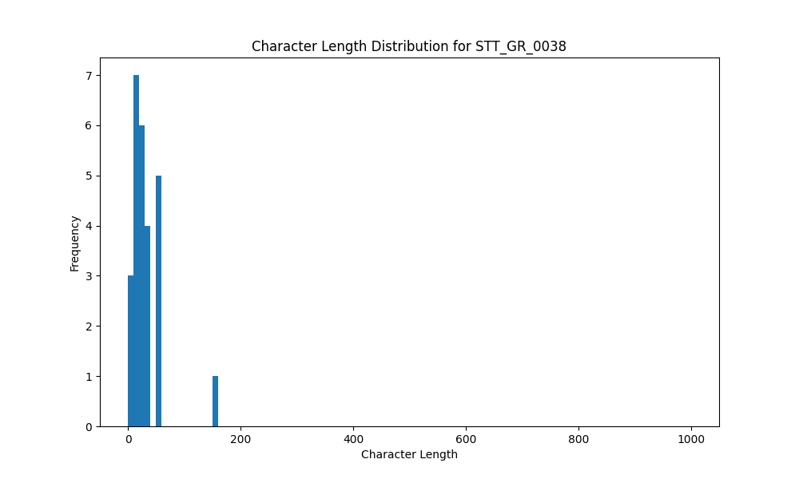

# Analysis Report for STT_GR_0038

## Summary Statistics

| Metric | Value |
|--------|-------|
| Total Segments | 26 |
| Total Duration | 47.88 seconds |
| Total Characters | 815 |
| Average Characters/Segment | 31.35 |

## Character Length Distribution

## Detailed Statistics by Character Length Bins

### Bin: (0.0, 10.0]

| Metric | Value |
|--------|-------|
| Number of Segments | 3.0 |
| Average Character Length | 5.67 |
| Total Characters | 17.0 |
| Average Duration | 0.66 seconds |
| Total Duration | 1.98 seconds |

#### Files in this bin:

| File Name | Character Length | Duration (s) |
|-----------|-----------------|---------------|
| STT_GR_0038_0344_1387620_to_1388131 | 4 | 0.51 |
| STT_GR_0038_1256_3770912_to_3771455 | 7 | 0.54 |
| STT_GR_0038_0968_3106624_to_3107552 | 6 | 0.93 |

### Bin: (10.0, 20.0]

| Metric | Value |
|--------|-------|
| Number of Segments | 7.0 |
| Average Character Length | 14.57 |
| Total Characters | 102.0 |
| Average Duration | 0.87 seconds |
| Total Duration | 6.11 seconds |

#### Files in this bin:

| File Name | Character Length | Duration (s) |
|-----------|-----------------|---------------|
| STT_GR_0038_0711_2453360_to_2454223 | 14 | 0.86 |
| STT_GR_0038_0717_2467152_to_2468048 | 11 | 0.90 |
| STT_GR_0038_0996_3163360_to_3164000 | 14 | 0.64 |
| STT_GR_0038_0194_879136_to_879968 | 13 | 0.83 |
| STT_GR_0038_0674_2331520_to_2332384 | 19 | 0.86 |
| STT_GR_0038_1272_3798432_to_3799743 | 19 | 1.31 |
| STT_GR_0038_0138_708632_to_709336 | 12 | 0.70 |

### Bin: (20.0, 30.0]

| Metric | Value |
|--------|-------|
| Number of Segments | 6.0 |
| Average Character Length | 23.5 |
| Total Characters | 141.0 |
| Average Duration | 1.32 seconds |
| Total Duration | 7.94 seconds |

#### Files in this bin:

| File Name | Character Length | Duration (s) |
|-----------|-----------------|---------------|
| STT_GR_0038_0608_2165992_to_2167240 | 27 | 1.25 |
| STT_GR_0038_0028_171240_to_173064 | 27 | 1.82 |
| STT_GR_0038_1078_3376420_to_3377700 | 21 | 1.28 |
| STT_GR_0038_0114_589944_to_591096 | 23 | 1.15 |
| STT_GR_0038_1042_3301988_to_3303332 | 22 | 1.34 |
| STT_GR_0038_0027_169704_to_170792 | 21 | 1.09 |

### Bin: (30.0, 40.0]

| Metric | Value |
|--------|-------|
| Number of Segments | 4.0 |
| Average Character Length | 33.75 |
| Total Characters | 135.0 |
| Average Duration | 2.02 seconds |
| Total Duration | 8.06 seconds |

#### Files in this bin:

| File Name | Character Length | Duration (s) |
|-----------|-----------------|---------------|
| STT_GR_0038_0565_2074824_to_2076552 | 33 | 1.73 |
| STT_GR_0038_1126_3488036_to_3489444 | 32 | 1.41 |
| STT_GR_0038_1144_3530340_to_3532356 | 38 | 2.02 |
| STT_GR_0038_1100_3428268_to_3431180 | 32 | 2.91 |

### Bin: (50.0, 60.0]

| Metric | Value |
|--------|-------|
| Number of Segments | 5.0 |
| Average Character Length | 53.6 |
| Total Characters | 268.0 |
| Average Duration | 2.78 seconds |
| Total Duration | 13.89 seconds |

#### Files in this bin:

| File Name | Character Length | Duration (s) |
|-----------|-----------------|---------------|
| STT_GR_0038_0315_1275596_to_1278860 | 55 | 3.26 |
| STT_GR_0038_0902_2932240_to_2934608 | 55 | 2.37 |
| STT_GR_0038_0767_2569488_to_2571375 | 51 | 1.89 |
| STT_GR_0038_0495_1927515_to_1929947 | 52 | 2.43 |
| STT_GR_0038_0447_1815596_to_1819532 | 55 | 3.94 |

### Bin: (150.0, 160.0]

| Metric | Value |
|--------|-------|
| Number of Segments | 1.0 |
| Average Character Length | 152.0 |
| Total Characters | 152.0 |
| Average Duration | 9.9 seconds |
| Total Duration | 9.9 seconds |

#### Files in this bin:

| File Name | Character Length | Duration (s) |
|-----------|-----------------|---------------|
| STT_GR_0038_0395_1579300_to_1589200 | 152 | 9.90 |

