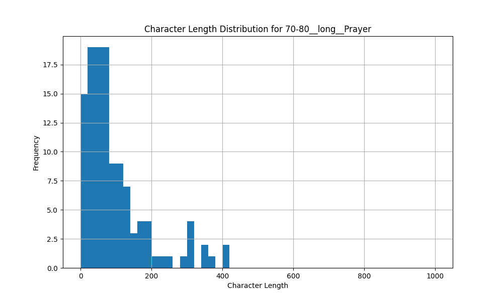
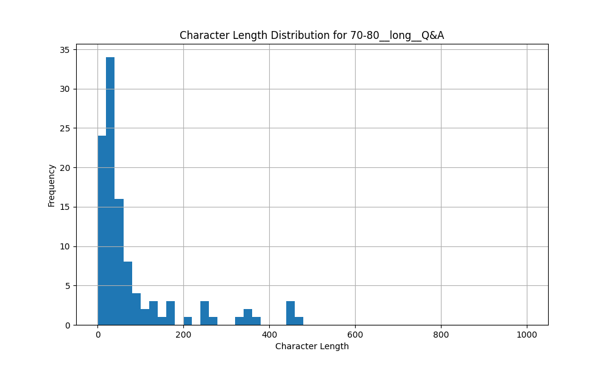
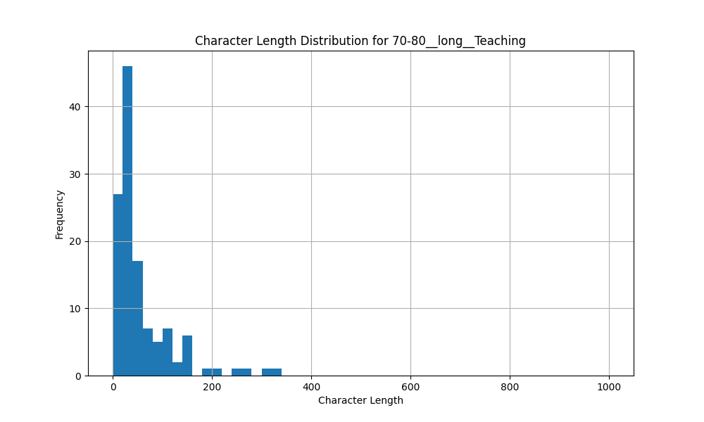
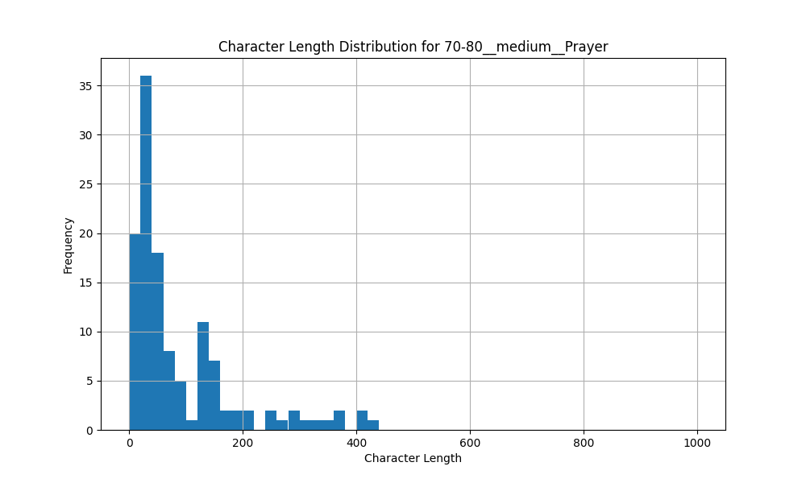
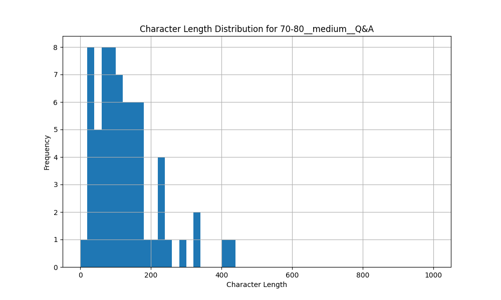
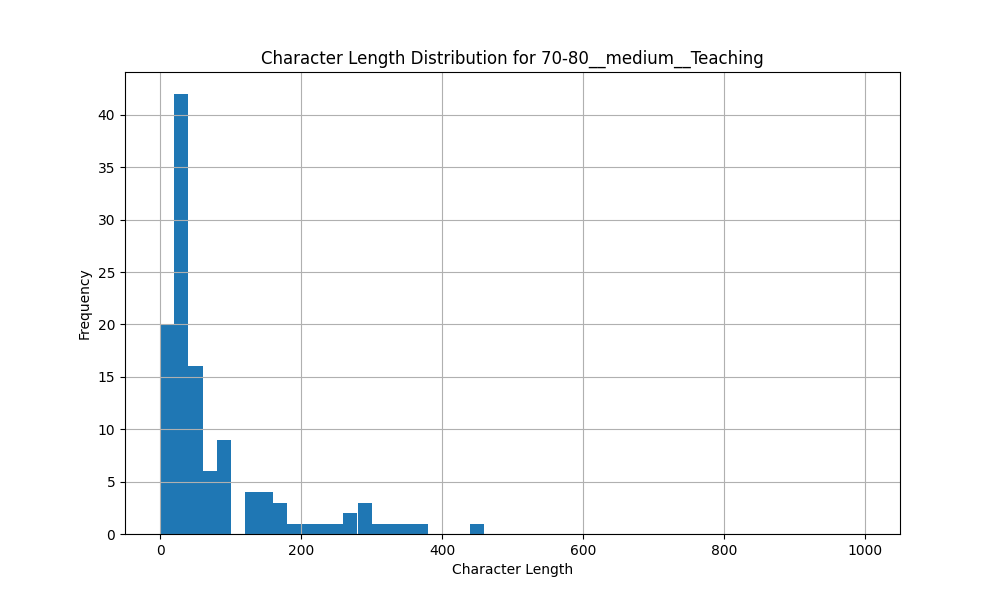
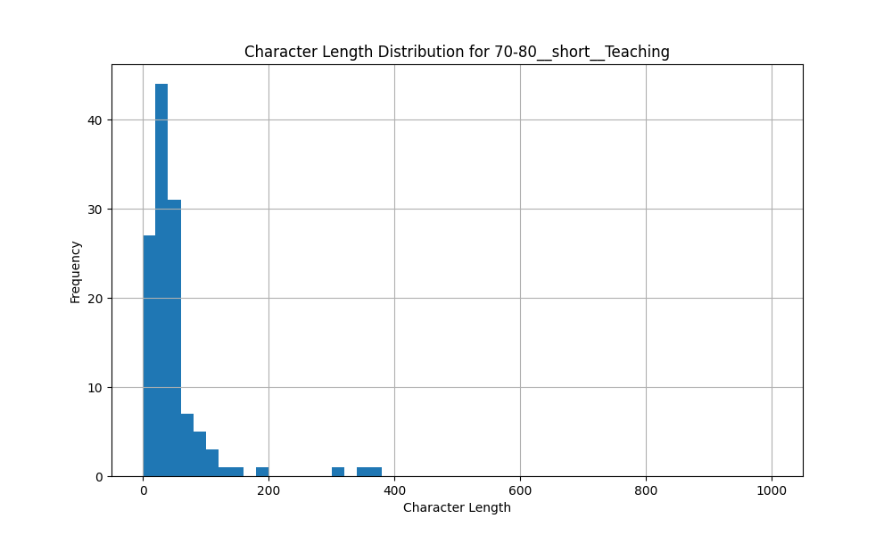
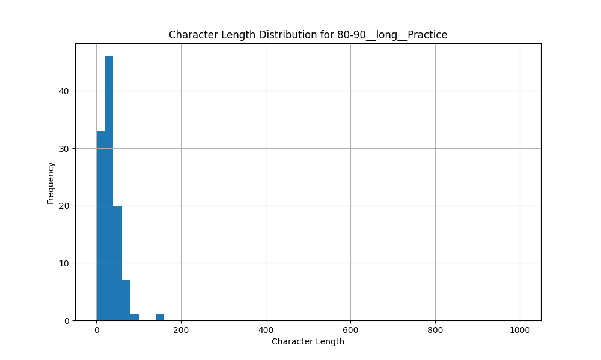

# Strata Analysis Summary

## Overall Statistics

Total number of unique strata: 8
Total number of original IDs: 38

## Strata Breakdown

### 70-80__long__Prayer

#### Statistics
| Metric | Value |
|--------|-------|
| Number of Original IDs | 2 |
| Total Segments | 121 |
| Total Duration | 705.64 seconds |
| Total Characters | 11817 |
| Average Characters/Segment | 97.66 |

#### Original IDs in this strata
```
STT_GR_0022, STT_GR_0028
```

#### Character Length Distribution


---

### 70-80__long__Q&A

#### Statistics
| Metric | Value |
|--------|-------|
| Number of Original IDs | 3 |
| Total Segments | 108 |
| Total Duration | 505.84 seconds |
| Total Characters | 8651 |
| Average Characters/Segment | 80.10 |

#### Original IDs in this strata
```
STT_GR_0019, STT_GR_0024, STT_GR_0011
```

#### Character Length Distribution


---

### 70-80__long__Teaching

#### Statistics
| Metric | Value |
|--------|-------|
| Number of Original IDs | 10 |
| Total Segments | 123 |
| Total Duration | 402.08 seconds |
| Total Characters | 6860 |
| Average Characters/Segment | 55.77 |

#### Original IDs in this strata
```
STT_GR_0004, STT_GR_0016, STT_GR_0010, STT_GR_0021, STT_GR_0002, STT_GR_0012, STT_GR_0003, STT_GR_0029, STT_GR_0023, STT_GR_0014
```

#### Character Length Distribution


---

### 70-80__medium__Prayer

#### Statistics
| Metric | Value |
|--------|-------|
| Number of Original IDs | 2 |
| Total Segments | 125 |
| Total Duration | 628.33 seconds |
| Total Characters | 11196 |
| Average Characters/Segment | 89.57 |

#### Original IDs in this strata
```
STT_GR_0030, STT_GR_0026
```

#### Character Length Distribution


---

### 70-80__medium__Q&A

#### Statistics
| Metric | Value |
|--------|-------|
| Number of Original IDs | 1 |
| Total Segments | 67 |
| Total Duration | 538.70 seconds |
| Total Characters | 8603 |
| Average Characters/Segment | 128.40 |

#### Original IDs in this strata
```
STT_GR_0027
```

#### Character Length Distribution


---

### 70-80__medium__Teaching

#### Statistics
| Metric | Value |
|--------|-------|
| Number of Original IDs | 11 |
| Total Segments | 118 |
| Total Duration | 530.12 seconds |
| Total Characters | 9188 |
| Average Characters/Segment | 77.86 |

#### Original IDs in this strata
```
STT_GR_0020, STT_GR_0025, STT_GR_0031, STT_GR_0013, STT_GR_0017, STT_GR_0008, STT_GR_0015, STT_GR_0005, STT_GR_0007, STT_GR_0006, STT_GR_0009
```

#### Character Length Distribution


---

### 70-80__short__Teaching

#### Statistics
| Metric | Value |
|--------|-------|
| Number of Original IDs | 4 |
| Total Segments | 123 |
| Total Duration | 359.25 seconds |
| Total Characters | 5814 |
| Average Characters/Segment | 47.27 |

#### Original IDs in this strata
```
STT_GR_0001, STT_GR_0033, STT_GR_0032, STT_GR_0018
```

#### Character Length Distribution


---

### 80-90__long__Practice

#### Statistics
| Metric | Value |
|--------|-------|
| Number of Original IDs | 5 |
| Total Segments | 108 |
| Total Duration | 200.24 seconds |
| Total Characters | 3433 |
| Average Characters/Segment | 31.79 |

#### Original IDs in this strata
```
STT_GR_0037, STT_GR_0034, STT_GR_0038, STT_GR_0035, STT_GR_0036
```

#### Character Length Distribution


---

